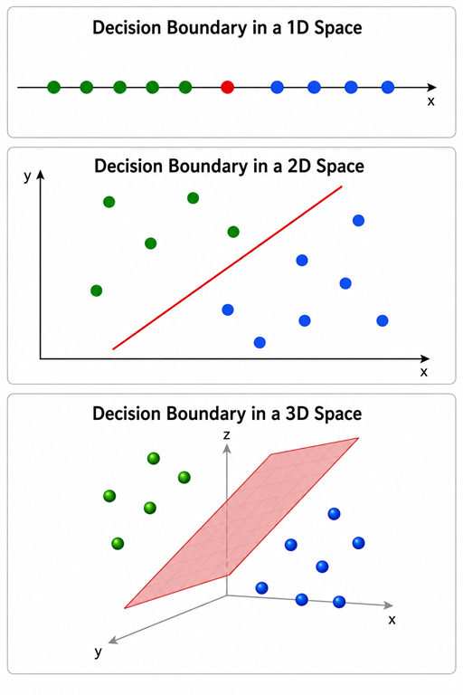

--- 
tags:
  - Support Vector Machine
  - SVM
---

# Support Vector Machine (SVM)

---
## 1. Introduction to problem to be solved

In many machine learning problems, the **objective is to separate different groups of data.**

For example, we may want to distinguish between cats and dogs, approved and rejected loan applications, or spam and legitimate emails.

**The goal is to find a decision boundary that separates one class from another.**

As illustrated in the figure below:

| | |
|---|---|
|  | - In a **1D** feature space, the decision boundary is a **point**.<br><br>- In a **2D** feature space, the decision boundary is a **line**.<br><br>- In a **3D** feature space, the decision boundary is a **plane**.<br><br>The same idea extends naturally to higher-dimensional feature spaces, where the decision boundary becomes a **hyperplane**. |

> Support Vector Machine (SVM) is one of the machine learning algorithms that solves this problem. It searches for a decision boundary that best separates different classes of data.


## 2. What is SVM

* Support Vector Machine (SVM) is a supervised machine learning algorithm used for:

	- Classification
	- Regression (predicting continuous values)

> <font color='red'>**SVM is like drawing the best possible dividing boundary between two groups of data.**</font>

(Although SVM can also be used for regression (called Support Vector Regression, or SVR), this article focuses on classification.)


---
## 3. A simple example
* Suppose we want a machine to identify:

		1. cat
		2. dog

* We give it 2 parameters (features) only:

		1. weight
		2. size
		
### Step 1: Create dataset

| Animal | Weight (kg) | Size (cm) |
|--------|-------------|------------|
| Cat    | 4           | 25         |
| Cat    | 5           | 28         |
| Cat    | 6           | 30         |
| Dog    | 18          | 60         |
| Dog    | 22          | 70         |
| Dog    | 25          | 75         |

### Step 2: Plot the points
- Imagine a graph:

		x-axis = weight
		y-axis = size

- Cats appear clustered in one area:

		smaller
		lighter

- Dogs appear in another:
		
		larger
		heavier

### Step 3: Draw a boundary
- SVM draws a line between them.

- For example: 
	
		y = mx + b

- **There are infinitely many lines that could separate these two groups of data.**.

- SVM chooses the one with the maximum margin (largest safety gap).

---
## 4. The actual math

Internally, SVM computes something like:

$$
w_1 x_1 + w_2 x_2 + b = 0
$$

Where,

$$
\begin{aligned}
x_1 &= \text{weight} \\
x_2 &= \text{size} \\
w_1, w_2 &= \text{importance of each feature} \\
b &= \text{boundary offset}
\end{aligned}
$$


---
## 5. SVM implementation in Python

``` python
from sklearn import svm

# X = [weight, size]
# weight = mass of the animal (kg)
# size   = height/length of the animal (cm

X = [
    [4, 25],
    [5, 28],
    [6, 30],
    [18, 60],
    [22, 70],
    [25, 75]
]

y = [-1, -1, -1, 1, 1, 1]

model = svm.SVC(kernel='linear')
model.fit(X, y)

test_point = [[20, 65]]
prediction = model.predict(test_point)[0]

print("Prediction:", "Dog 🐶" if prediction == 1 else "Cat 🐱")

print("Weights:", model.coef_[0])
print("Bias:", model.intercept_[0])
```

**expected output**
``` text
Prediction: Dog 🐶
Weights: [0.32258065 0.80645161]
Bias: -25.61290323
```

---
## 6. Three parameter example

- This is a Support Vector Machine (SVM) example for a loan approval system.

- It uses **three** features, income, credit score, and debt ratio to classify whether a loan should be approved or rejected based on past data.

- The decision boundary is represented mathematically as:

$$
w_1 x_1 + w_2 x_2 + w_3 x_3 + b = 0
$$

## 7. High-Dimensional SVM

!!! note "High-dimensional SVM (important intuition)"
    Mathematically, SVM is **not limited to 2D or 3D**.
    The same concept extends naturally to **N-dimensional feature spaces**, where each feature represents one dimension.

    In real-world machine learning problems, models often work with **tens, hundreds, or even thousands of features**. Although these high-dimensional spaces cannot be visualized physically, the underlying mathematics remains the same.

    Just as an SVM finds a **point** in 1D, a **line** in 2D, and a **plane** in 3D, it finds an **optimal separating hyperplane** in an N-dimensional feature space.
    

> Just as an SVM finds a point in 1D, a line in 2D, and a plane in 3D, it finds an optimal separating hyperplane in an N-dimensional feature space.


### 7.1 Python code example

```python
from sklearn import svm

# [income, credit_score, debt_ratio]
X = [
    [2, 450, 0.8],
    [3, 500, 0.7],
    [4, 550, 0.6],
    [8, 700, 0.3],
    [10, 750, 0.2],
    [12, 800, 0.1]
]

# 0 = reject, 1 = approve
y = [0, 0, 0, 1, 1, 1]

model = svm.SVC(kernel="linear")
model.fit(X, y)

test_point = [[6, 600, 0.4]]
prediction = model.predict(test_point)[0]

print("Approved" if prediction == 1 else "Rejected")
```

**Expected output**

```text
Approved
```

