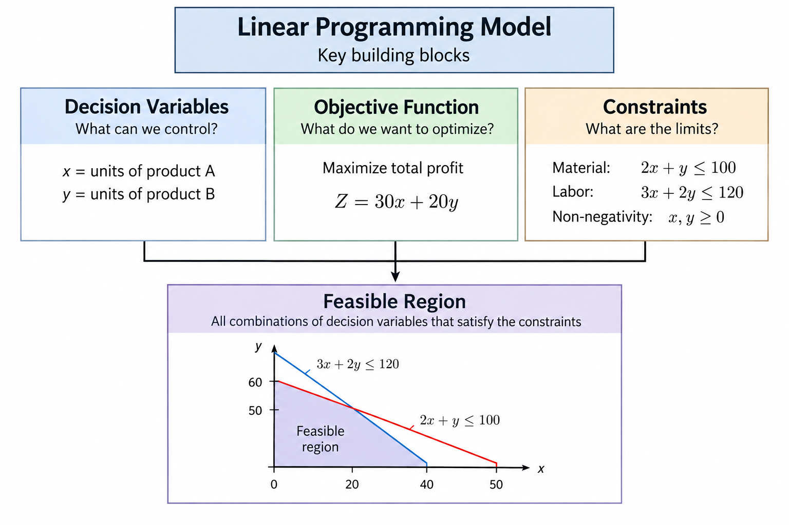
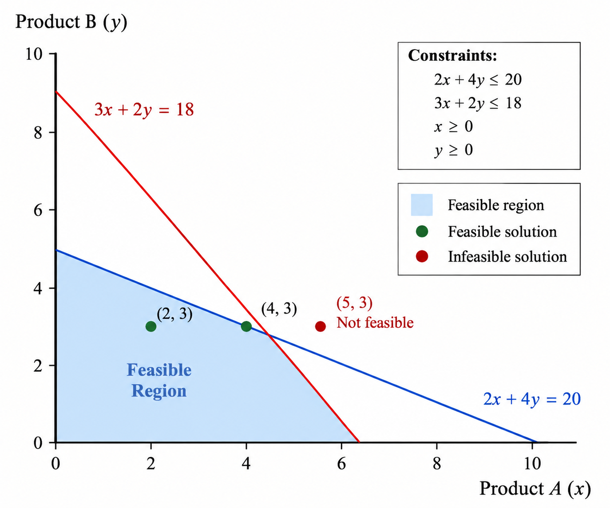

---
hide:
  - navigation
  
tags:
  - Linear Programming
  
---

#  Linear Programming Part 2 - Building Blocks
*The core building blocks of an LP problem. Decision variables, objective, constraints, feasible solutions, feasible region*

---
[▶ Linear Programming Part 0- About This Series](./LP-Pt0.md)

[▶ Linear Programming Part 1- Where LP Fits in AI Systems](./LP-Pt1.md)

[▶ Linear Programming Part 2- Fundamental Building Blocks](./LP-Pt2.md)

[▶ Linear Programming Part 3 - Solving LP Problems](./LP-Pt3.md)

[▶ Linear Programming Part 4 - Practical Scenarios](./LP-Pt4.md)

[▶ Linear Programming Part 5 - LP Algorithms](./LP-Pt5.md)

[▶ Linear Programming Part 6- LP vs Integer Programming vs Mixed-Integer Programming](./LP-Pt6.md)

[▶ Linear Programming Part 7- Limiations of LP](./LP-Pt7.md)

[▶ Linear Programming Part 8- Sensitivity Anddalysis](./LP-Pt8.md)

[▶ Linear Programming Part 9- Understanding Solver Output](./LP-Pt9.md)

[▶ Linear Programming Part 10- End to End Case Study](./LP-Pt10.md)

---

##  1. Essential Blocks 

A typical **Linear Programming (LP)** problem has a few key building blocks that are used to formulate an optimization problem.

The main building blocks are:

- **Decision Variables**: What can we choose or control?
- **Objective Function**: What are we trying to maximize or minimize?
- **Constraints**: What limitations or requirements must our decisions satisfy?

For example, a company may need to decide:

- How many units of each product to produce
- How to maximize its profit
- How to operate within available material and labor

These decisions, goals, and limitations can be expressed mathematically and combined into an LP problem.

The following sections introduce each building block step by step.

---

##  2. Decision Variables 

A **decision variable** represents something that we can **choose or control** in an optimization problem.

For example, suppose a company produces a product.

Let:

$$
x = \text{number of units to produce}
$$

Here, $x$ is the **decision variable** because the company can decide how many units to produce.

The value of $x$ is not known beforehand. The optimization process will determine the value that gives the best result while satisfying the constraints.

### Example

Suppose the company can produce between 0 and 100 units:

$$
0 \leq x \leq 100
$$

The decision variable is still simply:

$$
x
$$

The numbers 0 and 100 are **constraints** on that variable.

### Two Decision Variables

Many real problems involve more than one decision.

Suppose a company produces two products:

$$
x = \text{number of Product A units}
$$

$$
y = \text{number of Product B units}
$$

Now the optimization problem needs to determine two values:

$$
x,\ y
$$

For example:

$$
x = 3,\qquad y = 5
$$

would represent producing 3 units of A and 5 units of B.

So, the first question to ask when building an LP problem is:

> **What decisions do I need to make?**

Those decisions become the **decision variables**.

---
##  3. Objective Function 

The **objective function** defines what we want to **maximize or minimize**.

It represents the result we are trying to optimize based on the values of our decision variables.

For example, suppose a company produces two products:

$$
x = \text{number of Product A units}
$$

$$
y = \text{number of Product B units}
$$

If each unit of Product A gives $10 profit and each unit of Product B gives $15 profit, the total profit is:

$$
10x + 15y
$$

If the goal is to maximize profit, the objective function is:

$$
\boxed{\text{Maximize } 10x + 15y}
$$

The optimization process will try to find values of $x$ and $y$ that produce the **highest possible value** of the objective function while still satisfying all constraints.

### Maximization vs Minimization

An objective can be either **maximized** or **minimized**.

Examples of maximization:

- Maximize profit
- Maximize production
- Maximize revenue

Examples of minimization:

- Minimize cost
- Minimize delivery time
- Minimize resource usage

For example, if producing a product costs $8 for A and $12 for B, and the goal is to minimize production cost:

$$
\boxed{\text{Minimize } 8x + 12y}
$$

So, the second question to ask when building an LP problem is:

> **What do I want to maximize or minimize?**

The answer becomes the **objective function**.

---
##  4. Constraints 

**Constraints** define the **limitations or requirements** that our decisions must satisfy.

They determine which values of the decision variables are allowed.

Using our previous example:

$$
x = \text{number of Product A units}
$$

$$
y = \text{number of Product B units}
$$

Suppose producing the products requires material and labor.

If we have at most 20 units of material:

$$
2x + 4y \leq 20
$$

If we have at most 18 hours of labor:

$$
3x + 2y \leq 18
$$

These are constraints because they limit how much of each product we can produce.

### Non-Negativity Constraints

We also normally cannot produce a negative number of products.

Therefore:

$$
x \geq 0
$$

$$
y \geq 0
$$

These are also constraints.

### Types of Constraints

Constraints can represent different kinds of requirements:

**Resource limits**

$$
2x + 4y \leq 20
$$

**Minimum requirements**

$$
x + y \geq 10
$$

**Exact requirements**

$$
x + y = 10
$$

The important point is that constraints define the **boundaries within which the decision variables can be chosen**.

So, the third question to ask when building an LP problem is:

> **What limitations or requirements must my decisions satisfy?**

The answers become the **constraints** of the LP problem.

---
##  5. Putting the Three Blocks Together 

We now have the three main building blocks:

1. **Decision Variables**: What can we choose?
2. **Objective Function**: What do we want to maximize or minimize?
3. **Constraints**: What limitations or requirements must we satisfy?

Let's combine them into one simple LP problem.

### Example

Suppose a company produces two products:

$$
x = \text{number of Product A units}
$$

$$
y = \text{number of Product B units}
$$

Assume the following:

| | Product A | Product B |
|---|---:|---:|
| Profit per unit | $10 | $15 |
| Material required per unit | 2 units | 4 units |
| Labor required per unit | 3 hours | 2 hours |

The company has:

- **20 units of material available**
- **18 hours of labor available**

The company wants to determine how many units of each product to produce.

### Step 1: Decision Variables

The decisions we need to make are the quantities of the two products:

$$
x = \text{number of Product A units}
$$

$$
y = \text{number of Product B units}
$$

---

### Step 2: Objective Function

Each unit of Product A generates **profit of $10**, and each unit of Product B generates **profit of $15**.

Therefore, total profit is:

$$
\text{Profit} = 10x + 15y
$$

Since the company wants to maximize profit:

$$
\boxed{\text{Maximize } 10x + 15y}
$$

---

### Step 3: Constraints

Each unit of Product A requires **2 units of material**, while each unit of Product B requires **4 units**.

Since only **20 units of material** are available:

$$
2x + 4y \leq 20
$$

Each unit of Product A requires **3 hours of labor**, while each unit of Product B requires **2 hours**.

Since only **18 hours of labor** are available:

$$
3x + 2y \leq 18
$$

We also cannot produce a negative number of products:

$$
x \geq 0
$$

$$
y \geq 0
$$

### Complete LP Formulation

Putting everything together:

$$
\boxed{\text{Maximize } 10x + 15y}
$$

Subject to:

$$
2x + 4y \leq 20
$$

$$
3x + 2y \leq 18
$$

$$
x \geq 0
$$

$$
y \geq 0
$$

We have now **formulated** the LP problem.

The next step is to understand which combinations of $x$ and $y$ are feasible and which one gives the optimal result.

---
##  6. Feasible Solutions 

Once an LP problem has been formulated, not every possible value of the decision variables is acceptable.

A **feasible solution** is a set of decision-variable values that satisfies **all constraints**.

Using our previous example:

$$
2x + 4y \leq 20
$$

$$
3x + 2y \leq 18
$$

$$
x \geq 0
$$

$$
y \geq 0
$$

---
 Feasible Solution 1 

Consider the solution (we'll show how to find solution later):

$$
x = 2,\qquad y = 3
$$

We can check each constraint.

**Material:**

$$
2(2) + 4(3) = 16 \leq 20
$$

**Labor:**

$$
3(2) + 2(3) = 12 \leq 18
$$

**Non-negativity:**

$$
2 \geq 0,\qquad 3 \geq 0
$$

All constraints are satisfied, so:

$$
(x,y) = (2,3)
$$

is a **feasible solution**.

---
 Feasible Solution 2 

Now consider  another valid solution :

$$
x = 4,\qquad y = 3
$$

Material:

$$
2(4) + 4(3) = 20
$$

Labor:

$$
3(4) + 2(3) = 18
$$

This solution also satisfies all constraints, so it is feasible.

---
 A NOT Feasible solution 

However, consider:

$$
x = 5,\qquad y = 3
$$

Material:

$$
2(5) + 4(3) = 22 > 20
$$

The material constraint is violated, so this is **not a feasible solution**.

---

##  7. Feasible Region 

When there are two decision variables, we can visualize all feasible solutions on a graph.

The collection of all points that satisfy **every constraint** is called the **feasible region**.

In simple terms:

> **Feasible region = all possible decisions that are allowed by the constraints.**

The optimization problem then looks for the best solution **within this feasible region**.

This gives us an important distinction:

- **Feasible solution**: One specific solution that satisfies all constraints.
- **Feasible region**: All solutions that satisfy all constraints.
- **Optimal solution**: The feasible solution that gives the best objective value.

---
##  8. Summary 

An LP problem can be understood through three essential building blocks:

1. **Decision Variables**: What decisions can we make?
2. **Objective Function**: What do we want to maximize or minimize?
3. **Constraints**: What limitations or requirements must our decisions satisfy?

Once these are defined, we can formulate the complete LP problem.

The constraints determine the **feasible region**, which contains all possible solutions that satisfy the requirements.

The optimization process then looks for the **optimal solution**, which is the feasible solution that gives the best value for the objective.

In simple terms:

$$
\boxed{
\text{Decision Variables}
\rightarrow
\text{Objective}
\rightarrow
\text{Constraints}
\rightarrow
\text{Feasible Solutions}
\rightarrow
\text{Optimal Solution}
}
$$

These concepts form the foundation for understanding and solving Linear Programming problems.

---
## Relevant Link(s)

[AI in Context Main Page](../../index.md)

