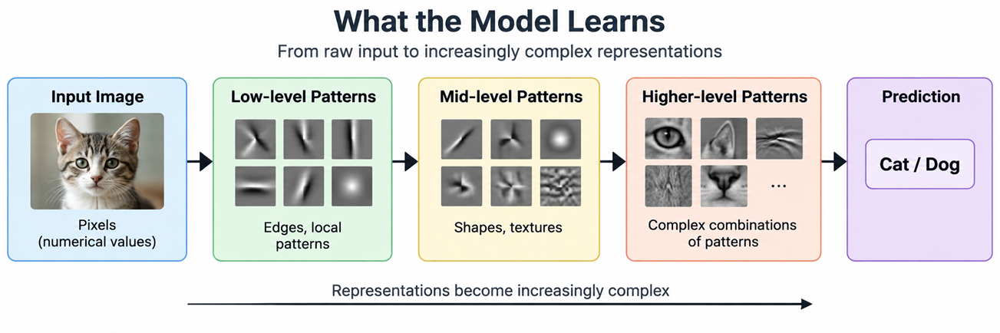
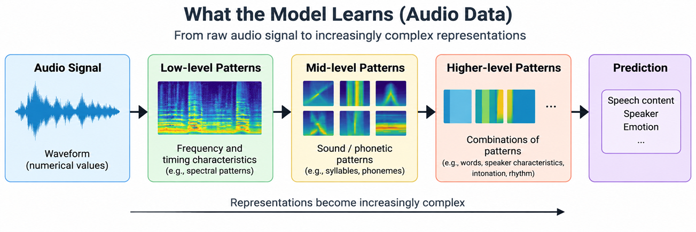

---
hide:
  - navigation
  
tags:
  - Representation Learning
 
---

# <font color='tomato'> Representation Learning in AI</font>
*How Machine Learning Models Learn Useful Representations (Features) Directly from Data.*

Pre-requisite concepts:


[Data Features in AI](dataandfeatures.md)

[Feature Engineering in AI](featureeng.md)


---



---

## <font color='green'>1. What is Representation Learning?</font>

In traditional machine learning, we often start by deciding which features should represent the data.

For example, given raw health-monitoring data, an engineer might extract:

```text
Heart rate
Blood pressure
Temperature
Heart-rate variability
```

These hand-crafted features are then given to a machine-learning model.

<font color='red'>But what if the useful characteristics of the data are not obvious?</font>

For example, 

Instead of requiring a human to define every useful feature, a machine-learning model can **learn a representation from the data itself**.

This is called **representation learning**.


### **An example: Issues with handcrafted feature approach**

Consider a simple image-classification problem: **distinguishing cats from dogs**.

A human could try to design features such as:

- Face shape
- Ear shape
- Ear position
- Nose shape and size
- Eye position
- Fur texture
- Body shape
- Snout length

But this quickly becomes difficult.

A feature that seems useful in one image may not work in another. A dog may have a face that looks similar to a cat. Different breeds can look very different. The animal may be sitting, lying down, partially hidden, viewed from the side, or photographed under different lighting conditions.

More importantly, the useful information may not be a single obvious feature such as "nose size" or "face shape". It may be a **combination of many patterns in the image**.

For example:

```text
Image
   |
   +-- Edges
   +-- Shapes
   +-- Textures
   +-- Local patterns
   +-- Spatial relationships
   +-- Combinations of patterns
   |
   v
"Cat" or "Dog"
```

---
It is difficult to manually define all of these patterns and all the combinations that might matter.

Instead, a machine-learning model can learn which patterns and combinations are useful from a large collection of labelled cat and dog images.

This is the central idea behind **representation learning**:

> **Instead of manually specifying all the useful features, let the model learn useful representations from the data.**


### **From Raw Data to Learned Representations**

The basic idea can be illustrated as:

```text
Raw Data
   |
   v
Learning Process
   |
   v
Learned Representation
   |
   v
Machine-Learning Task
   |
   v
Prediction
```

<font color='red'>The learned representation is an intermediate form of the original data.</font>

For example, consider an image.

The raw input may contain thousands or millions of pixel values:

```text
Pixel values
   |
   v
Learned representation
   |
   v
Image classification
```

> The model does not need the engineer to explicitly define every useful visual characteristic.

During training, it can learn patterns in the data that help with the task.


---
## <font color='green'>2. How Models Learn Representations</font>

If we are not manually defining the features, then an obvious question is:

<font color='red'>**How does the model actually learn them?**</font>

> The basic idea is the same as machine learning in general: **the model learns from examples.**


Consider the cat-versus-dog problem again.

We provide the model with many training examples:

```text
Image 1  →  Cat
Image 2  →  Dog
Image 3  →  Cat
Image 4  →  Dog
...
```

Initially, the model does not know which patterns are useful for distinguishing the two classes.

During training, the model processes the images, makes predictions, compares those predictions with the correct labels, and adjusts its internal parameters.

```text
Training Images
      |
      v
    Model
      |
      v
  Prediction
      |
      v
Compare with
correct label
      |
      v
Adjust parameters
      |
      +------------------+
                         |
                         v
                    Train again
```

As this process is repeated over many examples, the model gradually learns internal representations that help reduce its prediction errors.

---
## <font color='green'>3. What Is Actually Being Learned?</font>

The model is not simply memorizing a list such as:

```text
Cats → small nose
Dogs → large nose
```

Instead, it can learn combinations of patterns that are useful for the task.

For an image, these patterns can start with relatively simple structures:

```text
Pixels
   |
   v
Edges and local patterns
   |
   v
Shapes and textures
   |
   v
Parts of objects
   |
   v
Higher-level visual patterns
```


**<font color='red'>The exact representations learned depend on the model architecture, training data, and learning objective.**</font>

The important point is that **the engineer does not have to explicitly specify all these intermediate features**.

> The model discovers useful patterns by adjusting its parameters during training, such as edges, textures, shapes, etc.

---
## <font color='green'> 4. Learning from the Training Signal </font>

The model needs some way to determine whether its current representation is useful.

In supervised learning, the target labels provide this signal.

For example:

```text
Input image       Correct label
------------      -------------
Image of cat --->  Cat
Image of dog --->  Dog
```

If the model predicts incorrectly, the training process uses the error to update the model.

Over time, representations that help distinguish the classes are reinforced through the learning process.

This gives us a more concrete view of representation learning:

```text
Raw Data
   |
   v
Model parameters
   |
   v
Learn patterns
   |
   v
Internal representation
   |
   v
Prediction
   |
   v
Error
   |
   v
Update parameters
   |
   +-------------------->
        Repeat
```

Representation learning is therefore not a separate process added before machine learning.

**The representation is learned as part of the model's training process.**

---
## <font color='green'>4. Hierarchical Representations</font>

A learned representation does not have to be created in a single step.

Many machine-learning models learn representations in **multiple levels**, where simpler patterns are combined to form more complex patterns.

Consider an image again.

At an early stage, the model may learn relatively simple visual patterns such as:

```text
Pixels
   |
   v
Edges and local patterns
   |
   v
Shapes and textures
   |
   v
Parts of objects
   |
   v
Higher-level visual patterns
```

For example, edges can combine to form shapes. Shapes and textures can combine to represent parts of an object. These patterns can then be combined into more complex representations that help with the classification task.

For a cat-versus-dog classifier, this can be illustrated conceptually as:

```text
Pixels
   |
   v
Edges and local patterns
   |
   v
Shapes and textures
   |
   v
Object parts
   |
   v
Higher-level visual patterns
   |
   v
Cat / Dog
```

The model does not explicitly create features named "ear", "nose", or "face".

These are human descriptions that help us understand what the learned representations may capture. Inside the model, the representations are numerical values produced by mathematical operations.

The important idea is that **later representations can be built from earlier representations**.

This allows a model to learn increasingly complex patterns from the original data instead of requiring an engineer to manually define every possible combination of features.

The same general idea can apply to other types of data.

For example, in speech:

```text
Audio signal
   |
   v
Basic sound patterns
   |
   v
Phonetic patterns
   |
   v
Words
   |
   v
Higher-level language patterns
```

The exact representations learned depend on the model architecture, training data, and learning objective.

The key idea is that **representation learning can build useful representations at multiple levels, from relatively simple patterns to more complex combinations.**

---
## <font color='green'>5. Examples of Learned Representations</font>

Representation learning is used with many different types of data.

The form of the learned representation depends on the data and the task.

### **Images**

For an image-classification task, a model can learn visual patterns directly from pixel values.

```text
Image
   |
   v
Learned visual representation
   |
   v
Image classification
```

The representation may capture patterns related to shapes, textures, object parts, and their spatial relationships.

For example, a model trained to classify cats and dogs can learn representations that help distinguish the two classes without requiring an engineer to manually define every visual feature.

### **Audio**

For an audio task, the input may be a waveform or another numerical representation of the sound.

```text
Audio signal
   |
   v
Learned audio representation
   |
   v
Speech / Speaker / Emotion classification
```



Depending on the task, the learned representation may capture patterns related to speech sounds, frequency characteristics, timing, or combinations of these patterns.

### **Text**

For text, the input is converted into numerical representations that a model can process.

```text
Text
   |
   v
Learned representation
   |
   v
Text classification / Prediction / Generation
```

The learned representation can capture relationships between tokens and patterns in how they are used in context.

For example, in a text-classification task, the model can learn representations that help distinguish between different categories of text.

### **Time-Series Data**

Time-series data contains measurements collected over time, such as sensor readings, financial measurements, or machine telemetry.

```text
Time-series data
   |
   v
Learned representation
   |
   v
Prediction / Classification / Anomaly detection
```

The model can learn patterns involving changes over time, repeated behaviours, and relationships between measurements.

### **Different Data, Same Basic Idea**

Although the data types are different, the underlying idea is similar:

```text
Raw Data
   |
   v
Model
   |
   v
Learned Representation
   |
   v
Task
```

The representation is learned from the data as part of the model's training process.

What changes is the type of data, the model architecture, and the task for which the representation is learned.


---
## <font color='green'>7. Common Representation Learning Algorithms</font>

Some commonly used representation-learning approaches include:

Some commonly used representation-learning algorithms and methods include:

- Principal Component Analysis (PCA)
- Non-negative Matrix Factorization (NMF)
- Independent Component Analysis (ICA)
- Autoencoders
- Variational Autoencoders (VAEs)
- Word2Vec
- GloVe
- FastText
- Matrix Factorization
- Restricted Boltzmann Machines (RBMs)

Detailed explanations of these algorithms are beyond the scope of this article. They will be covered separately in other articles in this **AI in Context** series.


---
## <font color='green'>Summary and Takeaways</font>

Representation learning allows machine-learning models to **learn useful representations directly from data** instead of relying entirely on manually designed features.

The main ideas covered in this article are:

- Traditional machine learning often starts with **human-designed features**.
- Representation learning allows the model to **learn representations from training data**.
- The learned representation is an **intermediate numerical form of the original data**.
- Models learn representations by adjusting their parameters during training.
- Learned representations can contain **combinations of patterns** that may be difficult to define manually.
- Representations can be learned at **multiple levels**, from relatively simple patterns to more complex patterns.
- The exact representations depend on the **model architecture, training data, and learning objective**.
- Representation learning is used with many types of data, including **images, audio, text, and time-series data**.
- Feature engineering and representation learning differ mainly in **how the representation is obtained**: humans design features in one case, while the model learns representations in the other.
- The two approaches can also be **combined** in the same machine-learning system.

The overall idea can be summarized as:

```text
Raw Data
   |
   v
Learned Representation
   |
   v
Machine-Learning Task
   |
   v
Prediction
```

> **Representation learning shifts part of the work of representing data from the human engineer to the learning process of the model.**


---
## Relevant Link(s)

[AI in Context Main Page](../../index.md)

[Data Features in AI](dataandfeatures.md)

[Feature Engineering in AI](featureeng.md)


