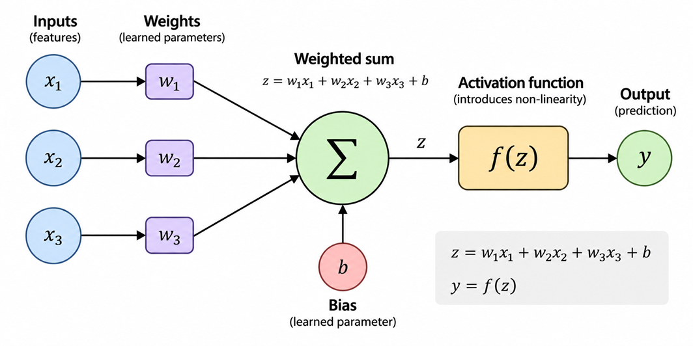
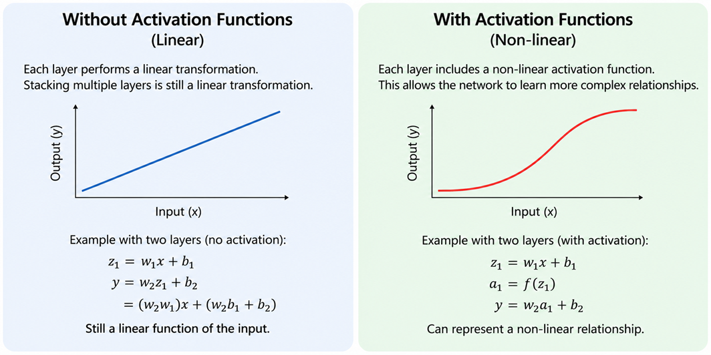

---
hide:
  - navigation
  
tags:
  - Neural Networks 
 
---

# <font color='tomato'>Neural Network Fundamentals - Part 1: Understanding How Neural Networks Work</font>
*How a Neural Network Transforms Inputs into Outputs Using Weights and Activation Functions.*


---
## <font color='green'>1. Why Neural Networks?</font>

Many real-world problems involve finding a relationship between **inputs and outputs**.

For example:

```text
Inputs                         Output

Patient measurements    --->   Health risk
House characteristics   --->   House price
Image                   --->   Cat / Dog
Audio signal            --->   Speech / Speaker
Text                    --->   Classification
```

For simple problems, we can sometimes describe this relationship using explicit rules or a relatively simple mathematical function.

But many real-world relationships are much more complex.

Consider an image-classification problem. We want to determine whether an image contains a cat or a dog.

A simple rule such as:

```text
If nose size > X
    -> Dog
else
    -> Cat
```

will not work reliably.

The appearance of an animal can vary because of its breed, pose, viewpoint, lighting, background, and many other factors. The useful information may also depend on combinations of many patterns rather than one simple measurement.

The same problem appears in other areas:

```text
Raw Data                  Desired Output

Image                  -> Cat / Dog
Audio                  -> Speech / Speaker
Text                   -> Category / Meaning
Sensor measurements    -> Prediction
Financial data         -> Risk / Price
```

Writing explicit rules for all the possible combinations becomes difficult.

This is where machine learning becomes useful.

<font color='red'> Read this article for more details [Evolution of Computing: From rules to Goals](../../blog/posts/2026-06-19-EvolutionOfComuting_Rules_to_Goals.md) </font>

> Instead of explicitly programming the relationship between every possible input and output, we can provide examples and allow a model to **learn a function that maps inputs to outputs**.


> A neural network is one type of machine-learning model that can learn these relationships.

At a high level, we can think of a neural network as a function:

```text
y = f(x)
```

where:

- `x` represents the input.
- `y` represents the output.
- `f` represents the function implemented by the neural network.

The important question is how the neural network defines this function.

It does this using **parameters**, particularly **weights** and **biases**, which determine how the inputs are transformed into outputs.

We will start with the simplest possible case: **a single neural-network node**.


---
## <font color='green'>2. A Single Neural Network Node</font>

A neural network is built from simple computational units called **nodes** or **neurons**.

To understand how a neural network works, we can start with just **one node**.

A node takes one or more input values and combines them using **weights**.



For example, suppose we have three inputs (as shown above):


```text
x₁ = 2
x₂ = 5
x₃ = 3
```

Each input has an associated weight:

```text
w₁ = 0.4
w₂ = 0.2
w₃ = -0.3
```

The node first multiplies each input by its corresponding weight and adds the results together.

```text
z = w₁x₁ + w₂x₂ + w₃x₃
```

Using the values above:

```text
z = (0.4 × 2) + (0.2 × 5) + (-0.3 × 3)
  = 0.8 + 1.0 - 0.9
  = 0.9
```

The node also has another parameter called the **bias**.


The weighted sum `z` is the value produced by combining the inputs, weights, and bias.

At this point, the node has **not yet produced its final output**.

The value `z` will be passed through an **activation function**, which determines the node's output.

```text
Inputs
   |
   v
Multiply by weights
   |
   v
Add weighted values + bias
   |
   v
Weighted sum (z)
   |
   v
Activation function
   |
   v
Output
```

The weighted-sum calculation is straightforward.

The important idea is that the **weights control how much each input contributes to the result**.

A positive weight increases the contribution of an input, while a negative weight reduces it. A weight close to zero means that the corresponding input has relatively little influence on the weighted sum.

The bias provides an additional adjustable value that shifts the result.

These parameters, **weights and bias**, are what ultimately determine the behaviour of the node.

In [Neural Network Fundamentals - Part 2: Training Neural Networks](nnp2.md), we will see how these parameters are learned during training.


---
## <font color='green'>3. Forward Propagation</font>

**Forward propagation** is the process of passing the input through the neural network to produce an output.

For a single node:

```text
Inputs
   |
   v
Weighted sum + bias
   |
   v
z
   |
   v
Output
```

The node calculates:

```text
z = w₁x₁ + w₂x₂ + w₃x₃ + b
```

The inputs are multiplied by their weights, added together, and combined with the bias.

The resulting value `z` is then passed to the **activation function** to produce the final output.

In simple terms:

```text
Input → Weighted Sum + Bias → z → Activation → Output
```

This flow from **input to output** is called **forward propagation**.


---
## <font color='green'>4. Activation Function</font>

The **activation function** takes the value produced by the weighted sum and transforms it into the node's output.

```text
Weighted sum + bias
        |
        v
        z
        |
        v
Activation function
        |
        v
     Output
```

In mathematical form:

```text
y = f(z)
```

<font color='red'> **Important Note for Anyone Who Are Interested in Fundamentals** </font>

For a single node, we could simply use the weighted sum as the output. The important reason for using an activation function becomes clear when we have **many nodes and layers**.

Without activation functions, every node would perform only a **linear transformation**. Combining many such nodes and layers would still produce a linear relationship between the input and output.

That would provide little benefit (if none) over using a single linear model.

The activation function introduces **non-linearity**, allowing a neural network to learn more complex relationships.



```text
Without activation:

Input → Linear transformation → Linear transformation → Output

Still essentially linear


With activation:

Input → Linear transformation → Activation
     → Linear transformation → Activation → Output

Can represent non-linear relationships
```

This is the main reason activation functions are used in neural networks: **to introduce non-linearity so that multiple nodes and layers can learn complex relationships.**

The different types of activation functions and how they introduce non-linearity will be explored in more detail in the separate **Activation Functions** article.

More details on this in: [Activation Function and Nonlinearity](activationfunction.md)

---
## <font color='green'>5. Example-1</font>

Let's use a simple example where a neuron classifies an animal as a **Cat** or **Dog** based on three features.

### 1. Example Feature Ranges

For illustration, assume the following approximate ranges:

| Feature | Cat | Dog |
|---|---:|---:|
| Weight | 2-6 kg | 5-40 kg |
| Height | 20-30 cm | 20-70 cm |
| Ear length | 4-8 cm | 5-20 cm |

These ranges are only illustrative. Real cats and dogs have overlapping characteristics.

### 2. Neuron Weights

For this example, suppose the neuron has:

```text
w₁ = 0.5
w₂ = 0.3
w₃ = 0.2
b  = -0.3
```

The weights and bias are **chosen for this example**. We are not explaining how they are learned here. That is covered in **Part 2: Training Neural Networks**.

### 3. Example: Dog

Suppose the animal has:

```text
Weight     = 15 kg
Height     = 45 cm
Ear length = 12 cm
```

Therefore:

```text
x₁ = 15
x₂ = 45
x₃ = 12
```

### 4. Normalized Input Values

Before being given to the neuron, these measurements would normally be **normalized** so that features with different scales can be used together.

For this example, assume the normalized values are:

```text
x₁ = 0.33
x₂ = 0.50
x₃ = 0.53
```

Normalization itself is not the focus here and will be covered separately.

### 5. Calculate the Output

The neuron calculates:

```text
z = w₁x₁ + w₂x₂ + w₃x₃ + b

  = (0.5 × 0.33) + (0.3 × 0.50) + (0.2 × 0.53) - 0.3

  = 0.165 + 0.150 + 0.106 - 0.3

  = 0.121
```

Using a simple step activation:

```text
z < 0  → Cat
z ≥ 0  → Dog
```

Since `z = 0.121`:

```text
Output = Dog
```

The important point is that the neuron takes the **three input features**, applies their **weights**, adds the **bias**, and produces a value that is then converted into a prediction.

The weights and bias used here are simply chosen to demonstrate the calculation. In a real neural network, these values are learned from training data.


---
## <font color='green'>6. Example-2</font>

Now let's use the **same neuron, with exactly the same weights and bias**, but give it the parameters of a cat.

### 1. Cat Parameters

Suppose the animal has:

```text
Weight     = 4 kg
Height     = 25 cm
Ear length = 6 cm
```

Therefore:

```text
x₁ = 4
x₂ = 25
x₃ = 6
```

### 2. Normalized Input Values

Assume the normalized values are:

```text
x₁ = 0.10
x₂ = 0.25
x₃ = 0.30
```

### 3. Calculate the Output

The neuron uses the **same weights and bias** as in Example 1:

```text
w₁ = 0.5
w₂ = 0.3
w₃ = 0.2
b  = -0.3
```

It calculates:

```text
z = w₁x₁ + w₂x₂ + w₃x₃ + b

  = (0.5 × 0.10) + (0.3 × 0.25) + (0.2 × 0.30) - 0.3

  = 0.050 + 0.075 + 0.060 - 0.3

  = -0.115
```

Using the same step activation:

```text
z < 0  → Cat
z ≥ 0  → Dog
```

Since `z = -0.115`:

```text
Output = Cat
```

The important point is that **nothing about the neuron changed**. The weights and bias remained exactly the same. Only the input values changed, producing a different output.


---
## <font color='green'>7. The Key Idea: The Weights</font>

The examples above show the basic mechanism of a neural-network node:

```text
Inputs
   ↓
Weights + Bias
   ↓
Weighted Sum
   ↓
Activation
   ↓
Output
```

The important part is that the **weights control how strongly each input affects the result**.

For example:

```text
z = w₁x₁ + w₂x₂ + w₃x₃ + b
```

Changing the weights changes the behaviour of the neuron.

A weight can:

- Increase the influence of an input.
- Decrease the influence of an input.
- Reverse the influence of an input when it is negative.

The bias also affects the final result by shifting the value of `z`.

Therefore, the weights and biases effectively determine **what the neuron learns to respond to**.

> In our examples, we manually chose the weights and bias just to demonstrate how the neuron works.

> In a real neural network, we do not manually choose these values. The network **learns them from training data** by repeatedly comparing its predictions with the expected outputs and adjusting the weights.

This process of learning the weights is called **training**.

Training neural networks will be covered in **[Neural Network Fundamentals - Part 2: Training Neural Networks](nnp2.md)**.


---
## Relevant Link(s)


[AI in Context Main Page](../../index.md)

[Neural Network Fundamentals - Part 2: Training Neural Networks](nnp2.md)

[Activation Function and Nonlinearity](activationfunction.md)

[Normalization of Inputs in Neural Networks](normalization.md)

[Evolution of Computing: From rules to Goals](../../blog/posts/2026-06-19-EvolutionOfComuting_Rules_to_Goals.md)
