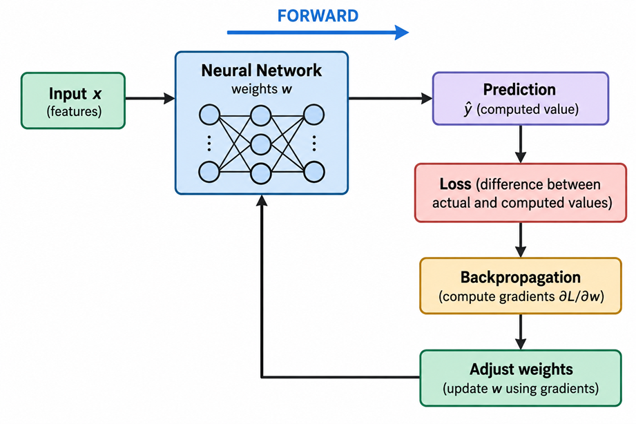

---
hide:
  - navigation
  
tags:
  - Neural Networks Training
  - Backpropagation
 
---

# <font color='tomato'>Neural Network Fundamentals - Part 2: Training Neural Networks</font>
*How Neural Networks Learn by Adjusting Their Weights from Training Data.*

This part is sequel to: [Neural Network Fundamentals - Part 1: Understanding How Neural Networks Work](nnp1.md)

---
## <font color='green'>1. Initializing the Weights</font>

Before a neural network can start training, it needs values for its **weights and biases**.

These values are called the model's **initial parameters**.

Usually, the weights are initialized with **small random values**, while biases are often initialized to zero.

For example:

```text
w₁ =  0.12
w₂ = -0.05
w₃ =  0.08

b = 0
```

These initial values are not meaningful predictions. They simply give the network a starting point.

The network will then use training data to gradually adjust these values.

```text
Initial weights
      ↓
Make predictions
      ↓
Compare with expected output
      ↓
Adjust weights
      ↓
Make better predictions
```

> <font color='red'> A neural network therefore does not start with the correct weights. **Training is the process of finding weights and biases that produce useful predictions.** </font>


---
## <font color='green'>2. What Is Training?</font>

**Training** is the process of adjusting a neural network's weights and biases so that its predictions become closer to the expected outputs.

The basic idea is:

```text
Training Data
     ↓
Neural Network
     ↓
Prediction
     ↓
Compare with Expected Output
     ↓
Adjust Weights
     ↓
Repeat
```

For example, suppose we are training a network to classify cats and dogs.

```text
Input            Expected Output

Cat features  →  Cat
Dog features  →  Dog
Cat features  →  Cat
Dog features  →  Dog

```

The network starts with its initial weights and makes predictions.

Those predictions will usually be wrong or imperfect at first.

The network then uses the difference between its **prediction** and the **expected output** to determine how its parameters should be adjusted.

This process is repeated over many training examples, gradually improving the model's predictions.

The key idea is:

> <font color='red'> **Training means learning the weights and biases from examples.** </font>


---
## <font color='green'>3. Training Data</font>

A neural network learns from **training data**.  Training data consists of examples containing:

- **Inputs**: the features given to the network.
- **Expected outputs**: the correct answers for those inputs.

For example, for a cat-versus-dog classifier:

| Weight | Height | Ear Length | Expected Output |
|---:|---:|---:|---|
| 4 kg | 25 cm | 6 cm | Cat |
| 15 kg | 45 cm | 12 cm | Dog |
| 5 kg | 28 cm | 7 cm | Cat |
| 20 kg | 50 cm | 14 cm | Dog |

The network takes the input features and produces a prediction.

It then compares that prediction with the **expected output**.

```text
Input Features
      ↓
Neural Network
      ↓
Prediction
      ↓
Compare with Expected Output
```

A training dataset normally contains **many examples**, not just the few examples shown above.

The variety of examples is important because the network needs to learn a general relationship between the inputs and outputs rather than simply memorize individual examples.

In the next step, we need a way to <font color='red'> measure </font> **how different the prediction is from the expected output**.

This is the role of the **loss function**.


---
## <font color='green'>4. Loss Function</font>

After making a prediction, the neural network needs to know <font color='red'>**how wrong that prediction is**.</font>

> A **loss function** measures the difference between the network's prediction and the expected output.

For example:

```text
Expected output = 1
Prediction       = 0.8
```

The prediction is close to the expected output, so the loss should be relatively small.

But if:

```text
Expected output = 1
Prediction       = 0.1
```

the prediction is much further away, so the loss should be larger.

Conceptually:

```text
Expected Output
       |
       | compare
       v
   Prediction
       |
       v
   Loss value
```

The loss function converts the prediction error into a **number**.

```text
Small loss  → prediction is closer to expected output
Large loss  → prediction is further from expected output
```

During training, the goal is to **reduce the loss** by changing the network's weights and biases.

However, the loss value alone does not tell us exactly **which weights should change or by how much**.

That is where **backpropagation** comes in.


## <font color='green'>5. Backpropagation</font>

> <font color='red'> **Backpropagation** is the process used to determine how the neural network's weights and biases should be adjusted to reduce the loss. </font>

The network first makes a prediction and calculates the loss:

```text
Input
  ↓
Neural Network
  ↓
Prediction
  ↓
Loss
```

Backpropagation then works **backward from the loss**, calculating how the loss changes with respect to each weight and bias.

```text
Loss
 ↓
Calculate gradients
 ↓
Determine how weights and biases should change
```

For example:

```text
w₁ → gradient
w₂ → gradient
w₃ → gradient
b  → gradient
```

A **gradient** tells us the direction and magnitude of change needed for a parameter to reduce the loss.

The weights are then updated using these gradients.

```text
Current weights
      ↓
Backpropagation
      ↓
Gradients
      ↓
Updated weights
      ↓
Lower loss
```

So, at a high level:

> **Backpropagation determines how the weights and biases should change to reduce the error.**



The actual mathematical update of the weights is performed using an **optimization algorithm**, such as gradient descent.


---
## <font color='green'>6. Gradient Descent</font>

Once backpropagation has calculated the gradients, the neural network needs a way to use those gradients to adjust its weights and biases.

**Gradient descent** is the most widely used optimization algorithm for minimizing the loss in neural networks.

The basic idea is simple:

```text
Current weights
      ↓
Calculate gradients
      ↓
Adjust weights
      ↓
Calculate loss again
      ↓
Repeat
```

The weights are adjusted in the direction that reduces the loss.

Other commonly used optimization algorithms include:

- Stochastic Gradient Descent (SGD)
- Momentum
- RMSProp
- Adam
- Adagrad

Different optimizers use different strategies for updating the weights, but their goal is the same: **reduce the loss and improve the network's predictions**.

The mathematical details of gradient descent and other optimization algorithms will be covered separately.

Different **loss functions** are also used for different types of neural network tasks. Examples include:

- Mean Squared Error (MSE)
- Mean Absolute Error (MAE)
- Cross-Entropy Loss
- Binary Cross-Entropy
- Categorical Cross-Entropy

Various loss functions and when to use them will be covered in other articles in this **AI in Context** series.

---
## <font color='green'>7. Putting Training Together</font>

We can now put the complete training process together.

For each training example, the neural network:

```text
1. Takes the input x
        ↓
2. Performs forward propagation
        ↓
3. Produces a prediction
        ↓
4. Calculates the loss
        ↓
5. Backpropagation calculates the gradients
        ↓
6. Gradient descent adjusts the weights and biases
        ↓
7. Repeat with more training examples
```

This process is repeated many times over the training data.

As the weights and biases are adjusted, the network generally becomes better at producing predictions that match the expected outputs.

In simple terms:

> **Training a neural network means repeatedly making predictions, measuring the error, calculating how the weights should change, and updating them to reduce the error.**


---
## Relevant Link(s)

[AI in Context Main Page](../../index.md)

[Neural Network Fundamentals - Part 1: Understanding How Neural Networks Work](nnp1.md)

[Normalization of Inputs in Neural Networks](normalization.md)

[Activation Function and Nonlinearity](activationfunction.md)


