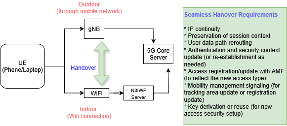

# N3IWF- Seamless handover between 5G and Wifi 
<!-- more -->
---

## Main idea of this blog
If you're looking for an introduction to N3IWF, feel free to check out my earlier blog post:
**[N3IWF Basics](2025-07-25-N3IWF.md)**

In this post, I’ll be sharing some insights and experiences on how N3IWF can be applied to support handover between 5G and gNB.

### Goal

## N3IWF for handover between 5G and Wifi
- A key feature of N3IWF is **seamless handover and mobility** — for example, a user moving from an outdoor cellular network into an indoor Wi-Fi environment should experience no service interruption.

- However, not all N3IWF implementations support this functionality. Some vendor solutions may lack this capability, so it’s important to understand the required features and resources when evaluating or deploying an N3IWF solution.

## What happens during the seamless handover
During handover between gNB and Wi-Fi via N3IWF, several things happen behind the scenes to ensure a smooth transition:

- IP continuity is maintained by anchoring the IP address at the UPF, so the user doesn't lose connectivity.

- Security tunnels (IPSec/IKEv2) are re-established when switching to or from Wi-Fi via N3IWF.

- Session and mobility context is preserved by the AMF and SMF to avoid re-authentication or session resets.

- User data is rerouted through the new access path (N3 or N3IWF), while QoS policies may be updated if needed.

## Hardware and Software Requirments
There are specific requirements that must be fulfilled both on the UE side and on the vendor side — particularly within the 5G Core — to support seamless handover using N3IWF.

### Hardware Requirements (Minimal)
|Device|Purpose|
|---|---|
|WiFi Access Point| Connect UE (phone or laptop) to the N3IWF via WiFi|
|PC/Server running N3IWF| Should support IPSec/IKEv2 and N2/N3 toward the 5G Core|
|PC/server running 5G Core| Components: AMF, SMF, UPF, UDM, AUS, NRF (from Open5GCore, Free5GC, or vendor)|
|Real UE (phone, laptop)| Needs IPSec client and connect SIM/eSIM credentials (with EAP-AKA or EAP-TLS support)|

### Software Requirements
|Software Component|details|
|---|---|
|N3IWF software| Must support IPSec/IKEv2 + EAP-AKA or EAP-TSL|
|5G Core software| Need AMF, SMF, UPF, AUSF, UDM (Open5GCore or Free5GC work|
|IPSec/IKEv2 client on UE| For Windows: strongSwan, For Android: built-in if using eSIM|
|Configuration scripts| To define UE Sim profile, keys, and network slicing info|
|(optional) Traffic generatror| ipref, ping, Wireshark for testing data sessions over N3|

### Key setup steps

Under construction...please come back later

