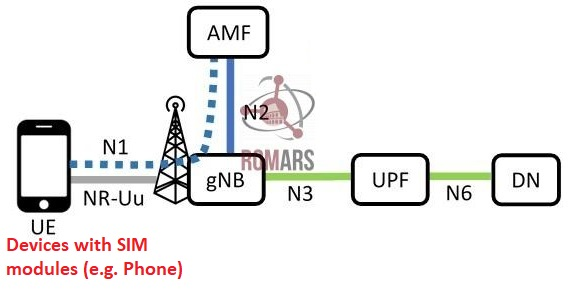
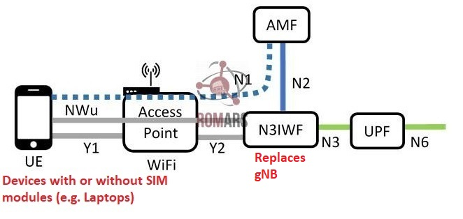

# N3IWF- Basic Concept

N3IWF stands for **Non-3GPP Interworking Function**. It is officially part of the 5G standard, as defined by the 3rd Generation Partnership Project (3GPP).

## What is 3GPP?
3GPP is a global collaboration of telecommunications standards organizations that develops the technical specifications for mobile networks, including:

    3G (UMTS)
    4G (LTE)
    5G (5G NR, 5G Core)
    Now working on 6G concepts (as of 2025)

## Traditional Connection (without N3IWF)
A user equipement (UE) such as a mobile phone is connected to the core network through a basestation. 
This requires antennas and necessary equipment on the UE itself. 

## Connection Through N3IWF
In this case, a device such as a laptop is connected to the core mobile network through a gateway, which provides connections and necessary protocol conversion.

N3IWF is a gateway between untrusted non-Mobile networks (like public WiFi) and the 5G core.

## Goals of N3IWF
There are several reasons for using N3IWF gateway.

- **Enhanced Security**: 5G communication is inherently more secure than Wifi (or other Non-3GPP) technologies. This way we can add SECURITY to untrusted networks like WiFi.

- **Low Avialbility of of Mobile Network**: Many environments—like homes, offices, factories, rural areas—don’t have great cellular coverage, but Wi-Fi, fixed broadband, or satellite are available.

- **Cost Reduction and Offloading**: Cellular spectrum is expensive and limited. Offloading to Wi-Fi saves capacity for users who truly need cellular bandwidth.

- **No Radio Connction Needed**:  Some devices — such as laptops, tablets, or IoT devices — don’t have cellular radios or SIM modules, so they can’t connect directly to 5G NR (New Radio).

- **Seamless Handover and Mobility**: A user walking from outdoors (cellular) into a building (Wi-Fi) should experience no service drop.

