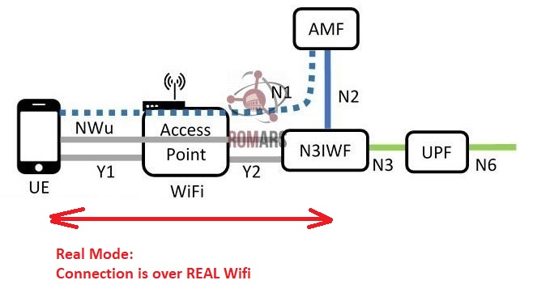
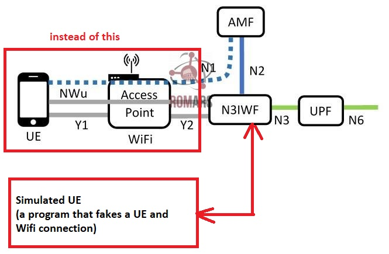

# N3IWF- A brief introduction
<!-- more -->
---

3GPP is a global collaboration of telecommunications standards organizations that develops the technical specifications for mobile networks, including:

    3G (UMTS)
    4G (LTE)
    5G (5G NR, 5G Core)
    Now working on 6G concepts (as of 2025)

3GPP has defined many functions and standard for 5G communications. One of them is N3IWF.
N3IWF stands for **Non-3GPP Interworking Function**, it is officially part of the 5G standard.


##1. Major components in a 5G  and where  5G-Core lies
A 5G mobile system can be broken in following three major components:

```
1. UE (e.g. A phhone)
2. gNB: Basestaion with antenna that provides connectivity to UE
3. 5G Core: A backend system that provides actualy functionality e.g.
user-authentication, internet access, communication among users etc.
```

An anology:
	```
	UE (Your phone) = A car
	gNB (5G tower) = The on-ramp to the highway
	5G Core = The traffic control center that:
		authenticates: Checks who you are
		routes your data: Allows you onto the highway, and routes you to the right destination
		security: keeps your data private and secure
	```


##2. What are 5G-Core functions
A 5G Core is an important part of 5G infrastructure which:
```
- Handles connections and movement between towers
- Stores your subscriber info and identity information
- Actually moves your data (like video, messages) across the network
- Keeps your data private and secure (encryption)
```
It implements major 5G functions and protocols such as AMF, SMF, UPF, **N3IWF**, etc.


### Where does N3IWF fit
N3IWF function of 5G lies **AFTER** gNB, hence it is part of 5G-Core components. In order to be able to use it, the 5G-core implementaiton must support N3IWF functionality.


##3. Connection without N3IWF (Traditional)
A user equipement (UE) such as a mobile phone is connected to the core network through a basestation. 
This requires antennas and necessary equipment on the UE itself. 


##4. Connection through N3IWF Gateway (bypass gNB)
In a N3IWF-based system, a UE device connects to 5G core **THROUGH A GATEWAY** (called N3IWF) , without involving gNB.

In this case, a device such as a laptop is connected to the core mobile network through a gateway, which provides connections and necessary protocol conversion.

N3IWF is a gateway between untrusted non-Mobile networks (like public WiFi) and the 5G core.


##5. Goals and benefits of N3IWF
There are several reasons for using N3IWF gateway.

- **Enhanced Security**: 5G communication is inherently more secure than Wifi (or other Non-3GPP) technologies. This way we can add SECURITY to untrusted networks like WiFi.

- **Low Avialbility of of Mobile Network**: Many environments—like homes, offices, factories, rural areas—don’t have great cellular coverage, but Wi-Fi, fixed broadband, or satellite are available.

- **Cost Reduction and Offloading**: Cellular spectrum is expensive and limited. Offloading to Wi-Fi saves capacity for users who truly need cellular bandwidth.

- **No Radio Connction Needed**:  Some devices — such as laptops, tablets, or IoT devices — don’t have cellular radios or SIM modules, so they can’t connect directly to 5G NR (New Radio).

- **Seamless Handover and Mobility**: A user walking from outdoors (cellular) into a building (Wi-Fi) should experience no service drop.


##6. "Real" vs "Simulated UE" modes
In N3IWF, a device can be connected in either of two modes:

- **Real mode:** In real mode, a physical device (phone, tablet, or PC) with proper support acts as the UE, and it connects to the 5G-Core through N3IWF over Wi-Fi.

- **Simulation mode:** you don’t need a real phone or device. The software itself pretends to be the UE and tests how it would behave when connecting to a N3IWF gateway. As long as N3IWF gateway is reachable (even without Wifi), we can reach 5G-Core and do experiemnts with 5G-core functions.

=== "Real Mode"
	


=== "Simulated UE Mode"
	


##7. Open5GCore and N3IWF
Open5GCore is a software implementation of the 5G Core network, developed by the Fraunhofer Institute in Germany, which:

```
- follows 3GPP standards (the official rules of how 5G works)
- implements major 5G Core network functions (like AMF, SMF, UPF, etc.)
- can be used in universities, private networks, or companies testing 5G tech
- Useful in non-3GPP access testing, such as:
    Secure enterprise Wi-Fi + 5G integration
```
- Open5GCore software includes an N3IWF implementation that supports both simulated UE mode and real UE mode.


- **Open5GCore does not support seamless handover between Wi-Fi (N3IWF) and 5G gNB** as a built-in, production-ready feature. Open5GCore does not support seamless handover from simulated UE (N3IWF over Wi-Fi) to a real gNB.

- We can test the following connections to Open5GCore **separately:**

    - Connect to Open5GCore over Wi-Fi (N3IWF) — real or simulated UE
    - Connect to Open5GCore over 5G gNB
    - Switch manually between Wi-Fi and 5G (disconnect Wi-Fi, then connect to 5G) — but the IP address will be reset, and the session will not be seamless


## 8. Summary

- A 5G network has three major components: UE, gNB, and 5G-Core
- N3IWF is an alternate method to bypass gNB and connect a UE to 5G-Core using a gateway called N3IWF.
- The benefits of N3IWF include: Security, availablity of 5G even when signals are not available everywhere (i.e ubiquity), Isolated testing of 5G Core, cost reduction, seamless handover during indoor and outdoors mobility.
- N3IWF implementations support two modes (either or both)
	- In simulated UE mode, the UE is virtual and runs inside the computer, using a simulated Wi-Fi environment — no real Wi-Fi or physical device is involved. This mode is mainly for easy testing and development.
	- In real UE mode, a real device can connect over actual Wi-Fi by establishing an IPSec tunnel to the N3IWF server, enabling real UE registration and session establishment via Wi-Fi. However, this requires additional setup of IPSec/IKEv2/EAP and proper SIM authentication.

- Open5GCore is an open-source implementaiton of 5G-Core, that includes N3IWF function as well (alongwith other 5G-Core functions such as AMF, SMF, UPF,...)

- Open5GCore does not support seamless inter-access handover between Wi-Fi (N3IWF) and 5G gNBaccess as a built-in, production-ready feature. Open5GCore does not support seamless handover from simulated UE (N3IWF over Wi-Fi) to a real gNB.

