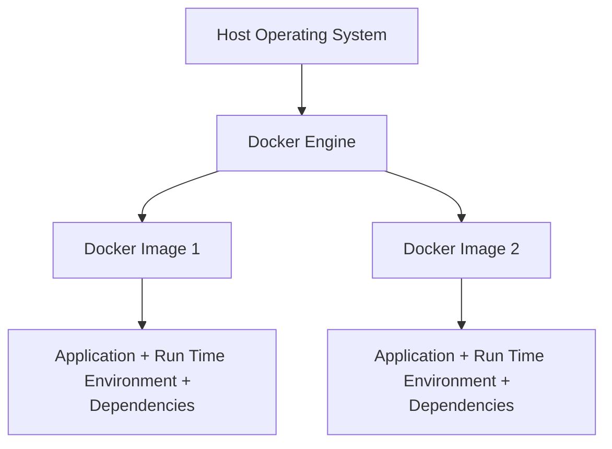
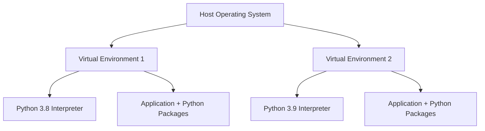

# Docker image vs Python virtual environment
While Docker and Python virtual environments both help manage software and dependencies, they have important differences. 

This section compares Docker and Python virtual environments to help understand these differences and choose the right tool for one's needs.
<!-- more -->

---
## 1. Introduction

**Docker Image:** 
A Docker image is a lightweight, standalone, and executable package that includes everything needed to run a piece of software (code, runtime, libraries, and system tools). It serves as a blueprint for creating Docker containers.

**Python venv:** 
A Python virtual environment is an isolated workspace that contains its own Python interpreter and site-packages directory, allowing projects to manage dependencies independently from the system-wide Python installation.

**How are they created** 
- Docker images are created using **the Docker tool**, a containerization utility that runs on Linux, Windows, and macOS.  
- Python virtual environments are created using the built-in **venv module** included with Python versions 3.3 and above.

---
## 2. Block diagrams

**Docker Diagram** 

---
**Venv Diagram** 

---
## 3. Python app as venv or docker iamge

- A Python app running in a venv isolates **only Python packages on the local system**, making it simple and lightweight for development. 

- A Python app as a Docker image **packages the entire environment—including the OS, runtime, and dependencies**, ensuring consistent behavior across any machine or production environment.

### 3.1 Key difference (Portability and Isolation)
- The main purpose of Docker is both **isolation and portability**, as it packages the entire application environment (including the OS and dependencies); so it can run consistently anywhere. 

- Whereas, Python venv focuses **mainly on isolation** of Python packages **within a single system** and **doesn’t provide portability** across different machines or operating systems.

- We can copy a Python virtual environment (venv) to another machine, but it may break due to absolute paths and system differences. It’s best to **recreate the venv** using a requirements file to ensure compatibility.

---
## 4. Other differences 
While both Docker images and Python virtual environments are designed to manage software dependencies and environments, they differ significantly in scope, use cases, and capabilities.

| Aspect    | Docker Image     | Python Virtual Environment (venv)  |
|------|---------------|--------------------------|
| **Scope of Isolation** | Full OS-level containerization including system libraries and binaries.  | Isolates only Python interpreter and packages.             |
| **Platform Independence** | Runs consistently across different OSes (Linux, Windows, macOS).    | Dependent on the host OS Python interpreter.                |
| **Resource Overhead**  | Higher resource usage due to containerization.   | Very lightweight; minimal overhead.    |
| **Complexity**   | Requires learning Docker concepts (images, containers, Dockerfiles).  | Simple, built-in Python tool, easy to create/manage.       |
| **Portability**    | Highly portable; images can run anywhere Docker is installed.    | Less portable; environments must be recreated on other machines.|
| **Dependency Management** | Manages all system-level and application dependencies.    | Manages only Python packages installed via pip or similar. |

---
## 5. Useful links

[Docker 101](https://mydigitalcomplex.com/sweng/containers/docker101/index.html)

[Python venv](https://mydigitalcomplex.com/programming/languages/python/python-env.html)

