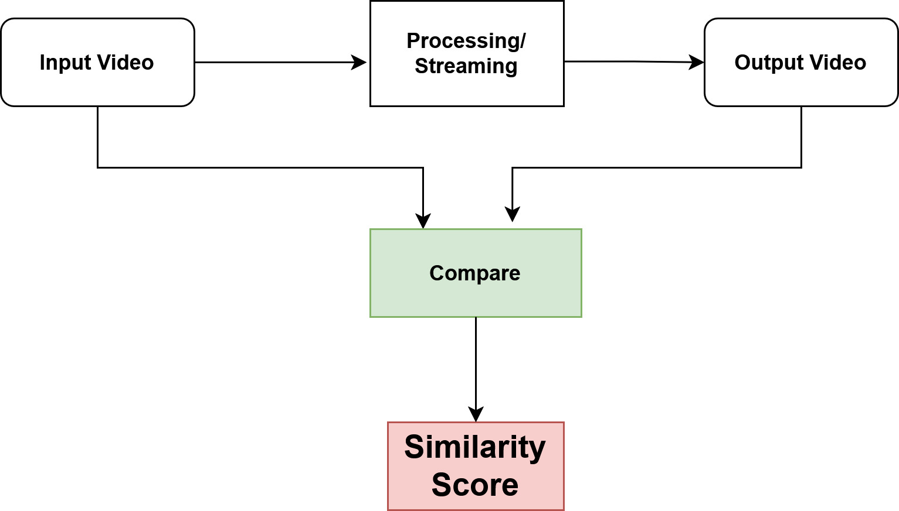
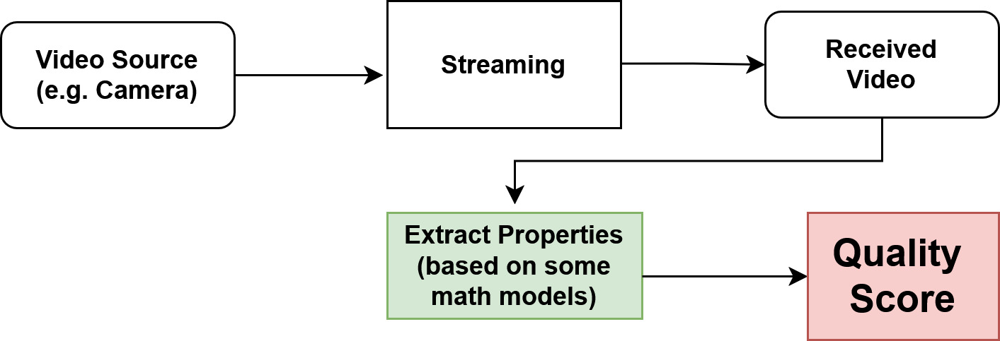

# Understanding Video Quality Assessment- Part 1

Video quality metrics like PSNR, SSIM, and VMAF were originally developed to evaluate **video fidelity** in controlled, offline settings, providing objective measurements of how closely a compressed or transmitted video matches its original.

In this series of articles on Video Quality Metrics, we’ll go through various approaches across different scenarios—ranging from offline comparison to live streaming, and from spatial to temporal quality assessment.
<!-- more -->

---
## 1. Reference-Based (RF) Algorithms (for Video Fidelity)

**Video fidelity** can be defined as **how closely a video preserves the original quality and details after compression, transmission, or processing**. One group of video quality metrics is to meausure fidelity.

The group of techniques used for this may be called **reference-based algorithms**. Here, the idea is simple:  
*we compare the video you received or processed with the original video; which means that we always need the reference video to measure how close the output is to the original.*

- The **Input** and **Output** videos are compared using some algorithm; usually the comparision is frame-by-frame comparision.

---
### 1.1. Applications
some common use-cases for reference-based (full-reference) video quality algorithms that measure video fidelity by comparing the output to the original: 

- **Video Codec Testing & Development:** Evaluating the efficiency of compression algorithms (e.g., H.264, H.265)
- **Delivery Optimization:** Platforms like YouTube or Netflix use full-reference metrics during encoding and testing to compare the compressed video to the original master
- **Content Restoration:** Measuring improvements after video denoising, super-resolution, or deinterlacing

---
## 2. No-Reference (NR) Algorithms (for Perceptual Quality)

Unlike reference-based methods, no-reference algorithms don’t require access to the original video. Instead, they estimate video quality directly from the content itself.

These techniques analyze the video for common distortions such as:

- **Blur:** loss of sharpness or detail 
- **Noise:** random pixel fluctuations 
- **Blocky:** compression artifacts – visible block edges from lossy encoding 

Based on these factors, they generate a quality score. 

---
### 2.1. Applications
- **Live Streaming Quality Monitoring:** Detect issues like blur, noise, or compression artifacts
- **Video Conferencing:** Monitor calls on Zoom, Teams to ensure smooth, clear videos
- **Content Upload Monitoring:**Platforms like Instagram, TikTok, or YouTube can automatically flag uploads with poor video quality.

---
## 3. RF and NR Algorithms

- **RF = **Reference-based
- **NR = **Non Reference-based

| Algorithm Type | Algorithm Name / Metric | Description (Spatial Only) |
|----------------|------------------------|----------------------------|
| RF | PSNR (Peak Signal-to-Noise Ratio) | Measures pixel-by-pixel difference between original and distorted frame; higher PSNR = better fidelity. |
| RF | SSIM (Structural Similarity Index) | Evaluates changes in luminance, contrast, and structure between original and distorted frame; closer to 1 = more similar. |
| RF | MS-SSIM (Multi-Scale SSIM) | Extension of SSIM across multiple scales to capture both fine and coarse structural distortions. |
| RF | VIF (Visual Information Fidelity) | Measures how much information from the original is preserved in the distorted frame; perceptually motivated. |
| NR | BRISQUE (Blind/Referenceless Image Spatial Quality Evaluator) | Uses natural scene statistics of spatial features to estimate quality without the original. |
| NR | NIQE (Natural Image Quality Evaluator) | Fits statistical model of natural images and measures deviation in distorted frames. |

---
## 4. Temporal vs Spatial Measurement 

The above categories of algorithms (RF and NR) are called **spatial video measurement** algorithms because they detect distortions within the space of a single frame. They analyze visual quality frame by frame, such as blur, noise, or compression artifacts.

 However, there is another class of issues in video called **temporal video issues**, which focus on the timing and consistency between frames. These include problems caused by network conditions, streaming, or playback mechanisms, such as: 

- **Frame drops:** missing frames that make video appear choppy.
- **Stuttering or jitter:** uneven playback caused by irregular frame intervals.
- **Freezing or pauses:** temporary halts in video due to buffering.
- **Motion artifacts:** ghosting or tearing when consecutive frames don’t align correctly.

| Technique / Metric | Type | Description |
|-------------------|------|-------------|
| Frame Drop Rate | Temporal | Measures the percentage or number of frames lost during transmission or playback, causing choppy video. |
| Frame Delay / Latency | Temporal | Measures the time delay between capture and display; critical for live streaming and real-time communication. |
| Jitter (Inter-frame Delay Variation) | Temporal | Measures variation in frame arrival times, leading to uneven playback. |
| Freeze Detection | Temporal | Detects repeated frames or pauses where the video appears frozen due to buffering or packet loss. |
| Motion Smoothness Metrics | Temporal | Evaluates consistency of motion between frames to detect stuttering or unnatural motion. |
| Flicker Detection | Temporal | Identifies rapid, unwanted changes in brightness or color across consecutive frames. |

---
## 5. Practical Aspects (Where Each Matters)

1. In **offline, buffered video processing, or codec design**, the primary focus is on spatial quality. In such cases, reference-based (RF) methods are used when a master copy is available to measure fidelity, while no-reference (NR) methods are used when the original is not available. 
 **[Only spatial-RF/NR is important; Temporal quality aspect is less relevant in this case.]**

2. In contrast, for **live transmission or streaming**, the focus shifts to no-reference spatial quality, since a master copy is not accessible, along with temporal quality metrics to handle real-time issues such as delay, jitter, and frame drops.
 **[A hybrid assessment (spatial-NR + temporal both) is required in this case]**

---
## 6. Takeaway

1. Spatial and temporal algorithms address very different classes of problems in video quality assessment:
	
	- **Spatial** = quality **within** a frame
	- **Temporal** = quality across frames over time, especially critical in live streaming and real-time video applications.

2. Spatial algorithms measure video quality **within a single frame**. They focus on visual distortions frame by frame.

3. Two Categories of spatial algorithms exist; 
	- RF: Used when a master/original video is available; Fidelity (exact similarity to the original) is the target.
	- NR: when a master copy is not available; Detect common visual distortions such as noise, blur, or blocky artifacts.
	
4. Temporal algorithms (TA) measure video quality **across multiple frames over time**. They capture issues caused by timing, motion, and network conditions, which are especially important in live streaming and real-time video.

5. Focus areas of TA are: 
	- frame drop, stuttering, or jitter
	- delays in playback
	- motion artifacts between consecutive frames
	
6. **Practical Aspects:**

	a. **Offline / Buffered Video / Codec Design:**
	
	- ✅Reference-based (RF) → when master copy is available
	- ✅No-reference (NR) → when master copy is not available
	- ❌Temporal (TA)  → Less important (may not be needed)

	 b. **Live Transmission / Streaming:**
	
	- ❌Reference-based (RF) → USUALLY NOT USED because master copy is not available
	- ✅No-reference (NR) → Used to assess the spatial quality (such as blurr, artifacts)
	- ✅Temporal (TA)  → to handle real-time issues

