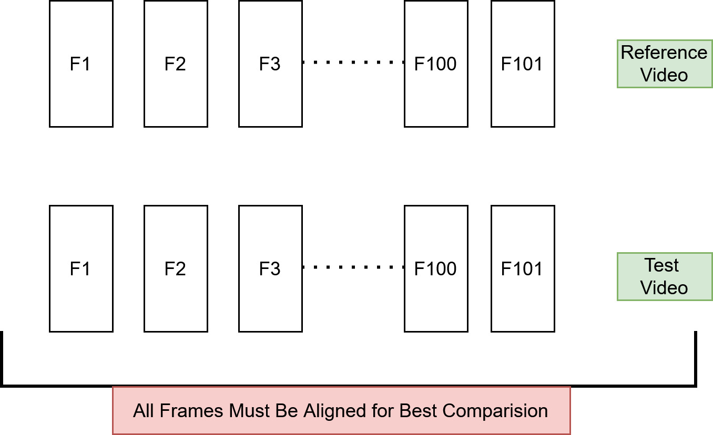

# Video Quality Pt2- (Spatial Quality)

In [Video Quality Part 1](2026-04-01-VideoQuality-P1.md) we introduced the basic idea of video quality metrics and the difference between **reference-based and no-reference approaches.**

In this part, we’ll go a bit deeper and look at how these methods work at a conceptual level, focusing on **spatial quality**—how individual video frames are evaluated for issues like blur, noise, and compression artifacts.
<!-- more -->

---
## 1. What is Spatial Quality

Spatial quality refers to how a single frame of a video looks. It captures visual issues such as:

- Blur (loss of sharpness)
- Noise (grainy appearance)
- Blockiness (visible rectangular artifacts from compression)

These distortions are usually introduced during compression, transmission, or processing.

---
## 2. Why They Are Considered Spatial

These metrics operate on individual frames and analyze:

- Pixel values
- Local structures
- Image statistics

They **do not consider time or motion** between frames.

---
## 3. Reference-Based Methods

 **1) Pixel-by-pixel comparison of two images/frames:** The simplest way to measure quality is to look at the difference between pixels. If every pixel in the processed image is very close to the original, the quality is considered high. If the differences are large, the quality is low.

PSNR (Peak Signal-to-Noise-Ration) is a common method for this purpose. It is based on the Mean Squared Error (MSE), which directly calculates the difference between corresponding pixel values in the two images.

 **2) Structural Similarity:** Instead of comparing pixels directly, structural metrics focus on patterns, edges, ridges, and local textures in the image. They measure how much the structure of the processed image deviates from the original.

SSIM (Structural Similarity Index Measure) is a popular method in this category. Instead of comparing individual pixels, SSIM breaks the image into patches (windows) and computes statistics (luminance, contrast, and structure) across neighborhoods.

 **3) Human Perception:**Perceptual metrics aim to predict what humans actually notice. They consider structural changes, contrast, detail loss, and sometimes temporal effects to produce a quality score that aligns closely with subjective human judgment. e.g. color perception, contrast perception, details/sharpness 

VIF (Visual Information Fidelity) is a method in this class which evaluates how much information is extracted from the scene compared to the original, correlating well with human perception.

VMAF (Video Multi-method Assessment Fusion) is another method in this cateogy; It was designed by Netflix to be a practical, high-accuracy perceptual metric. It acts as a "fusion" model, using a machine learning regressor (SVM) to combine multiple "elementary" metrics.

| Metric | Category | What is measured |
|--------|----------|------------------|
| **PSNR** (Peak Signal-to-Noise Ratio)  | Pixel-based | Direct pixel intensity differences (error between corresponding pixels) |
| **SSIM** (Structural Similarity Index Measure)   | Structural | Luminance (brightness), contrast, and structural patterns (edges, textures) |
| **VIF** (Visual Information Fidelity)   | Structural / Information-based | Amount of visual information preserved from the original (based on natural scene statistics) |
| **VMAF** (Video Multi-Method Assessment Fusion) | Hybrid (Structural + Perceptual) | Combination of features: detail loss, structural similarity, contrast, and some temporal/perceptual cues |

### 3.1. Frame Alignment and Resolution

- Reference-based metrics like PSNR, SSIM, VIF, and VMAF compare each frame of the processed video with the corresponding frame of the reference video.

- Misaligned frames (e.g., off by a few milliseconds) will produce artificially low quality scores, because the metric sees unrelated content as “differences.”

- So frames must be temporally synchronized as precisely as possible.

- FR metrics typically require the same resolution in reference and test video. e.g. PSNR is pixel-by-pixel comparisons. Different resolutions → mismatched pixels → meaningless scores.

---
## 4.Non-Reference Based Methods

- Non-reference (no-reference, NR) methods do not have access to the original video, so they measure quality based on statistical properties of natural images.

- **Assumption:** Natural images have predictable statistical patterns (textures, edges, correlations).

- **Distortion changes these statistics** (blur, noise, blockiness, compression artifacts).

| Metric  | Key Parameters Measured | Description | Score Interpretation | Training | Accuracy vs Human Perception |
|---------|-----------------------|------------|-------------------|----------|----------------------------|
| **BRISQUE** (Blind/Referenceless Image Spatial Quality) | Brightness, contrast, edges, textures | Measures deviations from expected natural image statistics; detects blur, noise, and texture distortions | 0–100, lower = better quality | Yes, trained on human-rated images (MOS) using SVR | High |
| **NIQE** (Perception-based Image Quality Evaluator) | Brightness, contrast, edges, textures | Measures how “unnatural” an image looks based on general natural image statistics | Lower = closer to natural / better quality | No, unsupervised; uses natural image model | Medium |
| **PIQE** (Natural Image Quality Evaluator) | Sharpness, blur, blockiness, local intensity variations | Detects local distortions like blur, blockiness, and noise without needing a reference | 0–100, higher = worse quality | No, rule-based algorithm | Low–Medium |

---
## 6. Summary

1. **Reference-based (RF) methods**
 There are two ways to compare: 

	a. Pixel-by-pixel comparision (human perception NOT taken into consideration)

	b. Structural Similarity (takes into account the human perception)

	c. Human perception based matching

2. **RF methods in plain language:**

	Pixel metrics:  “Do the pixel values match?”

	Structural metrics: “Do the shapes and patterns match?”

	Perceptual metrics: “Would a human notice this problem?”

3. For reference-based (full-reference) methods, alignment and size are critical

4. Non-reference (NR) methods do not require a reference video; They are based on statistical properties of images.

