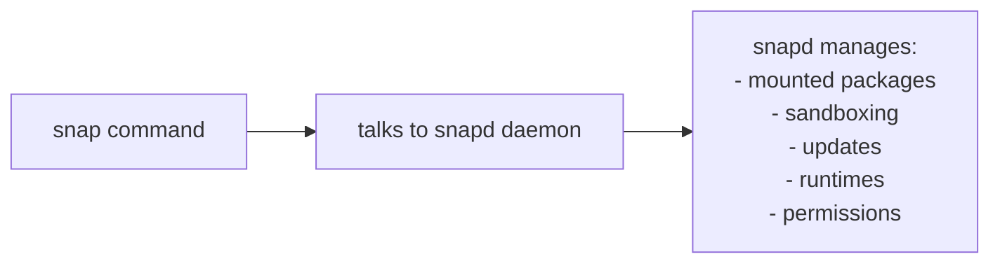

# <font color='green'>Snap Package Manager (brief comparision with APT)</font>

A package manager in Linux is a system that installs, updates, removes, and manages software and its dependencies. Instead of downloading ```.exe``` installers like on Windows, Linux software is usually distributed as packages that the package manager handles automatically. 
<!-- more -->

The pacakge manager keeps track of:

- what software is installed, 

- what libraries each program needs, 

- where files should go, 

- and how updates are applied, etc..

---
## 1. Apt and Snap
Two of the most common package managers on Linux (especially Ubuntu-based systems) are **APT and Snap**. 


- **APT** (Advanced Package Tool) is the traditional system where software integrates closely with the operating system and mostly uses shared system libraries. 

- **Debian** is one of the oldest and most important Linux distributions, and many other operating systems are built from it.

- **APT is the default** and most commonly used package manager for Debian-based systems. It is used to install, update, and remove software packages.

- APT works with .deb packages (Debian package format), while Snap uses its own containerized package format called Snap packages (as described below).


    

- **Snap** is a newer system where applications are packaged with many of their own dependencies, making them more self-contained and able to run consistently across different Linux distributions.

                    

    
---
## 2. When to use which?

**Use APT if you want:**<br>

- better performance
- tighter integration with Ubuntu/Debian
- less disk usage

- For example:
```
sudo apt install vlc
```

**Use Snap if you want:**<br>

- apps that work the same across distributions
- easier installs for complex software
- isolation/security
- For example (to install Visual Studio Code and Firefox):
```
sudo snap install code --classic  (note: It gives the app full access to your system, similar to normal (non-Snap) apps)

sudo snap install firefox
```

---
## 3. Dependencies handling in Snap

A Snap package will often bundle its own dependencies even if the system already has them installed.

So if:

- system already has ffmpeg installed via APT, and a Snap app depends on ffmpeg

- **the Snap may still include its own compatible version**

<br>

| Aspect | Effect of Snap bundling its own dependencies |
|--------|-------------------------------------------------------------|
| Disk size | Increases significantly — multiple Snap apps may include duplicate libraries, leading to higher storage usage than APT. |
| Speed (startup / performance) | Often slightly slower startup due to larger package size and mounted filesystem layers. Runtime performance is usually similar once running. |
| Installation speed | Can be slower because more data must be downloaded and installed. |
| Security | Stronger isolation — bundled dependencies and sandboxing reduce system-wide impact of vulnerabilities. |
| Consistency / reliability | Higher consistency — apps always use their packaged versions, avoiding dependency mismatch issues. |
| System dependency conflicts | Reduced risk — Snap avoids relying on system-installed libraries. |


---
## 4. ```snapd``` service

- Snap consists of **two key parts**: 
```text
1) snap package format (the apps themselves) 

2) snapd service: which is the background daemon that manages them
```

- In contrast, APT does not require a continuously running service. It is a command-line package manager that performs tasks only when you explicitly run it.


	
---
## 5. Snap ecosystem

1. **Snap packages** (.snap files):  
   The applications you install (self-contained software packages that include dependencies).

2. **snapd background service**:  
   The system service (daemon) that installs, runs, and manages Snap packages, including sandboxing, updates, and mounting.

3. **snap CLI**:  
   A command-line utility used to interact with the Snap system (install, remove, update, and query Snap packages).

---
## 6. Compatible distributions

### 6.1 APT-Compatible distributions (Debian-based family)


- Following systems use the APT package manager (.deb packages):

```
Debian (base system for many others)
Ubuntu
Linux Mint
Pop!_OS
elementary OS
Zorin OS
Kali Linux
Raspberry Pi OS (Debian-based)
```

### 6.2 Snap-Compatible distributions

- Snap works across multiple Linux families (not limited to one type).

- Snap support depends on installing the Snap service:

```
Ubuntu (default Snap support)
Debian
Fedora
openSUSE
Arch Linux
Linux Mint
Pop!_OS
elementary OS
Zorin OS
Red Hat Enterprise Linux (RHEL)
CentOS Stream
Raspberry Pi OS
```

---
## 7. debian package installation (two ways)

- Debian and its related systems use APT (Advanced Package Tool) to install software. 

- APT always works with .deb packages, **but the way it gets them can differ**.

### Method 1: from repositories 
```
sudo apt install curl
(APT checks online software repositories (official Debian/Ubuntu servers))

```

### Method 2: using a .deb file (manual install)

- Sometimes we download a .deb file manually from a website.
```
sudo apt install ./google-chrome-stable_current_amd64.deb

```
### Method 3: Older (not recommended)
```
sudo dpkg -i file.deb

❌ Does not automatically fix missing dependencies
That’s why APT is preferred today
```


---
## 8. Quick summary

- APT = Debian family only (.deb packages)

- Snap = Cross-distribution (works on most Linux distros)
(Snap requires snapd service to run)

- APT works with ```.deb``` packages (Debian package format), while Snap uses its own containerized package format called Snap packages.

- APT = manager that handles .deb packages via repositories


