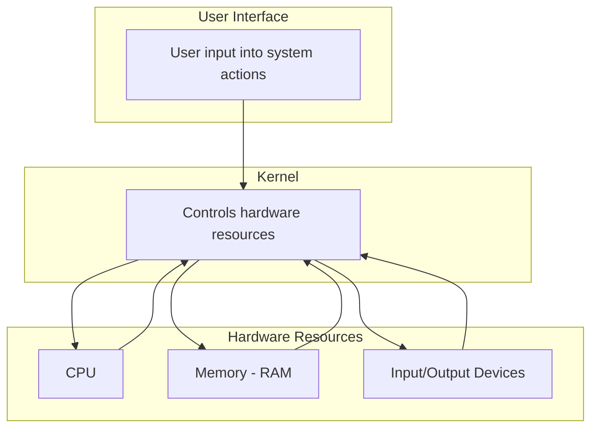
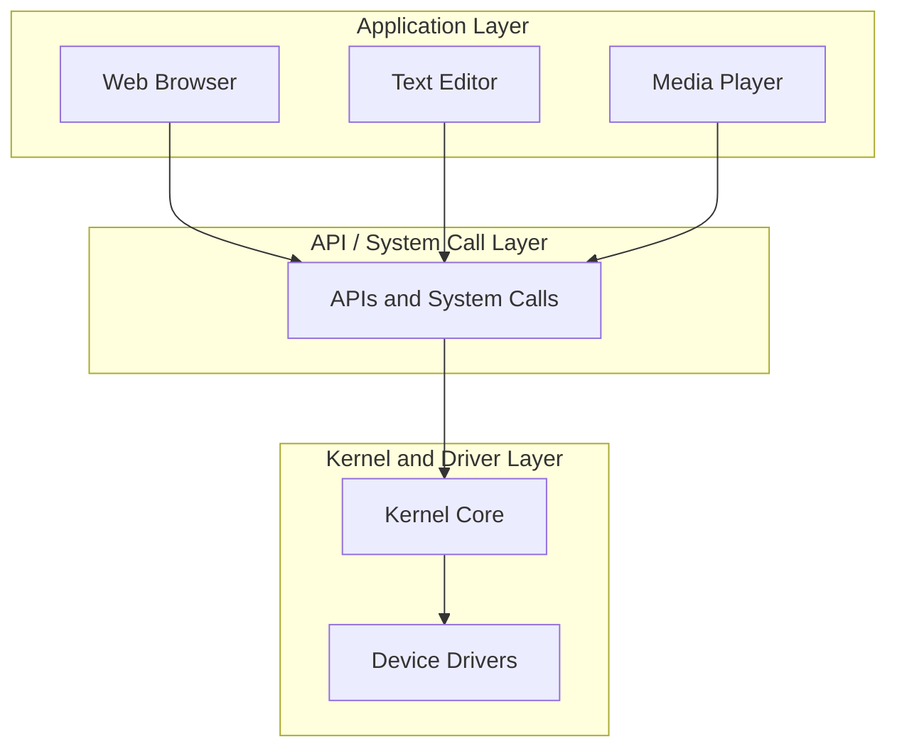
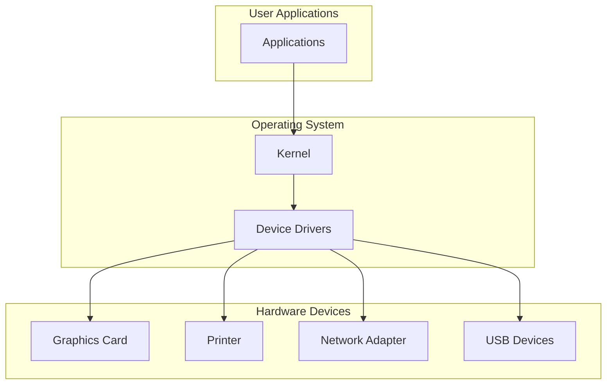
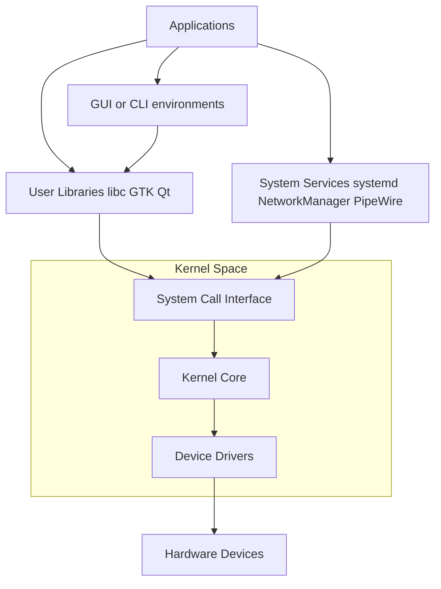

# Operating System Components: A Conceptual Overview

- This writing of mine presents a conceptual overview of operating system components, including the kernel, user interface, application interface, and supporting mechanisms.
<!-- more -->

- It explains key high-level operating system concepts and terminology for readers who are new to the subject.

- The intended audience is IT professionals rather than core computer science practitioners. I have written this at the request of a colleague working in machine learning and robotics who is not very familiar with operating system–level concepts.

---
## 1. What is operating system (OS)

- When we buy a computer, it is just a piece of hardware. On its own, it is not very useful because we cannot easily **interact with it** or make it perform meaningful tasks.

- This is why computers come with an Operating System (OS), such as Windows, macOS, or Linux. The OS allows us to communicate with the machine in a simple and practical way, so we can perform useful activities like browsing the internet, writing documents, or running applications.

- The operating system is one of the first essential components installed on a computing device. It enables users to operate the computer without needing to understand the internal technical or hardware details.

- An analogy is a **car driving system**. A driver can operate a car using the steering wheel, pedals, and controls without knowing the detailed mechanical or engineering workings of the engine. Similarly, an operating system allows a user to operate a computer without needing to understand its internal hardware complexity.

---
## 2. Essential functions of an OS

Broadly speaking, there are **three essential functionalities** in every operating system. These components work together to allow users to interact with the computer and utilize its resources effectively.

| Resource Management | User Interface (UI) | Application Interface |
|--------------------|---------------------|----------------------|
| Manages hardware resources like CPU, memory, and devices | Provides a way for users to interact with the system via GUI or CLI | Allows programs to interact with the OS through system calls and APIs to access hardware and system services  |

### i) Resource Management

The operating system manages all system resources such as input/output devices, memory, and the processor.

This happens mostly behind the scenes without the user’s direct awareness. The OS ensures that multiple programs can run efficiently without conflicts, by allocating and controlling access to hardware resources.

### ii) User interface (UI)

The operating system provides a user interface, which is a mechanism that allows users to communicate with the system.

Through the user interface, users can perform operations such as creating files, copying data, moving files, and running applications. A user interface can be:

		- Graphical User Interface (GUI): visual elements like windows, icons, and menus
		
		- Command Line Interface (CLI): text-based commands entered through a terminal

### iii) Application Interface

- The operating system also provides mechanisms that allow users (especially programmers) to write programs that can use system resources.

- These mechanisms are known as the application interface. They are different from the user interface. While the user interface is designed for direct user interaction, the application interface is designed for software to interact with the operating system.

- This includes system calls and APIs that allow programs to access hardware resources in a controlled manner.

---
## 3. Kernel Layer (the **inside** of OS)

- **From software implementation perspective, an OS can be split in two layers**; Kernal and User Interface

- **Kernel" is explained in this section; the UI will be explained in the next section. 

- The kernel is the core component of an operating system. It is a piece of software that forms the **foundation of the OS**, and almost **everything else is built on top of it**.

- The kernel directly interacts with the hardware and manages critical system operations. It acts as a bridge between software and physical components of the computer.

- The kernel performs the following key functions:
		- Manages CPU (process scheduling and execution of programs)
		- Manages memory (allocation and deallocation of RAM)
		- Controls input/output devices through drivers
		- Manages file systems and storage
		- Handles communication between hardware and software components

- On top of the kernel, other layers of the operating system are built, including the user interface, which is described in the next section.

---
## 4. User interface layer (the **outside** of OS)

- The user interface (UI) is the part of the operating system that allows users to interact with the computer system.

- It provides a way for users to give commands and receive output from the system in a usable form.

- The user interface is built on top of the kernel and relies on it to perform actual operations on hardware.

There are two main types of user interfaces (as mentioned earlier):

	Graphical User Interface (GUI) – uses visual elements such as windows, icons, and menus
	Command Line Interface (CLI) – allows users to interact with the system using text-based commands

- Through the user interface, users can perform everyday tasks such as **opening applications, managing files, and running commands**.

- In modern operating systems, especially Linux, **GUI environments are built on top of the same kernel**, meaning multiple different graphical interfaces can exist for a single operating system. 

- For example, in Linux, desktop environments like **GNOME and KDE Plasma** run on top of the Linux kernel, but provide very different visual styles and user experiences.

- Other common Linux desktop environments include XFCE (lightweight and fast), Cinnamon (traditional desktop experience), and LXQt (very lightweight for low-resource systems).

   
---
## 5. Application interface

- The operating system not only allows users to interact with the computer, but also **provides mechanisms for software applications** to interact with the system.

- Application Interface (API / system interface layer) **sits above the kernel**

- These mechanisms are collectively called the **Application Interface**. 

- While the user interface is designed for humans, the application interface is designed for programs.

- For example, when an application wants to:

		- create a file,
		- access memory,
		- communicate through a network,
		- display graphics,
		- or read input from a keyboard,

- it **does not directly access the hardware**; Instead, it **communicates with the operating system through predefined interfaces and system services**.

- These interfaces provide a controlled and standardized way for applications to use system resources without needing to understand hardware details.

- In modern operating systems, application interfaces are commonly exposed through:

		- System calls
		- Libraries
		- APIs (Application Programming Interfaces)

---
## 6. Device drivers (extending the kernel)

- Modern computers support a very large variety of hardware devices such as printers, graphics cards, network adapters, USB devices, webcams, and storage controllers.

- It is neither practical nor efficient for the kernel to contain detailed support for every possible hardware device directly within its core implementation.

- Instead, **operating systems use device drivers, which act as extensions to the kernel**.

- A device driver is **specialized software that knows how to communicate with a particular hardware device**. It provides the necessary low-level instructions required to operate that hardware correctly.

- In this model:

		- The kernel provides the general resource management framework
		- Device drivers provide hardware-specific functionality
		

- This design allows the operating system to **support new hardware without redesigning the entire kernel**.

- For example:

		- A printer driver knows how to communicate with a specific printer model
		- A graphics driver knows how to interact with a GPU
		- A network driver knows how to operate a network interface card

- From the **user’s perspective, these details remain mostly hidden**. The operating system and its drivers work together to provide a consistent and usable computing environment regardless of the underlying hardware.

---
## 7. All pieces fit togethar

