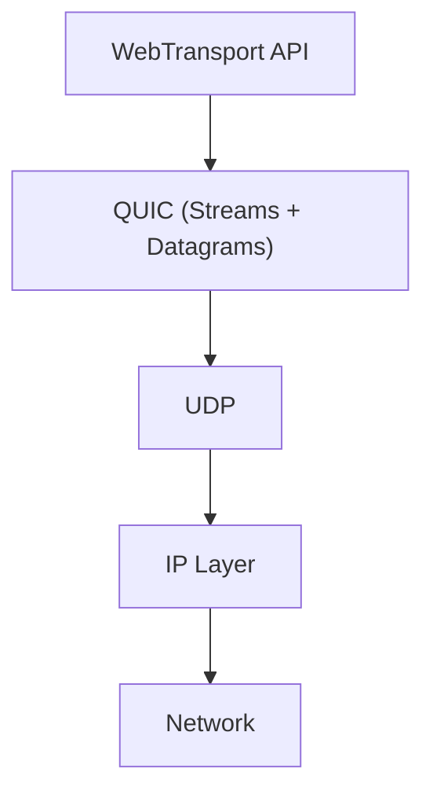
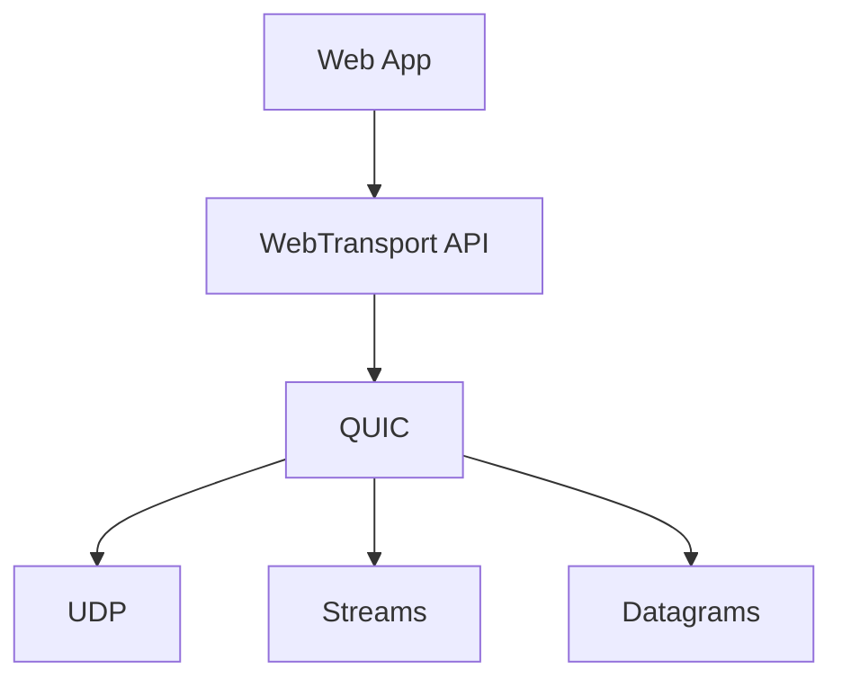
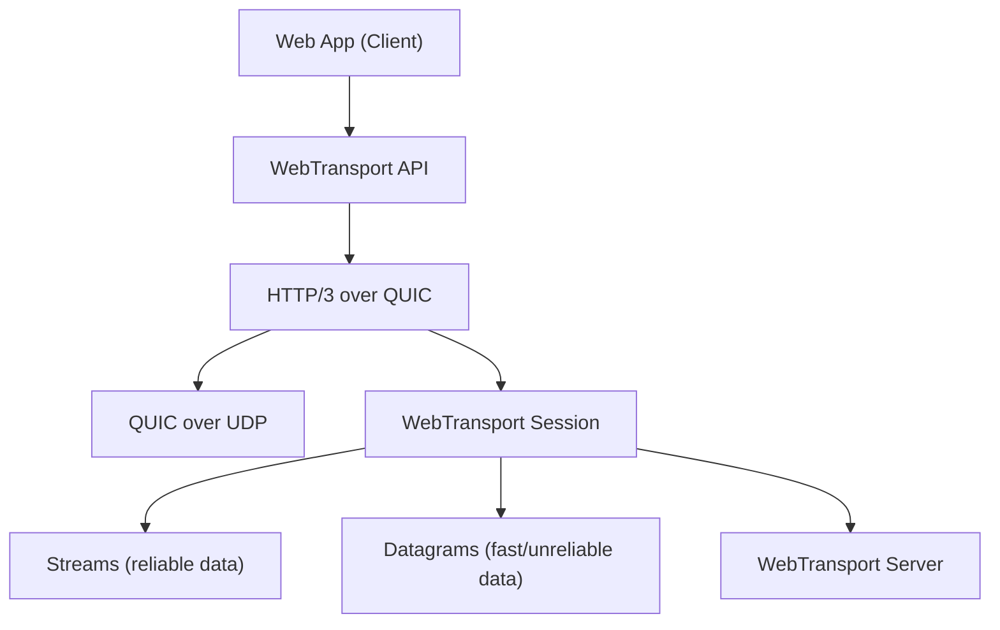

# WebTransport- A Conceptual Overview
- Every machine on the internet is identified by an IP address, and data is exchanged over the IP layer using **transport protocols**

- In this post, I will introduce WebTransport and explain it in comparison with existing alternatives. As a relatively new protocol, it offers useful capabilities for modern real-time applications, along with its own set of trade-offs.
<!-- more -->

- A good understanding of WebTransport requires familiarity with the [QUIC protocol](../../linux/protocols/quic.md), since WebTransport is built on top of QUIC.


---
## 1. Background 

- Above the IP layer, the **two foundational transport protocols** are TCP and UDP. 

- These two protocols represent fundamentally different trade-offs in how data is delivered: TCP prioritizes reliability and ordered delivery, while UDP prioritizes low latency and minimal overhead.

- In practice, the choice between them depends on application requirements such as reliability, latency sensitivity, and real-time behavior.

- Above the **transport layer(TCP/UDP)** there are other protocols that are for application needs such as Http, ftp etc.

- WebTransport is a modern web API designed for real-time communication. It is **not a replacement for TCP or UDP**, but instead builds **on top of UDP through QUIC**, enabling more flexible transport semantics for web applications.



## 2. QUIC is enhanced-UDP

- UDP is a **fast** transport protocol, but not reliable; TCP on the other hand is **reliable** but slow. 

- UDP (unlike TCP) does not establish connections, does not guarantee delivery, and does not enforce ordering.

- This makes UDP extremely fast and efficient for real-time use cases. There is no head-of-line blocking, no retransmission delay, and no connection setup overhead. Applications can send data immediately with minimal protocol interference.

- However, this simplicity comes at a cost: **UDP is completely unreliable**. Packets can be lost, duplicated, or delivered out of order,

- To solve this, QUIC was introduced. It preserves the performance advantages of UDP while adding back the essential features required for modern internet applications, such as reliability, congestion control, and built-in security.


| Feature                 | TCP                              | UDP                        | QUIC                                            |
| ----------------------- | -------------------------------- | -------------------------- | ----------------------------------------------- |
| Reliability             | Reliable (retransmits lost data) | Unreliable (no guarantees) | Reliable (per-stream reliability)               |
| Ordering                | Strict global ordering           | No ordering                | Ordering per stream (no global blocking)        |
| Encryption              | Optional (via TLS layer)         | Not built-in               | Built-in (TLS 1.3 integrated)                   |
| Implementation location | Kernel space                     | Kernel space               | User space (typically over UDP)                 |
| Typical use cases       | Web pages, APIs, databases       | Gaming, voice, streaming   | HTTP/3, WebTransport, modern real-time web apps |


---
## 3. What is **WebTransport**

- HTTP is the core web protocol used by the browser. Traditionally, it runs over TCP (as in HTTP/1.1 and HTTP/2), while newer versions like HTTP/3 run over QUIC.

- Inside the browser, there are APIs that expose modern networking capabilities built on top of QUIC, which itself runs over UDP.

- WebTransport is not a protocol that applications use directly. Instead, **it is a browser API that exposes QUIC’s transport features** such as streams and datagrams to web applications.



---
## 4. WebTransport client and server

- Client: WebTransport is primarily a browser API. Therefore, browser is the client.
- Server: must run a WebTransport-compatible server over QUIC

Example:
```
new WebTransport("https://example.com")
```

- What happens under the hood:

```
Browser
 → HTTP/3 request
 → QUIC connection (over UDP)
 → WebTransport session starts
```



---
## 5. WebTransport client and server

- WebTransport is useful when we need:
 
```
- Multiple independent streams (like many WebSockets in one connection)
- Datagrams (unreliable, fast messages) like UDP
- Low latency over QUIC (better under bad networks than TCP)
```

- Practical use-cases:

```
- Multiplayer games (real-time action)
- Live dashboards / trading systems
```

---
## 6. Some examples of WebTransport servers

- A WebTransport server is one that speaks HTTP/3 + QUIC + WebTransport session semantics

- Some examples:

1. Cloudflare WebTransport (production-grade example)
2. Go QUIC servers (quic-go)
3. MOQ (Media over QUIC)


---
## 7. Where WebSockets actually fit w.r.t. WebTransport

- When websockets were created (~2010 era):
```
- browsers needed real-time communication
- HTTP was request/response only
- no streaming, no push
```

- So WebSockets solved:
```
- persistent connection
- bidirectional messaging
- low latency vs polling
```

- Because they sit on TCP (unlike WebTransport which sits on top of QUIC->UDP)
```
- Head-of-line blocking issue
- Single stream only
- No datagrams
- TCP limitation (kernel-level, strict ordering, slow)

```

- The web moved from TCP-era thinking → QUIC-era networking
```
- HTTP/3 -> QUIC -> UDP
- Multiple streams
- Datagrams (huge deal)
```


---
## Reference(s)

[QUIC protocol](../../linux/protocols/quic.md)
