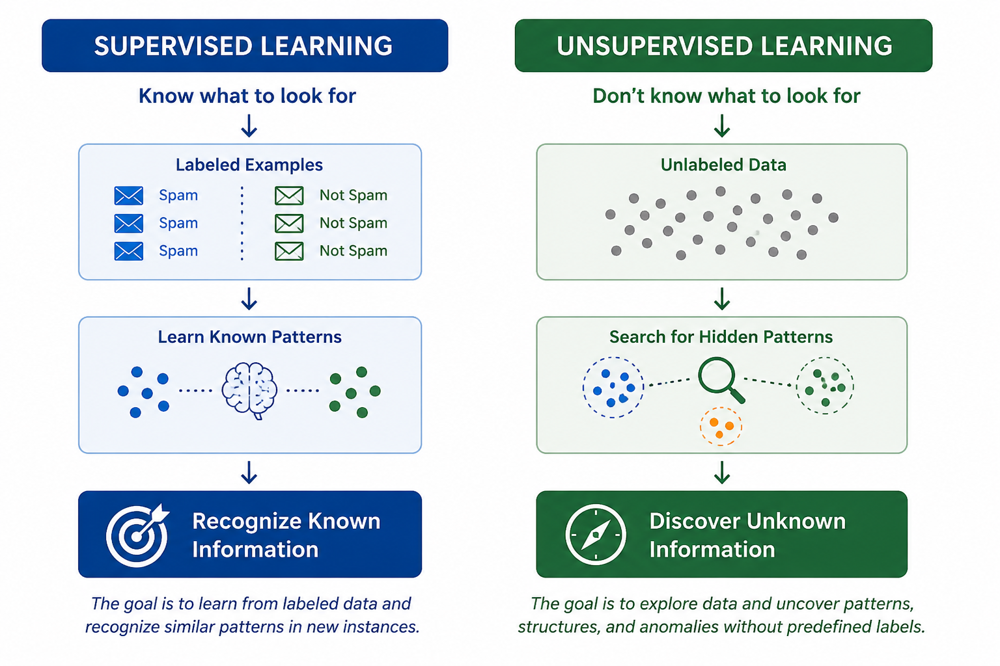

# <font color='green'> Unsupervised Learning: From Recognition to Discovery</font>
At a high level, supervised learning focuses on recognizing previously seen information, while unsupervised learning focuses on **discovering previously unseen information**.

<!-- more -->
In this blog post, I discuss the key distinction between supervised and unsupervised learning at a conceptual level. The central idea is simple: 

- **supervised learning is used when we know what we are looking for**, 

- whereas **unsupervised learning is used when we want to discover patterns or anomalies that were previously unknown (not seen before).**

---
## 1. The Known vs The Unknown

* Most machine learning systems today are based on supervised learning. In supervised learning, we provide examples along with the correct answers, and the machine learns to recognize similar patterns in the future.

* Whether the task is identifying objects in images, detecting spam emails, or predicting house prices, the objective is fundamentally the same: **In suprvised learning, we learn from known information and apply that knowledge to new instances.**

* This approach has proven extremely successful, but it assumes that we already know what we are looking for. Someone must define the categories, provide the labels, and specify the desired outcomes.

> In many real-world situations, the challenge is that we do not know what we are looking for until we find it.

* Consider a factory trying to detect previously unseen product defects, a bank trying to identify new fraud patterns, or a scientist exploring a large dataset for undiscovered phenomena. In each case, there are no predefined labels or categories to learn from. 

* **The objective is to uncover something that was previously unknown.** (This is where unsupervised learning comes in)


---
## 2. Supervised Learning: Finding Known Information
- Supervised learning is based on the idea of learning from examples where the correct answer is already known.

- During training, each data sample is paired with a label. The learning algorithm analyzes many such examples and learns the relationship between the input data and the corresponding labels.

-  For example, if we want to build a system that can distinguish between cats and dogs, we provide thousands of images that have already been labeled as either "cat" or "dog".
Once trained, the system can classify new images that it has never seen before. Although the images are new, the categories themselves are not.

The key point is that the machine is not discovering new concepts. It is learning to recognize concepts that were already defined by humans.

At a conceptual level, supervised learning is about finding known information. We know what we are looking for, and the machine learns how to identify it efficiently.


---
## 3. Unsupervised Learning: Discovering Unknown Information

* Unsupervised learning takes a fundamentally different approach. Instead of learning from labeled examples, it is given data without any predefined categories or correct answers.

* Since there are no labels to learn from, the objective is not to recognize known concepts, but to discover patterns and structures that may already exist within the data.

* For example, a dataset may naturally contain several groups of similar observations. Even though nobody has defined these groups beforehand, an unsupervised learning algorithm may be able to identify them.

* Similarly, the algorithm may detect observations that are significantly different from the rest of the data. These unusual observations are often referred to as anomalies or outliers.

* Unlike supervised learning, the machine is not told what to look for. Instead, it analyzes the data and attempts to identify meaningful relationships, groupings, or irregularities on its own.

* At a conceptual level, unsupervised learning is about discovery rather than recognition. The goal is to uncover information that was not explicitly known or labeled beforehand.

> Rather than learning from predefined answers, the goal of unsupervised learning is to explore data and discover patterns, structures, and anomalies that have not been explicitly identified beforehand.

---
## 4. Example: Detecting Previously Unseen Defects

* Consider a factory that manufactures thousands of products every day.

* Most products are produced correctly and therefore look very similar to one another. Occasionally, however, a product may contain a defect such as a missing component, a scratch, or a manufacturing error.

* One approach would be to collect examples of every possible defect and train a supervised learning model to recognize them. In practice, this is often difficult because new defects can appear at any time.

* Instead, an unsupervised approach can learn what a normal product looks like by analyzing a large number of defect-free examples.

* When a product differs significantly from this learned notion of normality, the system flags it for further inspection.

* The important point is that the system does not need to know in advance what the defect looks like. It only needs to recognize that something appears unusual.

* This illustrates the core idea of unsupervised learning: discovering observations that do not fit expected patterns, even when those observations have never been seen before.

* Few more examples of Unsupervised Learning"

```
Detecting new fraud patterns
Discovering customer segments
Identifying unusual network activity
Finding hidden groups in scientific data
```

---
## 5. Beyond Anomaly Detection

* **Detecting unusual observations is one application of unsupervised learning, but it is not the only one.**

* **Another common goal is to discover natural groupings within data**. These groups may exist even when nobody has explicitly defined them.

* For example, a retailer may analyze customer purchasing behavior and discover several distinct customer segments. Some customers may primarily buy discounted products, while others may consistently purchase premium items.

* Similarly, a scientist exploring experimental data may discover clusters of observations that correspond to previously unknown phenomena.

* In these situations, the objective is not to identify something unusual, but to reveal hidden structure within the data.

* Whether the goal is finding anomalies or discovering natural groupings, the underlying idea remains the same: uncover information that was not explicitly known beforehand.


---
## 6. Conclusion: Recognition vs Discovery

* Supervised learning and unsupervised learning serve different purposes.

* In supervised learning, we know what we are looking for. The goal is to learn from labeled examples and recognize similar patterns in new data.

* In unsupervised learning, we do not necessarily know what we are looking for. The goal is to explore data and uncover patterns, groups, and anomalies that have not been explicitly identified beforehand.

* At a conceptual level, supervised learning is about **recognition**, whereas unsupervised learning is about **discovery**.

* This is why unsupervised learning can be viewed as machine learning's search for the unknown.

><font color='green'>- Supervised learning is about recognizing what we already know.
<br><font color='red'>(Hey, I found something which I have seen before; I know what it probably is!)</font>
<br><br>- Unsupervised learning is about discovering what we do not yet know.</font>
<br><font color='red'>(Hey, I have found something that I have not seen before; Looks like something abnormal/anomaly)</font>
<br><font color='red'>(Hey, I have arranged things in different groups; I dont know what they are, but items in the same group have similar properties.)</font>





