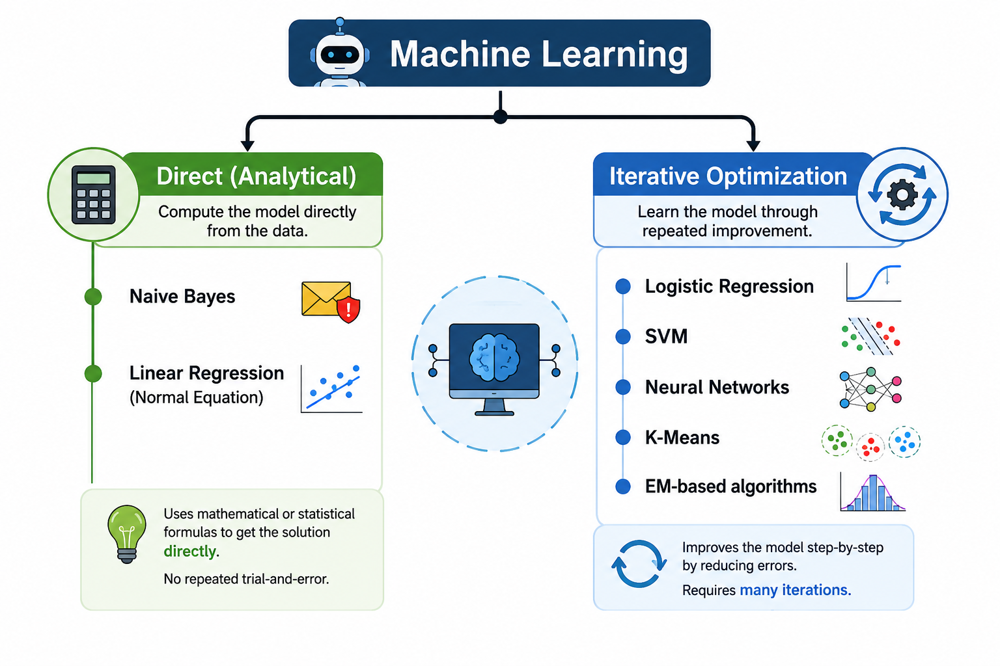

---
date:
  created: 2026-06-28
  posted: 2025-05-28

author:
  name: Mujeeb
  description: Creator

readtime: 5

categories:
  - Machine Learning

tags:
  - Optimization
  - Optimisation
---

# <font color='green'>How Machines Learn: Direct Learning vs. Iterative Optimization</font>

Machine learning models generally learn from data in one of two ways: **Direct (Analytical) Learning** or **Iterative Optimization**. Understanding these two approaches provides a useful big-picture view of how many machine learning algorithms are related.

<!-- more -->

This article focuses on the concepts rather than the mathematics, helping readers understand where common machine learning techniques fit.

---
## 1. Two Ways Machines Learn

One of the easiest ways to understand machine learning is to focus on **how a model learns from data**. At a high level, many machine learning algorithms follow one of two learning approaches.

- **Direct Learning (Analytical)** computes the model directly from the available data. Once the required calculations are complete, the model is immediately ready to make predictions.

- **Iterative Optimization** starts with an initial guess and repeatedly improves the model by reducing prediction errors until it reaches a satisfactory solution.

### A Simple Analogy

Think of the two approaches this way:

- **Direct Learning** is like calculating the average monthly sales from last year's receipts. You perform the calculation **once** and immediately obtain the answer.

- **Iterative Optimization** is like learning to ride a bicycle. You make mistakes, adjust your balance, and **gradually** improve through repeated practice.

> <font color='red'><b>Direct Learning is immediate. Iterative Optimization is gradual.</b></font>

---

## 2. What Does "Analytical" Mean?

The word **analytical** simply means **finding the answer using a predefined mathematical or statistical procedure**, rather than through repeated trial-and-error.

In other words, an analytical method has a well-defined sequence of calculations that produces the answer once those calculations are complete. These calculations may involve solving equations, computing averages, counting occurrences, estimating probabilities, or applying known statistical formulas.

Unlike iterative optimization, there is **no cycle of repeatedly guessing and correcting** the model.

Think of it this way:

- **Analytical** → Solve the problem directly.
- **Iterative** → Keep improving until you reach a good solution.

> <b>The key idea behind an analytical (direct) solution is that the answer <font color='red'>is calculated, not gradually learned</font>.</b>


---
## 3. When Is Each Approach Appropriate?

- Direct learning methods are often well suited for smaller or moderately sized datasets, especially when a closed-form analytical solution exists.

- Iterative optimization is generally preferred for larger or more complex problems, where computing a direct solution is impractical or impossible.


---
## 4. Comparison

| Aspect | Direct Learning (Analytical) | Iterative Optimization |
|--------|-------------------------------|------------------------|
| **Core Idea** | Compute the model directly from the data. | Learn the model through repeated improvement. |
| **Learning Process** | Perform the required calculations once using a predefined mathematical or statistical procedure. | Start with an initial guess, measure the error, adjust the model, and repeat until the error becomes sufficiently small. |
| **Everyday Analogy** | Calculating the average monthly sales from last year's receipts. | Learning to ride a bicycle through repeated practice and correction. |
| **Real-world Example** | Estimating average daily product demand from historical sales. | Teaching a computer to recognize cats and dogs by repeatedly correcting its mistakes. |
| **Typical Use Cases** | Basic spam filtering, simple sales forecasting, simple classification problems. | ChatGPT, face recognition, fraud detection, self-driving cars, image classification. |
| **Common Techniques** | Naive Bayes, Linear Regression (Normal Equation). | Gradient Descent, SGD, Adam, Logistic Regression, SVM, Neural Networks, K-Means, EM. |

> Analytical learning is like solving a math problem; we calculate the answer directly. 

> Iterative optimization is like learning a skill; we improve the answer through repeated practice, often performing thousands or even millions of iterations until the model converges to a good solution.

---

## 5. Classifying Common Machine Learning Algorithms

One purpose of this article is to provide a mental map of where common machine learning algorithms belong.




<!--
```text
                 Machine Learning
                        │
        ┌───────────────┴───────────────┐
        │                               │
 Direct (Analytical)            Iterative Optimization
        │                               │
  • Naive Bayes                 • Logistic Regression
  • Linear Regression           • SVM
    (Normal Equation)           • Neural Networks
                                • K-Means
                                • EM-based algorithms
```
-->


---

## 6. Key Takeaway

Understanding **how** an algorithm learns provides a simple mental framework for organizing machine learning techniques. Instead of memorizing algorithms individually, first ask:

> **Does this algorithm compute the solution directly, or does it improve the solution through repeated optimization?**

Once we answer that question, it becomes much easier to understand where an algorithm fits in the broader machine learning landscape.

> <font color='red'><b>Direct learning computes the answer once. Iterative optimization improves the answer many times until it becomes good enough.</b></font>


