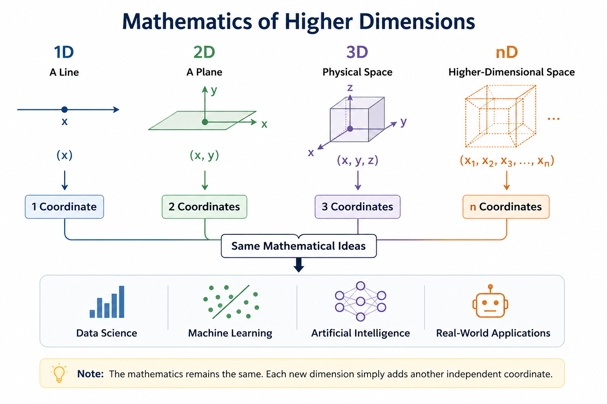

---
date:
  created: 2026-07-08
  posted: 2026-07-08

author:
  name: Mujeeb
  description: Creator

readtime: 10

categories:
  - Artificial Intelligence

tags:
  - Higher Dimension Maths
  - Feature Extraction
  - Higher Dimention Features
---

# Beyond 3D: Extending the Mathematics We Already Know

We live in a three-dimensional world, so most of the mathematics we learn is limited to 3D. However, the same mathematical ideas can be extended to any number of dimensions.

<!-- more -->
This article introduces the basic concepts behind higher-dimensional mathematics.

---
## 1. Introduction

We live in a three-dimensional world, so most of the mathematics taught in schools naturally focuses on one, two, and three dimensions. We learn about lines, planes, cubes, circles, spheres, and coordinate geometry because these are the objects we can easily visualize and relate to.

However, mathematics is not constrained by the physical world. The same mathematical ideas that describe 2D and 3D spaces can be extended to four, ten, or even thousands of dimensions. Although we cannot directly visualize such spaces, they follow the same mathematical principles.

This article introduces the basic concept of higher-dimensional mathematics, explains how it naturally extends the mathematics we already know, and briefly explores why it has become an important tool in modern fields such as data science and machine learning.

---
## 2. From 1D to 3D: The Mathematics We Already Know

Before exploring higher dimensions, it is helpful to understand how dimensions build upon one another.

A **one-dimensional (1D)** space consists of a single axis. Every point can be described using just one coordinate, such as (x).

A **two-dimensional (2D)** space is formed by introducing a second independent axis. Every point is now described by two coordinates, ((x, y)). This is the familiar coordinate plane used to study lines, circles, and other geometric shapes.

A **three-dimensional (3D)** space extends the same idea by adding a third axis. Every point is represented by three coordinates, ((x, y, z)), allowing us to describe objects in the physical world such as cubes, spheres, and other three-dimensional shapes.

>An important observation is that each new dimension does not require entirely new mathematics. Instead, it extends the mathematics of the previous dimension by introducing one additional independent coordinate. 

This simple pattern is the key to understanding higher-dimensional mathematics.

---
## 3. Extending Mathematics Beyond Three Dimensions

If adding a second coordinate extends a line into a plane, and adding a third coordinate extends a plane into space, there is no mathematical reason to stop there. We can continue adding independent coordinates to define four-dimensional, five-dimensional, or even \(n\)-dimensional spaces.

The same idea applies to mathematical equations. For example, the distance from the origin is given by:

- **2D:**

  $$
  d^2 = x^2 + y^2
  $$

- **3D:**

  $$
  d^2 = x^2 + y^2 + z^2
  $$

- **4D:**

  $$
  d^2 = x^2 + y^2 + z^2 + w^2
  $$

More generally, in an \(n\)-dimensional space,

$$
d^2 = \sum_{i=1}^{n} x_i^2
$$

or equivalently,

$$
d^2 = x_1^2 + x_2^2 + x_3^2 + \cdots + x_n^2.
$$

Notice that the mathematics itself has not fundamentally changed. We simply continue the same pattern by adding another independent coordinate whenever a new dimension is introduced.

This is one of the most important ideas in higher-dimensional mathematics: 

> **higher dimensions are not created by inventing entirely new mathematics, but by extending the mathematics we already know.**

---
## 4. Thinking in Higher Dimensions

At this point, a natural question arises: **if higher-dimensional spaces exist mathematically, why don't we learn much about them or experience them in everyday life?**

The answer is simple. Our physical world has three spatial dimensions, and our brains have evolved to perceive and reason about this three-dimensional space. As a result, we can easily visualize points, lines, planes, cubes, and spheres, but imagining a four-dimensional object is beyond our intuition.

Fortunately, mathematics does not depend on our ability to visualize something. Once a space is described using coordinates and equations, we can study it using algebra, geometry, and logic without ever having to "see" it.

For example, a point in a two-dimensional space is represented as

$$
(x, y)
$$

A point in a three-dimensional space is represented as

$$
(x, y, z)
$$

Similarly, a point in an \(n\)-dimensional space is simply written as

$$
(x_1, x_2, x_3, \ldots, x_n).
$$

> Although we cannot picture such a space, we can still calculate distances, angles, directions, and other geometric properties using the same mathematical principles. 

In higher-dimensional mathematics, equations and computations replace visualization.

---
## 5. Higher Dimensions in Data and Machine Learning

So far, we have treated each dimension as a physical direction in space. However, in many real-world applications, a dimension does not represent a spatial direction at all. Instead, it represents an independent **feature** or **attribute**.

For example, suppose we are describing a person using the following characteristics:

- Age
- Height
- Weight
- Annual income
- Years of education

Each characteristic can be treated as a separate dimension. A person can therefore be represented as a point in a five-dimensional space:

$$
(\text{Age}, \text{Height}, \text{Weight}, \text{Income}, \text{Education})
$$

Similarly, a house could be represented using features such as:

- Floor area
- Number of bedrooms
- Number of bathrooms
- Age of the property
- Distance from the city centre

Each house then becomes a point in a five-dimensional space.

Modern datasets often contain hundreds or even thousands of features. In such cases, every data sample can be viewed as a point in a high-dimensional space. Rather than studying geometric objects like cubes or spheres, data scientists analyze the relationships between these points to discover patterns, classify data, make predictions, and identify similarities.

**This idea forms the foundation of many modern fields, including machine learning, computer vision, recommendation systems, and data analytics.** Although humans cannot visualize these high-dimensional spaces, mathematics allows computers to work with them efficiently.

---
## 6. The Mathematics Behind Higher Dimensions

Representing data in hundreds or thousands of dimensions is only the first step. The real challenge is extracting useful information from these high-dimensional spaces. This is where mathematics becomes an essential tool.

- One of the most fundamental concepts is **distance**. By measuring the distance between two points, we can determine how similar they are. This idea is used in applications such as recommendation systems, image recognition, and clustering.

- Another important concept is the **vector**. In higher-dimensional mathematics, each data point is represented as a vector, and collections of vectors are analyzed using **linear algebra**. Operations such as vector addition, dot products, and matrix multiplication allow us to compare, transform, and manipulate data efficiently.

- As datasets become larger, they often contain redundant or highly correlated features. Techniques such as **Principal Component Analysis (PCA)** reduce the number of dimensions while preserving most of the important information. PCA is built on concepts such as covariance matrices, eigenvectors, and eigenvalues.

- Many machine learning algorithms can also be viewed as optimization problems. During training, an algorithm searches for the best values of its parameters in a high-dimensional space by minimizing a loss function. Methods such as **Gradient Descent** make this search computationally feasible, even when the number of dimensions reaches millions.

> Although **these mathematical techniques are far more advanced than the geometry taught in school, they are built upon the same fundamental ideas of coordinates, vectors, distances, and transformations.** 

Higher-dimensional mathematics is therefore not a completely new subject; it is a natural extension of the mathematics we already know.

---
## 7. From School Mathematics to Modern Applications

Many students learn mathematics in school without seeing how it is used beyond the classroom. Concepts such as coordinates, vectors, matrices, and equations may appear to be isolated topics with little practical value. However, these same concepts form the foundation of many modern technologies.

The mathematics of higher dimensions is a good example of this progression. The coordinate geometry used to describe points in two and three dimensions naturally extends to spaces with hundreds or even thousands of dimensions. Similarly, vectors and matrices become powerful tools for representing and processing large datasets.

As mathematics is extended to higher dimensions, it also becomes more application-oriented. Fields such as data science, machine learning, computer vision, robotics, scientific computing, and optimization all rely heavily on higher-dimensional mathematics. Techniques such as Principal Component Analysis (PCA), linear regression, neural networks, and support vector machines are all built upon mathematical concepts that originate from school mathematics.

The key difference is not that the mathematics becomes completely different, but that it becomes more abstract and more widely applicable. Instead of describing physical objects in space, the same mathematical principles are used to analyze data, recognize patterns, make predictions, and solve complex real-world problems.

In this sense, higher-dimensional mathematics represents the natural evolution of the mathematics we learn in school; from understanding the physical world around us to solving problems in science, engineering, and artificial intelligence.

---
## 8. Conclusion

Higher-dimensional mathematics may seem abstract at first because we cannot directly visualize spaces beyond three dimensions. However, the underlying ideas are surprisingly familiar. By extending the concepts of coordinates, vectors, and geometry beyond the physical world, mathematics provides a powerful framework for representing and analyzing complex problems.

Today, higher-dimensional mathematics is an essential part of many scientific and engineering disciplines. From data science and machine learning to computer vision and optimization, it enables us to work with datasets and systems that would otherwise be impossible to understand.

The most important takeaway is that higher dimensions are not a completely new branch of mathematics. They are a natural extension of the mathematics we already learn in school, demonstrating how simple mathematical ideas can grow into powerful tools for solving real-world problems.
