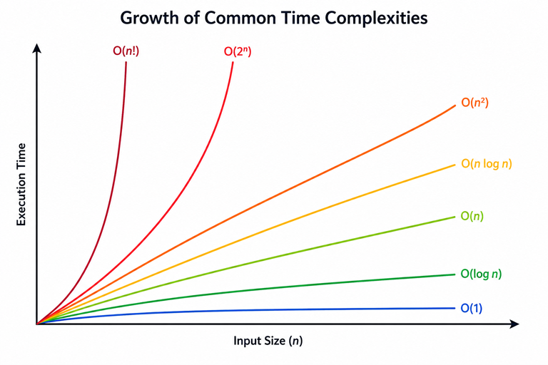

---
date:
  created: 2026-07-14
  posted: 2026-07-14

author:
  name: Mujeeb
  description: Creator

readtime: 10

categories:
  - Programming

tags:
  - Big O Notation
  - Big(O) Notation
  
  
---

#  Big(O) Notation Is About Scalability, Not Speed 

When comparing algorithms based on execution time, computer scientists use Big(O) notation. Big(O) describes **how an algorithm's running time grows as the size of the input grows**.
<!-- more -->

This blog assumes that the reader is already familiar with the basics of data structures and algorithm complexity.

---

##  1. Different Algorithms Have Different Strengths 

The interesting fact about algorithms is that different algorithms can solve the **same problem**, yet perform very differently. Some execute faster, some consume less memory, and others are simpler to implement. There is rarely a single "best" algorithm.

There is no universally "best" algorithm.

One algorithm may execute very quickly but require more memory. Another may use very little memory but take longer to complete. Yet another may be slower but much easier to understand and maintain.

The right choice depends on the problem.

For example, an embedded device with limited RAM may prefer a memory-efficient algorithm, while a high-performance server with abundant resources may prioritise execution speed.

When evaluating algorithms, software engineers usually look at two important characteristics:

- **Time Complexity:** How the execution time grows as the input size increases.
- **Space Complexity:** How memory usage grows as the input size increases.

> This article focuses on **time complexity**, which is expressed using **Big(O) notation**.

---
##  2. Common Big(O) Complexities 

The following table lists some of the most common time complexities, ordered from the most scalable to the least scalable.

| Complexity | Typical Example |
|------------|-----------------|
| **O(1)** | Accessing an array element by index |
| **O(log n)** | Binary Search |
| **O(n)** | Linear Search |
| **O(n log n)** | Quick Sort (average), Merge Sort |
| **O(n²)** | Bubble Sort, Selection Sort |
| **O(2ⁿ)** | Generating all possible subsets |
| **O(n!)** | Trying every possible ordering (Brute Force) |

As we move down the table, the running time increases much more rapidly as the amount of data grows.

*Figure 1: Big(O) describes how execution time grows as the input size increases. Algorithms with flatter curves scale better than those with steeper curves.*

The graph above illustrates the real purpose of Big(O). Every algorithm takes longer as the amount of data increases. The difference is **how quickly** the execution time increases. Algorithms whose curves rise slowly scale well, while those whose curves rise steeply become impractical as the dataset grows.

---
## 3. Big(O) Is Relative, Not Absolute 

One of the most common misconceptions is that Big(O) tells us exactly how fast an algorithm is.

It doesn't.

Big(O) is **not an absolute measure of execution time**.

For example, an algorithm with **O(n²)** complexity may actually outperform an algorithm with **O(n)** complexity for certain datasets or small input sizes. Processor architecture, compiler optimisations, implementation details, cache behaviour, and the characteristics of the input data all influence the actual execution time.

Instead, Big(O) answers a much more important question:

> **If the amount of data doubles, triples, or increases by 100 times, how much more work will the algorithm have to do?**

In other words, Big(O) measures **growth**, not today's execution time.

### 3.1 A Real-World Example (misapplication of O(n))

Imagine an embedded system that needs to sort **exactly 10 sensor readings** before transmitting them. The number of values is fixed. It will always be 10.

A software engineer decides to use **Quick Sort** because its average time complexity is **O(n log n)**, which is theoretically better than Bubble Sort's **O(n²)**.

Unfortunately, this decision is based only on Big(O).

Since the input size is fixed and very small, Bubble Sort's simplicity and low overhead can actually make it faster in absolute execution time. The higher theoretical complexity never becomes significant because the data never grows beyond 10 elements.

>  The engineer optimised for **scalability**, even though the application would never need to scale.

This is an important lesson.

**Big(O) predicts how performance changes as the input grows. It does not guarantee that an algorithm with a better Big(O) complexity will always be faster for small or fixed-size inputs.**

---

## 4. Bubble Sort vs Quick Sort 

Consider two well-known sorting algorithms.

- **Bubble Sort:** **O(n²)**
- **Quick Sort:** **O(n log n)** (average case)

Suppose we need to sort only 20 numbers.

Both algorithms will probably finish almost instantly. Depending on the implementation and the data, Bubble Sort may even perform just as well as, or occasionally better than, Quick Sort.

Now imagine the dataset grows:

- 200 numbers
- 2,000 numbers
- 20,000 numbers
- 2 million numbers

The situation changes dramatically.

Bubble Sort performs many more comparisons as the dataset grows, causing its execution time to increase rapidly. Quick Sort also becomes slower, but its running time increases much more gradually.

The important point is not that Quick Sort is always faster. Rather, it is that **Quick Sort scales much better** as the amount of data increases.

---

##  5. The Real Purpose of Big(O)

The true value of Big(O) becomes obvious when software has to process large datasets.

An algorithm that works perfectly well for 100 records may become unusable when the dataset grows to one million records.

Big(O) allows software engineers to predict this behaviour long before the application reaches that point.

When comparing algorithms, don't simply ask:

> **"Which algorithm is faster today?"**

Ask the more important question:

> **"Which algorithm will still perform well if my data becomes 10, 100, or 1,000 times larger?"**

That is the real purpose of Big(O) notation.

It is **not** simply a measure of speed.

It is a measure of **scalability**.

---

##  6. A Note About Memory 

This article focused only on **time complexity**, which measures how an algorithm's execution time grows as the input size increases.

Memory usage is analysed separately using **space complexity**. While Big(O) notation can also be used to describe space complexity, that is a different aspect of algorithm analysis and deserves its own discussion.

---
## Summary

- Different algorithms have different strengths. Some are faster, while others use less memory.
- Big(O) describes **how execution time grows** as the input size grows.
- Big(O) is **not** an absolute measure of speed.
- An algorithm with a better Big(O) complexity is **not always faster** for small or fixed-size datasets.
- The real value of Big(O) lies in comparing how well algorithms **scale** as data grows.
- Memory usage is analysed separately using **space complexity**.
