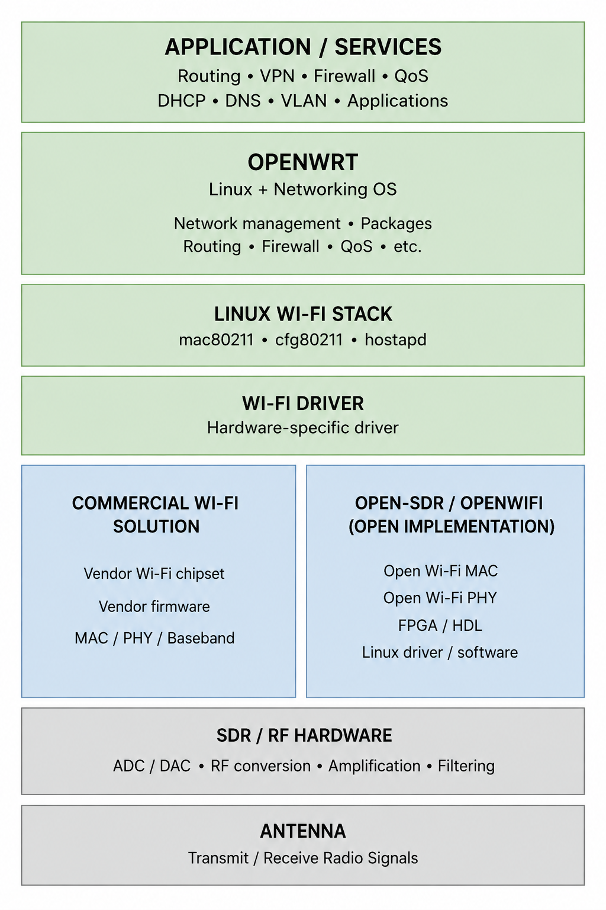

---
date:
  created: 2026-08-24
  posted: 2026-08-24

author:
  name: Mujeeb
  description: Creator

readtime: 10

categories:
  - Wifi
  
tags:
    - OpenWRT
    - OpenWifi
    - Open-sdr
    
       
---

# <font color='green'>Open Wifi Part 1: Understanding OpenWrt, OpenWiFi, and Wireless Stack</font>

A practical mental model of how an open Wi-Fi system is built, from the operating system and networking software to the Wi-Fi hardware and radio layer.
<!-- more -->

This article explains what OpenWrt provides, what it depends on, where OpenWiFi fits, and the different options available underneath OpenWrt.


---
## <font color='green'>1. The Big Picture: What Makes Up a Wi-Fi System</font>

A Wi-Fi device is a combination of **hardware, low-level radio software, Wi-Fi protocols, and higher-level networking software**.

A useful mental model is:

```text
Application / Network Services
            ↓
Operating System & Networking
       (e.g. OpenWrt/Linux)
            ↓
Wi-Fi Stack
    (e.g. mac80211, hostapd)
            ↓
Wi-Fi Driver
            ↓
Wi-Fi Chipset / MAC / PHY / Baseband
            ↓
RF Frontend
            ↓
Antenna
```

## The Main Layers

- **Operating system:** Runs the networking software and provides the platform on which applications and network services run.
- **Networking software:** Handles IP networking, routing, firewalling, VLANs, DHCP, DNS, QoS, etc.
- **Wi-Fi stack:** Implements the higher-level 802.11 functionality needed to operate a Wi-Fi network.
- **Wi-Fi driver:** Connects the Linux/Wi-Fi software stack to the specific Wi-Fi hardware.
- **Wi-Fi chipset:** Handles Wi-Fi-specific processing, including MAC and PHY/baseband functions. Depending on the hardware, some of this may be implemented in dedicated hardware, firmware, or an FPGA.
- **RF frontend:** Converts digital radio signals into signals suitable for transmission/reception at the actual radio frequency.
- **Antenna:** Transmits and receives the electromagnetic signal.


---
## <font color='green'>2. OpenWrt: What It Is and What it is NOT</font>

**OpenWrt is an open-source Linux-based operating system for embedded networking devices**, especially routers and access points.

It is best thought of as the **software platform that runs the networking device**.

### What OpenWrt Provides

- **Linux operating system**
- **IP networking**
- **Routing**
- **Firewall**
- **NAT**
- **DHCP / DNS**
- **VLANs**
- **QoS / traffic control**
- **VPN support**
- **Network interfaces and configuration**
- **Package management**
- **Web and command-line management**
- Support for various **Wi-Fi stacks and drivers**


This makes OpenWrt much more than a simple Wi-Fi configuration system. We can use it to build a customized router, access point, mesh node, gateway, or other networking device.

> **OpenWrt gives us the open software platform for the networking device; the actual Wi-Fi implementation depends on the hardware and Wi-Fi driver underneath it.**


---
### What OpenWrt Does Not Provide

OpenWrt provides the **operating system and networking environment**, but it **does not itself contain all the hardware needed to transmit Wi-Fi**.

To turn an OpenWrt device into a Wi-Fi device, additional hardware and software are required: 

- **Wi-Fi chipset / radio**
- **PHY / baseband hardware**
- **RF frontend**
- **Antennas**
- **Hardware-specific Wi-Fi drivers**
- **Chipset firmware**, when required by the hardware
- The physical implementation of the **802.11 PHY**

These components normally come from the **Wi-Fi hardware platform or its manufacturer**.

The important point is that **OpenWrt sits above the physical Wi-Fi implementation**.

---
## <font color='green'>3. How OpenWrt Talks to Wi-Fi Hardware</font>

OpenWrt does not directly control the Wi-Fi chipset. It uses the **Linux wireless subsystem** and a **hardware-specific Wi-Fi driver** to communicate with the chipset.

The simplified path is:

```text
OpenWrt
   ↓
hostapd / wpa_supplicant / iw
   ↓
cfg80211 / nl80211
   ↓
mac80211
   ↓
Wi-Fi Driver
   ↓
Wi-Fi Chipset
```

### The Main Components

- **hostapd:** Controls an access point, including association, authentication, and Wi-Fi security.
- **wpa_supplicant:** Handles Wi-Fi client/station functionality and authentication.
- **iw:** Command-line tool for configuring and inspecting Wi-Fi interfaces.
- **cfg80211:** Linux kernel subsystem used to configure wireless devices.
- **nl80211:** Netlink interface through which user-space programs communicate with the Linux wireless subsystem.
- **mac80211:** Common Linux 802.11 framework used by many Wi-Fi drivers.
- **Wi-Fi driver:** Hardware-specific code that communicates with a particular Wi-Fi chipset.

### Why the Driver Matters

OpenWrt can support a Wi-Fi chipset only when there is a suitable **Linux/OpenWrt driver** for that hardware.

For example, different chipsets use different drivers:

- **Qualcomm/Atheros:** `ath9k`, `ath10k`, `ath11k`, etc.
- **MediaTek:** `mt76`
- Other chipsets have their own drivers.

The driver is therefore the **bridge between the generic Linux/OpenWrt networking software and the specific Wi-Fi hardware**.

### Why This Matters for Open Wi-Fi

This creates an important boundary:

```text
Open-source
    │
    ├── OpenWrt
    ├── Linux wireless subsystem
    └── Open-source driver
             │
             ▼
      ┌─────────────────┐
      │ Wi-Fi chipset   │
      │ firmware / PHY  │
      │ baseband        │
      └─────────────────┘
             │
             ▼
        RF hardware
```

Even if everything above the chipset is open source, the **chipset, firmware, or PHY/baseband can still be proprietary**.


---
## <font color='green'>4. OpenWrt with Commercial / Vendor Wi-Fi</font>

The most common way to use OpenWrt is with a **commercial Wi-Fi chipset** supplied by a hardware manufacturer.

However, **we cannot take any Wi-Fi chipset and simply install OpenWrt on it**. The hardware must be supported by OpenWrt/Linux, including having a compatible **Wi-Fi driver** and, where required, compatible firmware.

### Hardware Compatibility

When choosing hardware for OpenWrt, we need to check:

- Is the **device supported by OpenWrt**?
- Is the **Wi-Fi chipset supported**?
- Is there a compatible **Linux/OpenWrt driver**?
- Does the driver support the Wi-Fi features we need?
- Is the required **firmware** available and compatible?
- Are the required bands, channels, MIMO features, etc. supported?

For example, a Wi-Fi chipset may technically work with Linux but still have **limited OpenWrt support or missing features**.

Therefore:

> **OpenWrt support is hardware-specific. We must choose a supported device/chipset rather than assuming that any Wi-Fi hardware will work.**

### What Is Under Our Control

With a supported commercial Wi-Fi platform, OpenWrt can be used to build:

- Wi-Fi access points
- Routers
- Mesh nodes
- Repeaters
- Gateways
- Customized networking devices

We can modify the networking behavior without modifying the Wi-Fi PHY itself.

For example, we can experiment with:

- Routing
- VLANs
- Firewalling
- QoS
- Traffic shaping
- Network management
- Mesh networking

### What Remains Outside Our Control

With a typical commercial Wi-Fi chipset, some lower-level components may remain proprietary:

- Chipset hardware design
- Firmware
- PHY / baseband implementation
- Hardware-specific features
- Some driver components

Therefore, **OpenWrt does not automatically make the entire Wi-Fi device open source**.


### The Practical Model

Think of the relationship as:

> **OpenWrt = open networking platform**

> **Commercial Wi-Fi hardware = the supported wireless platform underneath it**

> **Driver = the bridge between them**

If our goal is to build a **router, AP, mesh node, or specialized network device**, this combination is usually sufficient.

If we want to modify the **actual Wi-Fi PHY, MAC, or baseband implementation**, we need to look beyond a conventional commercial Wi-Fi chipset. That is where projects such as **open-sdr/openwifi** become relevant (as described below).


---
## <font color='green'>5. open-sdr/openwifi: An Open Wi-Fi Implementation</font>

**open-sdr/openwifi** is an open-source research platform that provides an implementation of Wi-Fi that can be modified at a much deeper level than a typical OpenWrt + commercial Wi-Fi chipset setup.

The key difference is that the project exposes parts of the **actual Wi-Fi MAC and PHY implementation**, including an FPGA-based implementation.

### What It Provides

The project includes:

- **Linux Wi-Fi driver and software**
- Integration with the Linux **`mac80211`** subsystem
- **FPGA-based Wi-Fi MAC/PHY implementation**
- HDL/FPGA source code
- SDR-based RF hardware support
- Tools and software for configuring and experimenting with the system

A simplified view is:

```text
Linux / OpenWrt
       ↓
openwifi driver / software
       ↓
FPGA Wi-Fi MAC / PHY
       ↓
SDR RF hardware
       ↓
Antenna
```

### Why the FPGA Matters

With a conventional Wi-Fi chipset, much of the low-level Wi-Fi implementation is inside the chipset and its firmware.

We normally interact with it through a driver:

```text
Linux
  ↓
Wi-Fi driver
  ↓
Commercial Wi-Fi chipset
  ↓
Closed/partly closed PHY + MAC
```

With open-sdr/openwifi, the FPGA implementation is available as source:

```text
Linux
  ↓
openwifi driver
  ↓
Open FPGA MAC / PHY
  ↓
SDR
```

This gives researchers the ability to **inspect, modify, and experiment with the actual Wi-Fi implementation**.

### What It Is Useful For

open-sdr/openwifi is particularly useful when we want to research or modify:

- Wi-Fi PHY
- Wi-Fi MAC
- Timing and synchronization
- New wireless algorithms
- Experimental Wi-Fi features
- Wireless TSN
- Wi-Fi sensing
- Other low-level wireless techniques

### The Trade-off

This flexibility comes with significantly more complexity.

Unlike installing OpenWrt on a supported commercial router, open-sdr/openwifi generally requires **FPGA/SDR hardware and a deeper understanding of Linux, wireless networking, FPGA development, and digital communications**.

Therefore:

> **OpenWrt + commercial Wi-Fi hardware:** use Wi-Fi as an existing technology and focus on networking.

> **open-sdr/openwifi:** use an open implementation of Wi-Fi itself and have the ability to modify the lower layers.


### <font color='red'>Important: openwifi Does Not Include the Complete RF Chain</font>

**open-sdr/openwifi provides the open digital Wi-Fi implementation, but it is not the complete radio hardware.**

In particular, openwifi does **not** mean that the following are included as part of the openwifi implementation:

- RF frontend
- ADC / DAC hardware
- RF amplifiers
- Filters
- RF up/down converters
- Antenna

A useful mental model is:

```text
open-sdr/openwifi
        │
        ├── Wi-Fi MAC
        ├── Wi-Fi PHY
        ├── FPGA / HDL
        └── Linux driver / software
        │
        ▼
Compatible SDR / RF Hardware
        │
        ├── ADC / DAC
        ├── RF conversion
        ├── Amplification
        └── Filtering
        │
        ▼
     Antenna
```

The SDR/RF hardware is therefore a **separate hardware platform that openwifi uses**.

This distinction is important:

> **openwifi gives us an open implementation of much of the digital Wi-Fi processing; we still need compatible RF hardware and an antenna to actually transmit and receive radio signals.**


---
## <font color='green'>6. Other Wi-Fi Options Under OpenWrt</font>

open-sdr/openwifi is **not the only way to provide Wi-Fi on an OpenWrt device**.

The most common approach is to use a **commercial Wi-Fi chipset with a Linux/OpenWrt-supported driver**.

Examples include platforms based on:

- **Qualcomm / Atheros**
- **MediaTek**
- Other chipsets supported by the Linux wireless subsystem and OpenWrt

The important point is not the manufacturer name alone. The specific **chipset, device, driver, firmware, and OpenWrt version** must be checked for compatibility.

### Option 1: Commercial Wi-Fi Hardware

```text
OpenWrt
   ↓
Linux Wi-Fi stack
   ↓
Supported Wi-Fi driver
   ↓
Commercial Wi-Fi chipset 
   ↓
RF / Antenna
```

This is by far the most practical option when we want to **build a networking system rather than develop Wi-Fi itself**.

We get access to the networking functionality provided by OpenWrt while the chipset handles the low-level Wi-Fi implementation.

### Option 2: open-sdr/openwifi

```text
OpenWrt / Linux
       ↓
openwifi driver
       ↓
Open FPGA MAC / PHY
       ↓
SDR
       ↓
RF / Antenna
```

This is appropriate when we want to **modify or research the Wi-Fi implementation itself**.

### Choosing Between Commercial vs. Openwifi

| Goal | Better option |
|---|---|
| Build a router or AP | Commercial Wi-Fi + OpenWrt |
| Build a mesh node | Commercial Wi-Fi + OpenWrt |
| Build a customized networking device | Commercial Wi-Fi + OpenWrt |
| Experiment with routing/QoS/firewalling | Commercial Wi-Fi + OpenWrt |
| Modify the Wi-Fi MAC/PHY | open-sdr/openwifi |
| Research new PHY algorithms | open-sdr/openwifi |
| Research Wi-Fi timing/TSN | open-sdr/openwifi |
| Experiment with Wi-Fi sensing | open-sdr/openwifi |

### The Practical Rule

> **If Wi-Fi is just the connectivity layer for our project, use supported commercial Wi-Fi hardware.**

> **If Wi-Fi itself is the research subject, consider open-sdr/openwifi.**

This is the main decision to make when choosing what goes underneath OpenWrt.


---
## <font color='green'>7. Open vs Proprietary Layers</font>

Using OpenWrt does **not automatically mean that the entire Wi-Fi system is open source**.

The different layers can have different levels of openness.

For example:

```text
OpenWrt
   ↓
Linux Wi-Fi stack
   ↓
Open-source driver
   ↓
Commercial Wi-Fi chipset
   ↓
Proprietary firmware / PHY / hardware
   ↓
RF / Antenna
```

> In this case, the **upper software layers are open**, but parts of the actual Wi-Fi implementation may remain proprietary.


### A More Open System

With a project such as open-sdr/openwifi:

```text
OpenWrt / Linux
       ↓
Open Wi-Fi software / driver
       ↓
Open FPGA MAC / PHY
       ↓
SDR
       ↓
RF / Antenna
```

More of the implementation is available for inspection and modification.


### What "Open" Can Mean

When evaluating a Wi-Fi platform, it is useful to ask which of these are open:

- **Operating system**
- **Networking software**
- **Wi-Fi stack**
- **Wi-Fi driver**
- **Firmware**
- **MAC implementation**
- **PHY / baseband implementation**
- **FPGA / HDL design**
- **Hardware design**
- **RF hardware**

> <font color='red'>A system can be open at one layer and closed at another.</font>


---
## <font color='green'>8. Choosing the Right Platform</font>

The right platform depends on **what we are trying to build or research**.

The most important decision is whether **Wi-Fi itself is the subject of our work**, or whether Wi-Fi is simply the connectivity layer.

### If Wi-Fi Is Just Connectivity

Use:

```text
OpenWrt
   ↓
Supported commercial Wi-Fi hardware
```

This is the simplest and most practical approach.

We can focus on:

- Applications
- Routing
- Networking
- QoS
- Firewalling
- Mesh networking
- Network management

We do not need to understand or modify the Wi-Fi PHY or baseband.

### If We Want to Modify Wi-Fi

Use:

```text
Linux / OpenWrt
       ↓
open-sdr/openwifi
       ↓
FPGA / SDR
```

This makes sense when our research involves:

- MAC/PHY modifications
- New Wi-Fi algorithms
- Wireless synchronization
- Experimental scheduling
- PHY-level sensing
- Wireless TSN
- Other low-level wireless research


### A Simple Decision Table

| Goal | Recommended platform |
|---|---|
| Router / gateway | **OpenWrt + commercial Wi-Fi** |
| Access point | **OpenWrt + commercial Wi-Fi** |
| Mesh networking | **OpenWrt + supported Wi-Fi hardware** |
| Custom networking | **OpenWrt + commercial Wi-Fi** |
| Routing / QoS research | **OpenWrt + commercial Wi-Fi** |
| Wi-Fi MAC research | **open-sdr/openwifi** |
| Wi-Fi PHY research | **open-sdr/openwifi** |
| FPGA-based Wi-Fi research | **open-sdr/openwifi** |
| Wireless TSN research | **open-sdr/openwifi** |
| New Wi-Fi protocol experimentation | **open-sdr/openwifi** |

### The Core Rule

> **Use OpenWrt when we want to build something with Wi-Fi.**

> **Use open-sdr/openwifi when we want to build or modify Wi-Fi itself.**

This distinction prevents unnecessary complexity. If our project is about drones, routing, distributed networking, or applications running over Wi-Fi, we generally do **not** need to build the Wi-Fi PHY ourselves.


---
## <font color='green'>9. Putting It All Together: The Complete Open Wi-Fi Stack</font>

The easiest way to understand the relationship between OpenWrt and open Wi-Fi projects is to look at the complete stack.

### Conventional OpenWrt Device

A typical OpenWrt-based router or access point looks like:

```text
Applications / Network Services
            ↓
          OpenWrt
            ↓
 Linux Networking + Wi-Fi Stack
            ↓
       Wi-Fi Driver
            ↓
 Commercial Wi-Fi Chipset
            ↓
       PHY / Baseband
            ↓
        RF Frontend
            ↓
          Antenna
```

Here, OpenWrt provides the **operating system and networking environment**, while the commercial Wi-Fi hardware provides the lower-level wireless implementation.

### OpenWrt + open-sdr/openwifi

A research-oriented system can instead look like:

```text
Applications / Network Services
            ↓
       OpenWrt / Linux
            ↓
 Linux Networking + Wi-Fi Stack
            ↓
     openwifi Driver
            ↓
     FPGA MAC / PHY
            ↓
          SDR
            ↓
       RF Frontend
            ↓
          Antenna
```

Here, much more of the Wi-Fi implementation is **open and modifiable**.

### The Mental Model

The important thing is to separate the roles:

| Component | Role |
|---|---|
| **OpenWrt** | Operating system + networking platform |
| **Linux wireless stack** | Common Wi-Fi software framework |
| **Wi-Fi driver** | Connects Linux to specific Wi-Fi hardware |
| **Commercial Wi-Fi chipset** | Provides the low-level Wi-Fi implementation |
| **open-sdr/openwifi** | Provides an open, modifiable Wi-Fi implementation |
| **RF hardware** | Converts between digital signals and radio frequency |
| **Antenna** | Transmits and receives the wireless signal |

### The Big Picture

We can therefore think of the system as three broad layers:

```text
┌─────────────────────────────────────┐
│       Applications / Networking     │
│                                     │
│  Routing • Firewall • QoS • VPN     │
│  Mesh • Network Services • etc.     │
├─────────────────────────────────────┤
│          OpenWrt / Linux            │
├─────────────────────────────────────┤
│           Wi-Fi Layer               │
│                                     │
│ Commercial chipset   OR  openwifi   │
├─────────────────────────────────────┤
│          RF + Antenna               │
└─────────────────────────────────────┘
```

The key takeaway is:

> **OpenWrt is an open networking platform, not the entire Wi-Fi system.**

> **Commercial Wi-Fi hardware is the practical choice when Wi-Fi is simply a connectivity layer.**

> **open-sdr/openwifi becomes valuable when we want to inspect, modify, and research the Wi-Fi implementation itself.**

This distinction provides the foundation for understanding more advanced topics such as **Wi-Fi mesh, MANETs, TSN, long-range wireless networking, and programmable wireless systems**.




---
## Relevant Link(s)

[OpenWrt Official Website](https://openwrt.org/)

[Openwifi TSN: Wi-Fi on system-on-chip](https://openwifi.tech)

