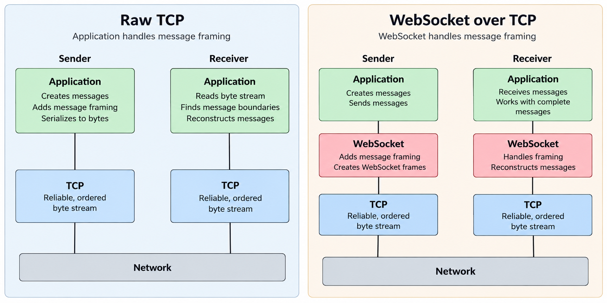
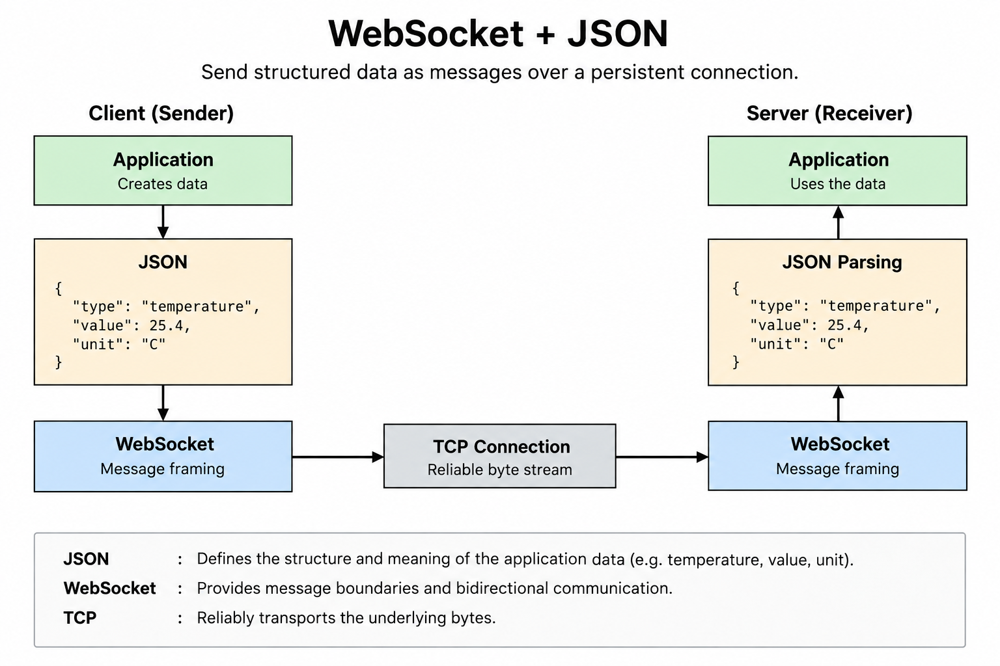

---
hide:
    - navigation
  
tags:
    - Byte Stream vs. Message in TCP
    - Websocket
    
---

# <font color='tomato'>WebSocket vs TCP: What’s the Difference?</font>
*WebSocket uses TCP, but adds message-oriented communication on top of its byte stream.*

This article assumes a basic understanding of TCP as a byte stream.  
See [TCP is NOT Message Oriented](tcp-is-reliable-not-message-oriented.md) before continuing.


---
## <font color='green'>1. What Does WebSocket Add to TCP?</font>

As we saw in [TCP is NOT Message Oriented](tcp-is-reliable-not-message-oriented.md), TCP is a **reliable, ordered, byte-oriented protocol**.

TCP gives us a continuous stream of bytes, but it does not understand **message boundaries**.

For example, if an application sends:

```text
HELLO
WORLD
```

TCP sees:

```text
H E L L O W O R L D
```

The application has to provide its own mechanism to determine where one message ends and another begins.

**WebSocket is a protocol built on top of TCP that adds message-oriented communication.**

It defines its own framing mechanism, allowing applications to send and receive distinct **messages** over the TCP byte stream.

<font color='red'>But message boundaries are not the only thing WebSocket adds.</font>
> WebSocket also provides a **full-duplex communication channel**, allowing both sides to send data independently at any time.

So how does it achieve this while running on top of TCP? The answer is in the WebSocket protocol itself.

> TCP already provides a full-duplex byte stream: each endpoint has an independent stream for sending and receiving.

WebSocket builds on this capability and defines frames that can carry data in either direction:


```text
Client                         Server
  │                              │
  │──── WebSocket frame ────────>│
  │                              │
  │<──── WebSocket frame ────────│
  │                              │
  │──── WebSocket frame ────────>│
  │                              │
```

Neither side has to wait for the other to finish sending before it can send its own data.

This gives WebSocket the communication model that many interactive applications need: **persistent, message-oriented, bidirectional communication over a TCP connection.**


---
## <font color='green'>2. WebSocket Messages and Frames</font>

The focus of this article is the **message-oriented nature of WebSocket**.

With TCP, we saw that there is no concept of a message boundary. It is simply a continuous stream of bytes.

WebSocket adds that missing concept.

Instead of treating the connection as one continuous stream, WebSocket organizes the data into **messages**.

Conceptually:

```text
TCP:

HELLOWORLD
──────────────────────────────
        byte stream
```

WebSocket interprets the communication as:

```text
WebSocket:

┌─────────┐  ┌─────────┐
│  HELLO │  │  WORLD  │
└─────────┘  └─────────┘
 Message 1    Message 2
```

> The WebSocket protocol defines where each message starts and ends, so the application no longer has to invent its own message-framing mechanism.


WebSocket can also split a large message into multiple frames and reassemble them before presenting the complete message to the application.

So from the application's point of view, it can work with:

```text
Message 1
Message 2
Message 3
```

rather than having to worry about how those messages are divided across the underlying TCP byte stream.





---
## <font color='green'>3. Why Use WebSocket Instead of Raw TCP?</font>

If TCP already provides a reliable, full-duplex connection, why do we need WebSocket?

One of the biggest advantage is that WebSocket provides a **standard application-level communication protocol** on top of TCP.

With raw TCP, the application has to define and implement things such as:

- Message framing
- Message types
- Connection establishment rules
- Keepalive or heartbeat behavior
- Handling different kinds of messages


With WebSocket, many of these details are already defined by the protocol.

For example, the application can simply think in terms of:

```text
send message
receive message
```

rather than:

```text
write bytes
read bytes
find message boundary
parse message
reconstruct message
```

WebSocket is also designed to work naturally with **web applications**. A browser can establish a WebSocket connection and then exchange messages with a server without the application having to implement a custom TCP protocol.

So raw TCP gives us **low-level control over a reliable byte stream**.

WebSocket gives us a **standardized, message-oriented communication layer** on top of that stream.


---
## <font color='green'>4. A Practical Example: WebSocket + JSON</font>

A common real-world use of WebSocket is sending structured application data between a client and server.

For example, a monitoring application could send:

```json
{
  "type": "temperature",
  "value": 25.4,
  "unit": "C"
}
```

Here, **JSON defines the structure of the application data**.

WebSocket is responsible for treating this data as a **message**.

TCP is responsible for reliably carrying the underlying bytes.

Conceptually:

```text
Application
    ↓
JSON data
    ↓
WebSocket message
    ↓
TCP byte stream
    ↓
Network
```

At the receiving side:

```text
Network
    ↓
TCP byte stream
    ↓
WebSocket message
    ↓
JSON parsing
    ↓
Application
```

The important distinction is:

```text
TCP
→ Reliable byte transport

WebSocket
→ Message boundaries

JSON
→ Structure and meaning of the application data
```

So WebSocket and JSON are not alternatives. They solve different problems and are commonly used together.



---
## <font color='tomato'>5. Summary</font>

TCP provides a **reliable, ordered byte stream**, while WebSocket adds a **message-oriented communication layer** on top of it.

With raw TCP, the application has to handle message framing itself. With WebSocket, message framing is part of the protocol, so the application can work directly with messages.

WebSocket also uses the **full-duplex nature of a single TCP connection**, allowing both sides to send and receive independently.

In practical applications, WebSocket messages often carry structured data such as **JSON**.

JSON defines the **structure and meaning of the application data**, while WebSocket defines the **message boundaries**, and TCP reliably transports the underlying bytes.

The key distinction is:

```text
TCP       → reliable byte stream
WebSocket → message-oriented communication over TCP
JSON      → structure and meaning of application data
```


---
## Relevant Link(s)

[TCP is NOT Message Oriented](tcp-is-reliable-not-message-oriented.md)

[TCP/IP and Network Progamming Page](../tcpip-networkprogramming.md)


