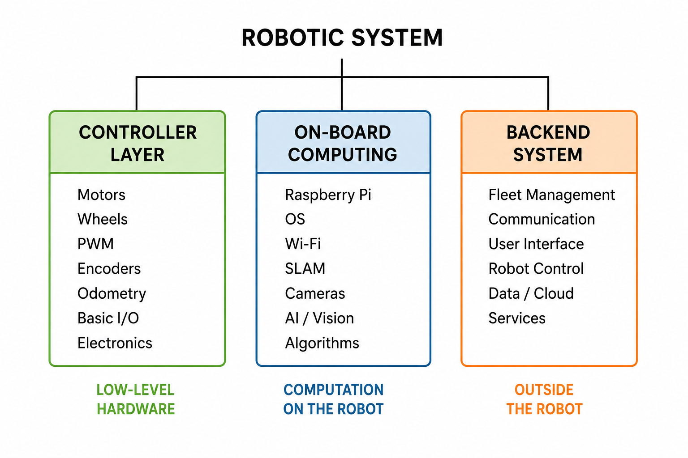

---
tags:
  - raspberry pi

---

# Robotic Systems: Understanding the Three Computing Layers
*A practical map of the controller, onboard computing, and backend layers that make up a modern robotic system*




---
## <font color='green'>1. Objective </font>

A robotic system consists of many components and tools. A modular structure is typically followed, with these components spread across different layers.

When working on a robot, whether as a student or a professional, we need to understand **where our focus lies**. A robotic system can broadly be viewed through three layers:

- **Controller layer** — handles motors, actuators, basic sensors, and low-level control.
- **On-board computing layer** — handles the operating system, cameras, perception, SLAM, and other advanced algorithms.
- **Backend layer** — handles connectivity, communication, fleet management, and user interfaces.

Understanding these layers helps us identify **which part of the robotic system we are working on and what we need to learn in depth**.

---
## <font color='green'> 2. Controller Layer </font>

The controller layer is the lowest layer of a robotic system. Its main purpose is to **directly interact with the physical components of the robot**.

This layer is responsible for basic input and output operations, such as:

- Controlling motors and actuators.
- Reading basic sensors such as encoders and odometry sensors.
- Generating PWM signals for motor control.
- Monitoring the basic state of the robot.
- Handling low-level control and feedback.

A controller typically does not perform complex computation. Instead, it receives commands, interacts with the hardware, and provides feedback to the higher layers.

For example:

    On-Board Computer
           │
           │ Command
           ▼
       Controller
        │       │
        ▼       ▼
      Motors   Sensors
        │       │
        └───┬───┘
            │
            ▼
        Feedback

The controller therefore acts as the **interface between the software running on the robot and the physical hardware**.

For example, an on-board computer may decide that the robot should move forward. The controller receives this command and generates the appropriate signals to drive the motors. It can also read encoder information and return the motor or wheel state to the higher-level computer.

> The important point is that the controller layer is mainly concerned with **hardware interaction, low-level control, and real-time input/output**, rather than computationally intensive algorithms.


---
## <font color='green'> 3. On-Board Computing Layer </font>

The on-board computing layer is responsible for the **more complex computation performed directly on the robot**.

Unlike the controller layer, which mainly handles low-level input and output, this layer uses a more powerful computer such as a **Raspberry Pi, NVIDIA Jetson, or similar platform**.

A typical on-board computing system may include:

- A more powerful processor and memory.
- An operating system such as Linux.
- Wi-Fi, Ethernet, or other communication interfaces.
- Cameras and other advanced sensors.
- Software platforms and algorithms such as SLAM, computer vision, navigation, and AI.

For example:

    Camera ──────────┐
                    │
    LiDAR  ──────────┤
                     ▼
              On-Board Computer
                     │
              ┌──────┴──────┐
              │            │
             SLAM       Navigation
              │            │
              └──────┬──────┘
                     │
                     ▼
                Controller
                     │
                     ▼
                   Motors

The on-board computer receives data from cameras and other sensors, processes the data, and runs the algorithms required for the robot to understand its environment and make decisions.

For example, a robot may use a camera and LiDAR to perform **SLAM (Simultaneous Localization and Mapping)**. The resulting information can then be used for navigation, while the final movement commands are sent to the controller layer.

> Therefore, this layer is mainly concerned with **computation, perception, decision-making, and higher-level robot functions**.


---
## <font color='green'> 4. Backend Layer </font>

The backend layer is the part of the robotic system that exists **outside the robot itself**. It provides the services required to communicate with, manage, and interact with one or more robots.

Communication between the robot and the backend requires **connectivity**. Depending on the application, this may be provided through:

- **Wi-Fi** — commonly used when robots operate within a local network, such as a factory or warehouse.
- **Cellular networks** — useful when robots operate over larger areas or need connectivity outside a local network.
- **Ethernet or other wired networks** — used when a reliable physical connection is available.

A typical backend system may provide:

- **Connectivity and communication** between robots and external systems.
- **Fleet management** for monitoring and managing multiple robots.
- **Data storage and processing** for robot data and logs.
- **User interfaces** for operators to monitor and control robots.
- **Remote control and configuration** of robots.

For example:

    Robot 1 ──┐
    Robot 2 ──┤
    Robot 3 ──┼──► Wi-Fi / Cellular ──► Backend
    Robot 4 ──┤                              │
    Robot 5 ──┘                              │
                                             ├── Fleet Management
                                             ├── Data
                                             ├── Monitoring
                                             └── User Interface

The backend can therefore act as a central system through which users and other applications communicate with robots.

For example, in a fleet of delivery robots, the backend may receive the status and location of every robot, assign tasks, monitor the fleet, store operational data, and provide a dashboard for operators.

Therefore, this layer is mainly concerned with **connectivity, communication, coordination, management, and interaction with robots from outside the robot itself**.

---
## <font color='green'> 5. How the Layers Work Together </font>

The three layers do not operate independently. They work together to form a complete robotic system.

A simple view of the overall system is:

```text

    Backend System
    ┌──────────────────────────────┐
    │ Fleet Management           │
    │ Data / Monitoring          │
    │ User Interface             │
    └──────────────┬───────────────┘
                   │
             Wi-Fi / Cellular
                   │
                   ▼
    On-Board Computing
    ┌──────────────────────────────┐
    │ Operating System           │
    │ SLAM / Navigation          │
    │ Vision / AI                │
    └──────────────┬───────────────┘
                   │
                   ▼
    Controller
    ┌──────────────────────────────┐
    │ Motor Control              │
    │ Sensors / Encoders         │
    │ PWM / Low-level I/O        │
    └──────────────┬───────────────┘
                   │
                   ▼
              Robot Hardware
```


For example, consider a mobile robot moving to a particular location.

The **backend** may assign the robot a task. The **on-board computer** receives the task and uses sensors, SLAM, and navigation algorithms to determine how the robot should move. The **controller** then converts the movement commands into signals for the motors and reads feedback from the encoders and other basic sensors.

> **The controller interacts with the hardware, the on-board computer performs the main robot computation, and the backend connects the robot to the outside world.**

---
## <font color='green'> 5. Overview of the Robotic System </font>

A robotic system can be broadly divided into three main layers. Each layer has a different role, but they work together to form the complete system.

```text

    ROBOTIC SYSTEM
          │
    ┌─────┼────────────┐
    │     │            │
    ▼     ▼            ▼
Controller   On-Board   Backend /
   Layer     Computing   System
    │           │          │
  Motors      Raspberry Pi  Fleet
  Wheels      OS            Management
  PWM         Wi-Fi         Communication
  Encoders    SLAM          User Interface
  Odometry    Cameras       Robot Control
  Basic I/O   AI / Vision   Data / Services
  Electronics Algorithms    Cloud / Backend

```

The **Controller Layer** is responsible for interacting directly with the physical hardware of the robot. It includes motors, wheels, encoders, PWM, basic sensors, and other low-level input/output components.

The **On-Board Computing Layer** provides the computing power required for more advanced robot functions. This may include a Raspberry Pi or similar computer, an operating system, cameras, Wi-Fi, SLAM, computer vision, AI, and other algorithms.

The **Backend Layer** exists outside the robot and connects the robot to external systems. It may provide fleet management, communication, user interfaces, remote robot control, data services, and cloud infrastructure.

These layers provide a simple way to understand **where different components and responsibilities belong within a robotic system**.

---
## <font color='green'> 7. Where Should We Focus? </font>

A robotic system contains many different technologies. However, **a student or professional does not need to study every layer in the same depth**.

It is important to identify our area of focus and spend more effort learning the technologies directly related to it.

For example:

- A **robot control** student should focus more on controllers, motors, sensors, electronics, and low-level control.
- A **robotics software** student should focus more on operating systems, sensors, SLAM, perception, navigation, and algorithms.
- A **robotics backend** student should focus more on connectivity, communication, fleet management, data, and user interfaces.

This does not mean ignoring the other layers. A basic understanding of the complete system is important because all layers must work together.

> **The goal is not to know everything equally. The goal is to know where our focus lies and go deeper in that area.**

Understanding this can help avoid unnecessary effort and allow us to spend more time developing the skills that are most relevant to our work.


---
## <font color='green'> 8. Takeaway </font>

A robotic system consists of many components and technologies, which can be broadly organized into three layers:

    Controller Layer
    └── Motors, sensors, PWM, electronics, low-level control

    On-Board Computing Layer
    └── OS, cameras, SLAM, AI, vision, navigation, algorithms

    Backend Layer
    └── Connectivity, communication, fleet management, data, user interface

Each layer has a different role, and different people may work primarily on different layers.

The important point is that **you do not need to learn everything in equal depth**. First understand the complete robotic system, identify where your work fits, and then focus your learning and effort on that particular layer.

> **Understand the whole system, but go deep where your work lies.**


