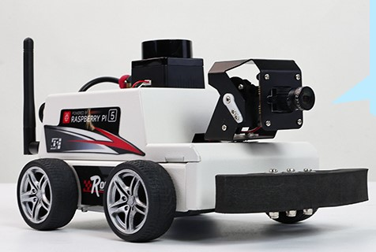

---
tags:
  - yahboom
---

# Yahboom MicroROS-Pi5

---

Yahboom MicroROS-Pi5 is a robotic smart car from Yahboom that lets students and hobbyists explore robotics through hands-on projects.

This section highlights various Yahboom activities, including connectivity setup, programming, software installation, and hands-on project implementation.

---
## Relevant links

[Yahboom Learning Resources](https://www.yahboom.net/download)

[MicroROS-Pi5 Official Website/Documentation](https://www.yahboom.net/study/MicroROS-Pi5)

[Yahboom VM four-wheel Car](http://www.yahboom.net/study/MicroROS-ESP32)

[Yahboom Pi5 repository](https://www.yahboom.net/study/raspberry5)

