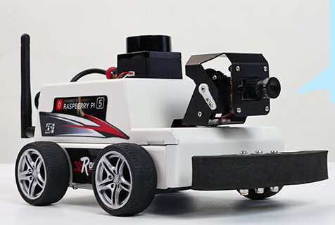

---
hide:
  - navigation
  
tags:
  - Robotic Systems
  - Robot Platforms
  - Yahboom System
  

---

# Yahboom Pi5 Robot: Understanding Its Computing Layers
*Mapping the controller, on-board computer, sensors, and backend components of a real robotic platform*



---
## <font color='green'> 1. Objective </font>

The previous article introduced the three main layers of a robotic system: the Controller Layer, the On-Board Computing Layer, and the Backend Layer. 

[▶ Robotic Systems: Understanding the Three Computing Layers](../robotic_layers.md)


In this article, we will use the Yahboom Pi 5 robot as a practical example to understand how these layers appear in a real robotic platform.

The goal is to identify which parts of the robot belong to each layer and what role each layer plays.

> **The idea is simple: understand the three layers through a real robot.**

---

## <font color='green'> 2. Yahboom Pi 5 Robot Overview </font>

The Yahboom Pi 5 robot brings together the different components required to build a complete robotic system.

At a high level, these components can be viewed through the same three layers introduced in the previous article:

- **Controller Layer**: responsible for low-level interaction with the robot hardware.
- **On-Board Computing Layer**: responsible for computation and higher-level robot functions.
- **Backend Layer**: responsible for communication and interaction with systems outside the robot.

A simplified view of the first two layers is:

```text
                    Yahboom Pi 5 Robot
                           │
             ┌─────────────┴─────────────┐
             │                           │
             ▼                           ▼
     Controller Layer            On-Board Computing Layer
             │                           │
     ┌─────────────────┐         ┌─────────────────┐
     │    ESP32-S3     │         │  Raspberry Pi 5 │
     │                 │         │                 │
     │ • Motor Control │         │ • Linux / OS    │
     │ • Encoders      │◄───────►│ • ROS / ROS 2   │
     │ • Servo Control │ MicroROS│ • Vision / AI   │
     │ • IMU           │         │ • Navigation    │
     │ • Low-level I/O │         │ • Networking    │
     └─────────────────┘         └─────────────────┘
             │                           │
             ▼                           ▼
       Motors / Sensors             Cameras / LiDAR
```

The **ESP32-S3** handles the low-level interaction with the robot hardware, while the **Raspberry Pi 5** provides the computing environment for higher-level robotics software.

The next sections look at each layer in the context of the Yahboom Pi 5 robot.

---
## <font color='green'> 3. Controller Layer </font>

The Controller Layer in the Yahboom Pi 5 robot is based on an **ESP32-S3** located on the MicroROS control board.

The ESP32-S3 is responsible for the lower-level control of the robot. Its main functions include:

- Motor control and encoder feedback
- Servo control
- IMU data acquisition
- Low-level sensor interfacing
- Communication with the Raspberry Pi5 through MicroROS

The controller board provides a **4-channel encoder motor driver**, **2-channel PWM servo driver**, **6-axis IMU**, and interfaces for devices such as LiDAR.

The ESP32-S3 therefore handles the real-time interaction with the robot hardware, while the Raspberry Pi 5 performs the higher-level computation.

> **The ESP32-S3 is the controller; the Raspberry Pi 5 is the on-board computing platform.**

---

## <font color='green'> 4. On-Board Computing Layer </font>

The On-Board Computing Layer of the Yahboom Pi 5 robot is built around the **Raspberry Pi5**.

The Raspberry Pi5 provides the main computing environment for the robot. It runs the operating system and the higher-level software required for robot applications.

Its main roles include:

- Running the **Linux operating system**.
- Running **ROS / ROS 2** and other robotics software.
- Processing data from cameras and other higher-level sensors.
- Running **vision, AI, SLAM, and navigation** applications.
- Communicating with the **ESP32-S3 controller** through MicroROS.
- Providing **Wi-Fi and Ethernet network connectivity** for communication with external systems.

The Raspberry Pi 5 therefore sits above the controller layer. It makes higher-level decisions and sends commands to the ESP32-S3, which handles the low-level interaction with the robot hardware.

> **The Raspberry Pi 5 is the computing layer of the Yahboom robot, while the ESP32-S3 handles the low-level control.**

---

## <font color='green'> 5. Backend Layer </font>

<font color='red'>The Backend Layer exists outside the Yahboom Pi 5 robot. It provides the connection between the robot and external systems.</font>

In this setup, the backend can be viewed as the system that communicates with the Raspberry Pi 5 through the network.

Typical functions include:

- Remote communication with the robot.
- Sending commands to the robot.
- Receiving robot status and data.
- Providing a user interface for interacting with the robot.
- Storing or processing robot data.

The Raspberry Pi 5 acts as the connection point between the robot's on-board computing environment and these external systems.

```text
        Backend / External System
                  │
             Network / Wi-Fi
                  │
                  ▼
           Raspberry Pi 5
                  │
               MicroROS
                  │
                  ▼
              ESP32-S3
                  │
                  ▼
           Robot Hardware
```

> **The Backend Layer connects the robot to systems and users outside the robot itself.**

---

## <font color='green'> 6. How the Three Layers Connect </font>

The three layers of the Yahboom Pi 5 robot work together as a single system.

The **Backend Layer** communicates with the robot through the network. The **Raspberry Pi 5** performs the higher-level computation, while the **ESP32-S3** handles the low-level control of the robot hardware.

```text
        Backend / External System
                  │
             Network / Wi-Fi
                  │
                  ▼
          Raspberry Pi 5
       On-Board Computing Layer
                  │
               MicroROS
                  │
                  ▼
              ESP32-S3
           Controller Layer
                  │
                  ▼
          Motors / Sensors
```

For example, when a movement command is given, the Raspberry Pi 5 processes the command and communicates the required low-level commands to the ESP32-S3. The ESP32-S3 then interacts with the motors and sensors.

Feedback from the hardware follows the reverse path back to the Raspberry Pi 5 and, when required, to the backend system.

> **The three layers work together: the backend communicates with the robot, the Raspberry Pi 5 performs the main computation, and the ESP32-S3 controls the hardware.**


---

## <font color='green'> 7. Mapping the Yahboom Robot to the Three Layers </font>

The Yahboom Pi 5 robot can now be mapped to the three-layer model introduced in the previous article.

```text
                 Yahboom Pi 5 Robot
                         │
        ┌────────────────┼────────────────┐
        │                │                │
        ▼                ▼                ▼
   Controller      On-Board           Backend
      Layer         Computing           Layer
                     Layer
        │                │                │
    ESP32-S3        Raspberry Pi 5    External System
        │                │                │
    • Motors        • Linux          • Network
    • Encoders      • ROS / ROS 2    • Remote Control
    • IMU           • Vision         • User Interface
    • Servo         • SLAM           • Data / Services
    • Low-level I/O • Navigation
```

The important point is that the **physical robot may contain components from more than one layer**. The layers are defined by the role performed by each component, rather than simply by where the component is physically located.

In the Yahboom Pi 5 example:

- **ESP32-S3**: Controller Layer
- **Raspberry Pi 5**: On-Board Computing Layer
- **External computer / services**: Backend Layer

This mapping makes it easier to understand how the general robotic system model applies to a real robot.

---

## <font color='green'> 8. Where Should We Focus? </font>

The Yahboom Pi 5 robot contains components across different layers, but we do not need to study all layers in the same depth.

Our area of interest determines where we should focus:

- **Robot Control**: ESP32-S3, motors, encoders, sensors, and low-level control.
- **Robotics Software**: Raspberry Pi 5, Linux, ROS / ROS 2, perception, SLAM, and navigation.
- **Backend / Robotics Systems**: networking, communication, user interfaces, and external services.

A basic understanding of all three layers is still important because they work together as one robotic system.

> **Understand the complete robot, but go deeper into the layer that matches your area of work.**


---

## <font color='green'> 9. Takeaway </font>

The Yahboom Pi 5 robot provides a practical example of the three-layer robotic system:

```text
Controller Layer
└── ESP32-S3
    └── Motors, encoders, IMU, servo, low-level I/O

On-Board Computing Layer
└── Raspberry Pi 5
    └── Linux, ROS / ROS 2, vision, SLAM, navigation

Backend Layer
└── External Systems
    └── Network, remote control, user interface, data / services
```

Each layer has a different responsibility, but they work together to form the complete robotic system.

> **The controller controls the hardware, the Raspberry Pi 5 performs the main robot computation, and the backend connects the robot to the outside world.**

Understanding this structure makes it easier to identify where a particular hardware component, software function, or robotics task belongs.

---
## Relevant Link(s)

[▶ Robotic Systems: Understanding the Three Computing Layers](../robotic_layers.md)

[MicroROS-Pi5 Docs- External Link](https://www.yahboom.net/study/MicroROS-Pi5)

[Yahboom Pi5 repository- External Link](https://www.yahboom.net/study/raspberry5)


