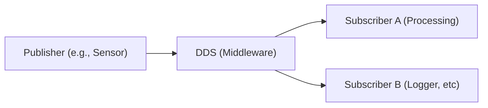

---
tags:
  - publisher
  - subscriber
---

# Publisher-Subscriber (P/S) model
ROS (Robot Operating System) is fully dependent on the subscriber/publisher (P/S) model for its communication framework. 

This section is about fundamental concepts of P/S model.

---
## 1. What is P/S model?

- While the client/server model is arguably the most widely used in networking, it’s not the only one. 

- Other topologies, such as the publisher/subscriber model, peer-to-peer (P2P), and others, offer alternative communication patterns suited to different needs. 

- In the publisher/subscriber model, publishers broadcast messages without knowing who will receive them, while subscribers register interest in specific types of messages without needing to know the source. 

- This loose coupling between sender and receiver enables flexible, scalable, and efficient data distribution.

=== "Single Publisher"

	```mermaid
	graph LR
		Publisher["Publisher<br>(server)"]
		Broker["Message Broker (Topic) "]
		SubscriberA["Subscriber A"]
		SubscriberB["Subscriber B"]
		SubscriberC["Subscriber C"]

		Publisher --> Broker
		Broker --> SubscriberA
		Broker --> SubscriberB
		Broker --> SubscriberC
	```

=== "Multiple Publishers"
	```mermaid
	graph LR
		Publisher1["Publisher 1<br>(topic 1)"]
		Publisher2["Publisher 2<br>(topic 2)"]
		Broker["Message Broker <br>(Topic 1 , Topic 2)"]
		SubscriberA["Subscriber A <br>(topic 1)"]
		SubscriberB["Subscriber B <br>(topic 1)"]
		SubscriberC["Subscriber C <br>(topic 2)"]

		Publisher1 --> Broker
		Publisher2 --> Broker
		Broker --> SubscriberA
		Broker --> SubscriberB
		Broker --> SubscriberC
	```
	**Easily Scalable**

---
## 2. Some other networking models

There are other topology models as well, such as peer-to-peer (P2P), broadcast, multicast, and mesh networks.

- **Client/Server:** Clients request services and servers provide them.
- **Subscriber/Publisher:** Publishers send messages without targeting specific receivers, and subscribers receive only messages they’re interested in.
- **Peer-to-Peer (P2P):** All nodes act as both clients and servers, sharing resources directly.
- **Broadcast:** Messages are sent from one node to all nodes in the network.
- **Multicast:** Messages are sent from one node to a specific group of nodes.
- **Mesh Network:** Every node connects directly to several others, allowing multiple paths for data.


| **Networking Model**    | **Description** | **Typical Use-Cases** |
|------------------------|--------------|--------------------|
| **Client/Server**| Clients request services from a central server.  | Web apps, email, databases, cloud services|
| **Publisher/Subsciber**| Publishers send messages without targeting specific receivers; subscribers receive interested messages. | Real-time messaging, IoT sensor data, event-driven systems, logging|
| **Peer-to-Peer (P2P)**| Nodes act as both clients and servers, sharing resources directly.| File sharing (BitTorrent), blockchain, decentralized communication        |
| **Broadcast**| One node sends messages to all nodes in the network.    | LAN protocols (ARP), network discovery, local multimedia streaming        |
| **Multicast**| One node sends messages to a specific group of nodes. | Live video streaming, online gaming, video conferencing, group chat|
| **Mesh Network**| Nodes connect directly to several others for multiple data paths.              | Wireless sensor networks, disaster recovery, smart homes, community Wi-Fi |

=== "Broadcasting"
	```mermaid
	graph TD
		Broadcaster["Broadcaster<br>(publisher/server)"]
		Node1["Node 1"]
		Node2["Node 2"]
		Node3["Node 3"]

		Broadcaster --> Node1
		Broadcaster --> Node2
		Broadcaster --> Node3
	```

=== "Multicasting"
	```mermaid
	graph TD
		Sender["Sender<br>(publisher/server)"]
		MulticastGroup["Multicast Group"]
		Node1["Node 1 <br>(Member)"]
		Node2["Node 2 <br>(Member)"]
		Node3["Node 3 <br>(Non-member)"]

		Sender --> MulticastGroup
		MulticastGroup --> Node1
		MulticastGroup --> Node2
		%% Node3 is not part of the group, so no arrow to Node3
	```

=== "P/S"
	```mermaid
	graph LR
		Publisher["Publisher<br>(server)"]
		Broker["Message Broker (Topic) "]
		SubscriberA["Subscriber A"]
		SubscriberB["Subscriber B"]
		SubscriberC["Subscriber C"]

		Publisher --> Broker
		Broker --> SubscriberA
		Broker --> SubscriberB
		Broker --> SubscriberC
	```

---
## 3. P/S vs Broadcast
While broadcasting and the publisher/subscriber model might seem similar because both involve sending messages to multiple recipients, they are actually quite different in how they work:

| **Aspect**| **Broadcasting**  | **Multicasting**| **Publisher/Subscriber** |
|-----------------------|------|-------------|---------------------|
| **Message delivery**  | Sends messages to all nodes in the network, regardless of interest              | Sends messages to a specific group of nodes  | Sends messages only to subscribers who have expressed interest in specific topics  |
| **Targeting**         | No filtering; everyone gets the message | Group-based targeting; only members of the multicast group receive messages     | Topic-based targeting; only interested subscribers receive messages   |
| **Scalability** | Less scalable, especially in large networks due to message flooding  | More efficient than broadcasting, but still limited by group size and network    | Highly scalable; decoupled architecture allows for flexible distribution     |
| **Use case example**  | LAN broadcast (ARP requests)  | Live video streaming, IPTV, conferencing | Real-time stock updates, IoT, event notifications  |

---
## 4. P/S vs client/server
Publisher/Subscriber (P/S) and Client/Server can look similar, especially since both involve message exchange between two parties. Here's a breakdown:

| **Aspect**            | **Client/Server**  | **Publisher/Subscriber** |
|-----------------------|-------------------|-------|
| **Communication**     | Direct, request/response model | Indirect, via a broker (or topic)   |
| **Coupling**          | Tightly coupled – client must know the server address              | Loosely coupled – publishers and subscribers don’t need to know about each other    |
| **Direction**         | Bidirectional (client sends request, server responds)              | Unidirectional – publisher sends, subscriber receives (no direct response)          |
| **Scalability**       | Limited by server capacity                                          | Highly scalable – more publishers/subscribers can join without tight dependencies   |
| **Flexibility**       | Less flexible – changes require coordination between client and server | More flexible – subscribers can join/leave dynamically                              |
| **Use Cases**         | Web servers, APIs, file servers, databases     | IoT networks, real-time messaging, event streaming (e.g., Kafka, ROS)               |
| **Example**           | A web browser requesting a web page from a server         | A temperature sensor (publisher) broadcasting data to multiple monitoring devices   |

=== "Client/Server"
	```mermaid
	graph LR
		Client1["Client 1"]
		Client2["Client 2"]
		Client3["Client 3"]
		Server["Server"]

		Client1 -- "Request" --> Server
		Server -- "Response" --> Client1

		Client2 -- "Request" --> Server
		Server -- "Response" --> Client2

		Client3 -- "Request" --> Server
		Server -- "Response" --> Client3
	```

=== "P/S"
	```mermaid
	graph LR
		Publisher1["Publisher(server 1)<br>(topic 1)"]
		Publisher2["Publisher(server 2)<br>(topic 2)"]
		Broker["Message Broker <br>(Topic 1 , Topic 2)"]
		SubscriberA["Subscriber A <br>(topic 1)"]
		SubscriberB["Subscriber B <br>(topic 1)"]
		SubscriberC["Subscriber C <br>(topic 2)"]

		Publisher1 --> Broker
		Publisher2 --> Broker
		Broker --> SubscriberA
		Broker --> SubscriberB
		Broker --> SubscriberC
	```

---
## 5. How does this fit into ROS2?

- Robots often have multiple sensors and components producing data (publishers) and others consuming data (subscribers).

- Various components may need to read data from sensors dynamically; i.e., components can be added or removed at runtime without disrupting the system.

- The Publisher/Subscriber model is very handy because it is highly scalable and loosely coupled.

- The middleware that acts like the broker in ROS2 is called DDS (Data Distribution Service), which handles message routing, discovery, and quality of service.



<font color='red'>Important: DDS in ROS2 is not a strict broker.</font> It enables peer-to-peer communication between nodes, whereas in typical broker-based systems, all data passes through a central broker.

---
## 6. Advantages and disadvantages

### 6.1. Advantages

- **Highly scalable:** Easily supports many publishers and subscribers without tight coupling.
- **Easy to program:** Clear separation of concerns; nodes don’t need direct knowledge of each other.
- **Asynchronous communication:** Publishers and subscribers operate independently, improving fault tolerance.
- **Flexible topology:** Nodes can be added or removed dynamically without affecting the whole system.
- **Middleware handles complexity:** DDS abstracts low-level networking and discovery, simplifying development.

### 6.1. Disadvantages

- **Not always suitable for hard real-time:** Latency and delivery timing can vary depending on middleware and network.
- **Potential message loss:** Depending on QoS settings, some messages might be dropped or delayed.
- **Debugging complexity:** Indirect communication through brokers can make tracing issues harder.
- **Overhead of middleware:** DDS adds extra layers, which might increase resource use compared to simpler direct models.

## 7. Tools that use P/S model

| **Tool**  | **Description / Use Case** | **Typical Use Cases**                              |
|--------------------|----------|-----------|
| **ROS2**           | Robotics middleware using DDS-based P/S communication   | Robotics, autonomous systems, real-time control   || **MQTT (Mosquitto)** | Lightweight MQTT broker implementation for IoT and M2M communication  | IoT devices, home automation, telemetry           |
| **Apache Kafka**    | Distributed event streaming platform for big data and analytics  | Real-time data pipelines, event sourcing, logging |
| **RabbitMQ**       | Message broker supporting multiple messaging patterns including P/S  | Enterprise messaging, task queues, microservices  |
| **ZeroMQ (ØMQ)**   | High-performance asynchronous messaging library supporting P/S   | High-speed messaging, financial services, distributed systems |
| **NATS**           | Lightweight, high-performance messaging system for cloud-native apps | Cloud-native apps, microservices, IoT |
| **ActiveMQ**       | Open-source message broker supporting P/S among other patterns| Enterprise integration, messaging middleware |


---
### Reference(s)
[ROS Concepts](./ros2/ros2-concepts.md)


