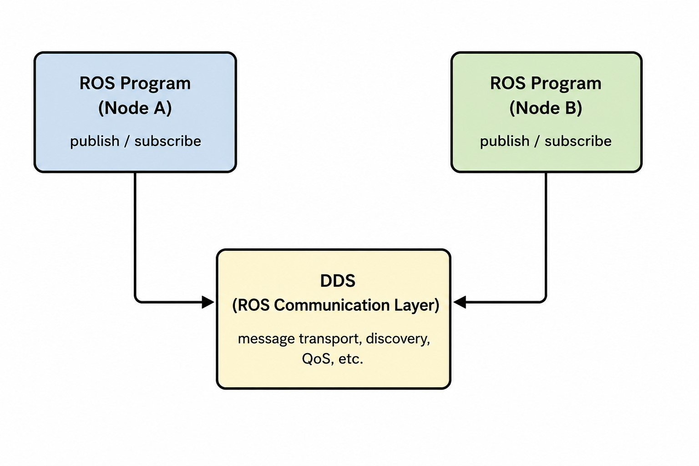
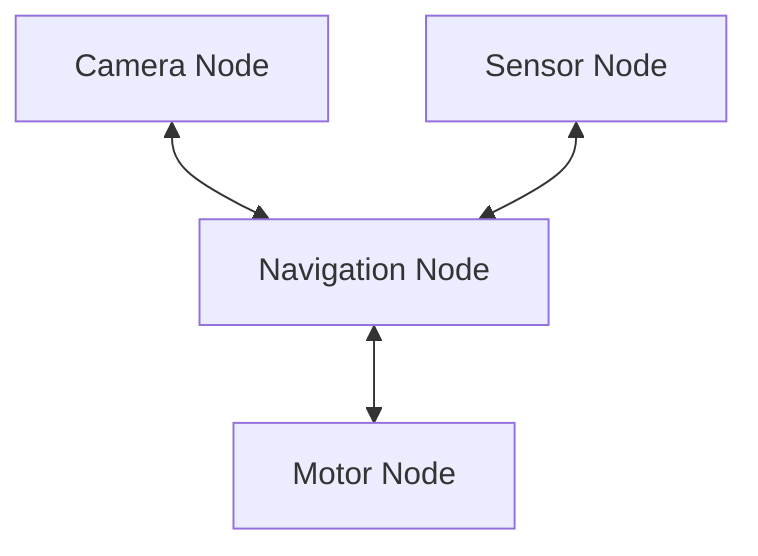
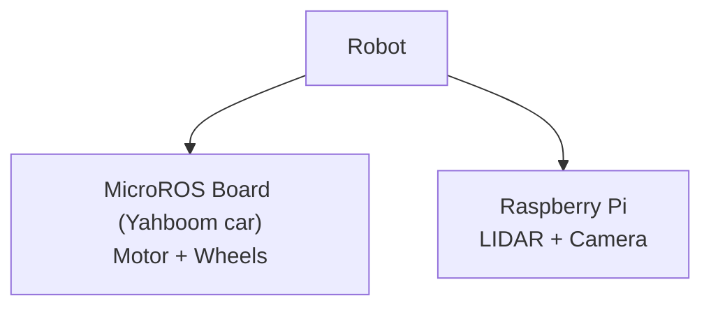
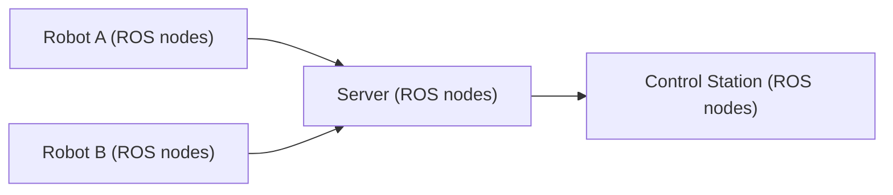

---
hide:
  - navigation

tags:
    - ros
---

# <font color='green'>Robot Operating System (ROS)</font>

---
## 1. What is ROS
- ROS is a robotics software framework that runs on top of an operating system and lets multiple programs work together as a coordinated robot system.

- ROS is <font color='red'>not a real operating system</font>. It does not replace Linux or Windows. It runs on top of an OS, just like a web server or browser application.

- ROS lets us write **programs that run and communicate in a structured way**, instead of being independent programs. These programs can easily exchange data, coordinate actions, and work together as a system.



---
## 2. ROS is scalable and dynamic

- These programs (nodes) can be pieces of code that read data from sensors, or code that receives data from other modules, such as robot movement commands.

- The <font color='red'>underlying mechanism </font>is the [publisher/subscriber model](pubsub-model.md), which is highly scalable and dynamic (nodes can be added or removed at any time without changing other components).

- So instead of one big program, ROS splits a robot system into many small, independent programs.

## 3. ROS inside single/multiple machines
- ROS is fundamentally a distributed communication framework

- ROS can run on a single robot computer or across multiple machines and robots connected over a network.

- ROS can be used in **variety of configurations.**

### 3.1 Sinlge machine(robot)

- Most basic configuration


```text
Single robot board:
 ├── Camera node
 ├── Motor node
 ├── Navigation node
 └── Sensor node
```



### 3.2 Multiple computers in one robot

- Very common in real robots (such as [Yahboom](../platforms/yahboom-pi5/index.md))

```text
Robot
 ├── MicroROS board (in Yahboom car)-motor,wheels
 └── Raspberry Pi (additional board for computing for LIDAR, Camera)
```





### 3.3 Multiple robots on same network

```text
Robot A  ←→  Robot B  ←→  Control Station
```

- ROS can distribute nodes across:
```text
robots
servers
control Stations
```




 


---
## **Useful Links**

**[ROS2 Notes Main Page](./ros2/index.md)**


