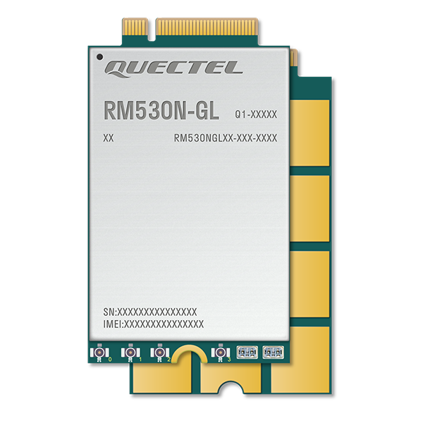
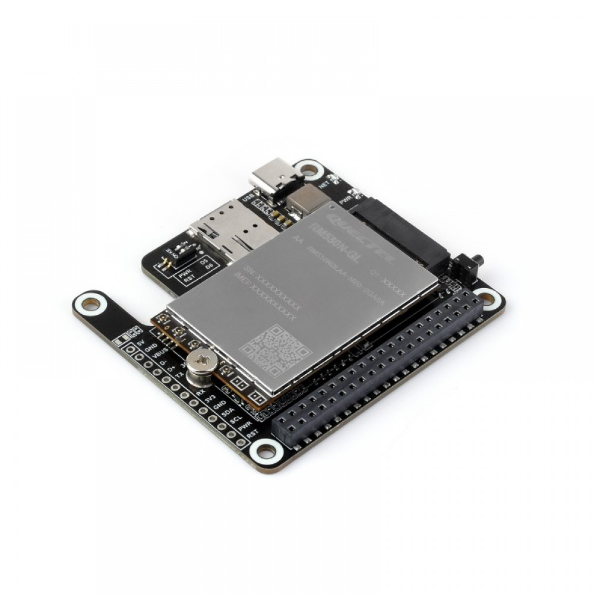
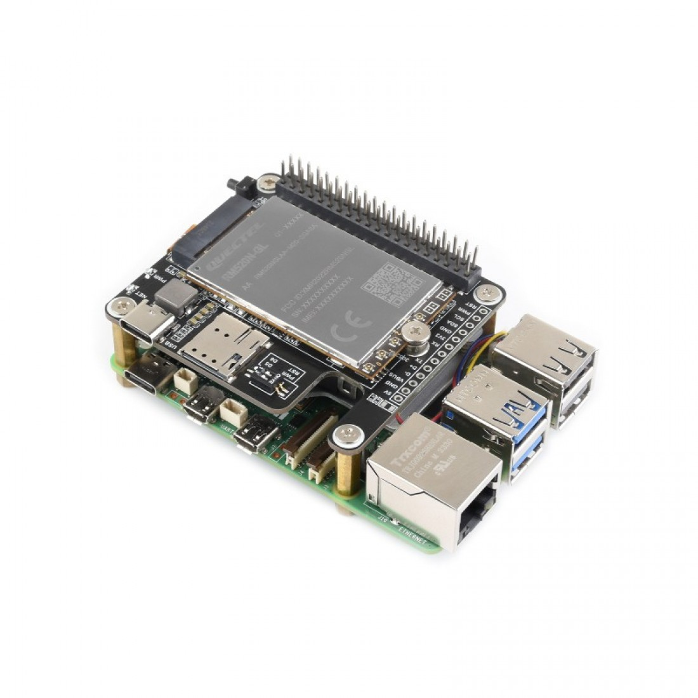
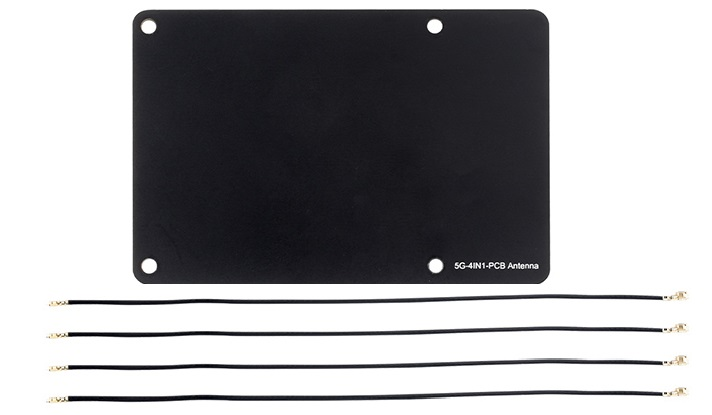
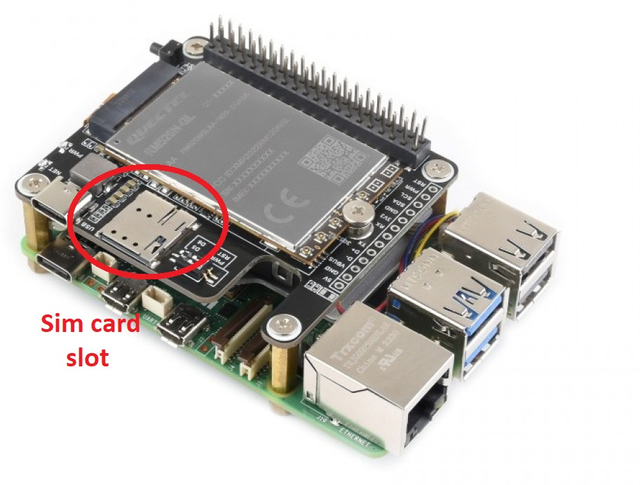
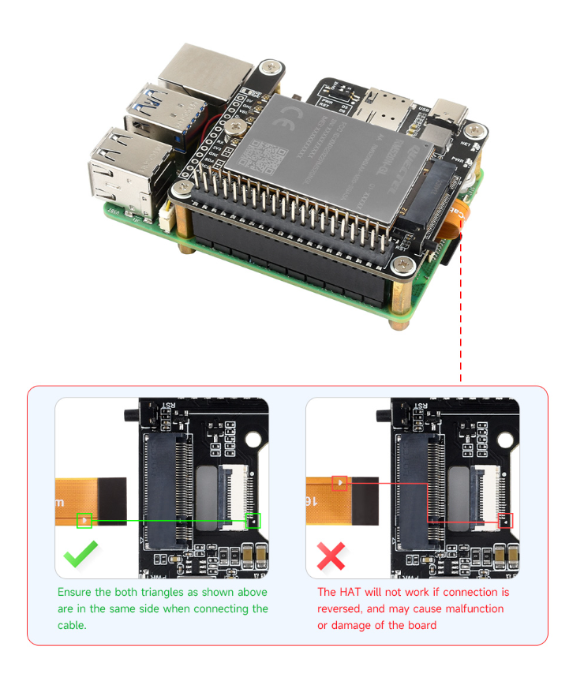

---
tags:
  - quectel
  - RM530N-GL
  - raspberry pi
---

# Hardware setup & connections
This section explains how to connect the RM530N-GL module to a Raspberry Pi board, covering the necessary hardware wiring and interface details.

## 1. Three hardware modules
The hardware setup described here is made up of three modules integrated into a single system

| Component | Image(click to enlarge) | Description |
|:--|:--:|:--|
| 5G RM530N-GL |  | A Sub-6GHz & mmWave 5G module |
| RM530N-GL 5G HAT+|  | RM530N-GL Cap  to 5G HAT+ |
| RPi-5 |  | Raspberry Pi 5 on which cap is mounted |

Description:

1. **5G RM530N-GL:**
A 5G modem responsible for mobile network communication. However, it requires additional components to function properly, including a SIM card and antennas.

2. **RM530N-GL 5G HAT+:**
This HAT acts as a bridge between the modem and the target computer (e.g. Raspberry Pi 5). It provides the necessary interfaces for both sides: a SIM slot and other supports for the modem, and USB/PCIe interfaces to connect with the target computer.

3. **Target Computer (e.g. Raspberry Pi 5):**
The main computing unit where the HAT is mounted. Once connected, the system becomes a complete, functional solution for 5G communication.

In short:
**"Modem is mounted on the HAT, and the Hat is mounted on RPi-5"**

## 2. Additional modules 

Antenna and SIM cards are two important additional units that must be connected to the assembled board. The antenna enables wireless communication, while the SIM card provides access to a mobile network.

- **Antenna:**
An essential hardware component for enabling wireless communication. The antenna, along with its connecting cables, must be attached directly to the modem to ensure proper signal reception and transmission.

- **SIM Card:**
Required to connect to a mobile network. The SIM card is inserted into the slot provided on the HAT, allowing the system to authenticate with a telecommunications operator.

### Pictures of antenna and sim-card slot
Click to enlarge

| Antenna and Wires | SIM-card slot | 
|:--|:--:|
|  |  | 

## 3. Assembling the hardware

Reference: [Waveshre-RM50N-GL_5G_Hat+](https://www.waveshare.com/wiki/RM530N-GL_5G_HAT+#RM5xx_Series_Module){:target="_blank"}

Follow the instructions provided in the link above to complete the hardware assembly.

- ❌ Note: This project does not use the PCIe connection to interface the HAT with the Raspberry Pi 5.
- ✅ Instead, the USB interface is used to connect the HAT to the Raspberry Pi 5.

Click to enlarge:

| ❌PCIe Connection (NOT used in this project) | ✅ USB Connection (used in this project) | 
|:--|:--:|
|  |  | 

## 4. Final assembled board

Below are some images of the fully assembled product, ready for use:

| Piture type | Image(click to enlarge) | Description |
|:--|:--:|:--|
| USB on Pi-5 |  | Shows the USB ports on the Raspberry Pi 5. |
| SIM and USB on Cap |  | Shows the SIM card slot and USB modem on the cap. |
| Cap Mounting on PI-5 |  | Shows how the cap is mounted onto the Raspberry Pi 5. |

---
## 5. Some useful links

[Waveshre-RM50N-GL_5G_Hat+](https://www.waveshare.com/wiki/RM530N-GL_5G_HAT+#RM5xx_Series_Module){:target="_blank"}

[Quectel 5G RM530N-GL](https://www.quectel.com/product/5g-rm530n-gl/){:target="_blank"}

[Hubtronics-RM530N-GL PCIe to 5G Hat+](https://www.hubtronics.in/rm530n-gl-5g-hat-plus?srsltid=AfmBOor0o1-OiXnwroMSHIjHqa-Fa92hwIS_DCLU8MhuV3YA5WxNgYaD){:target="_blank"}
