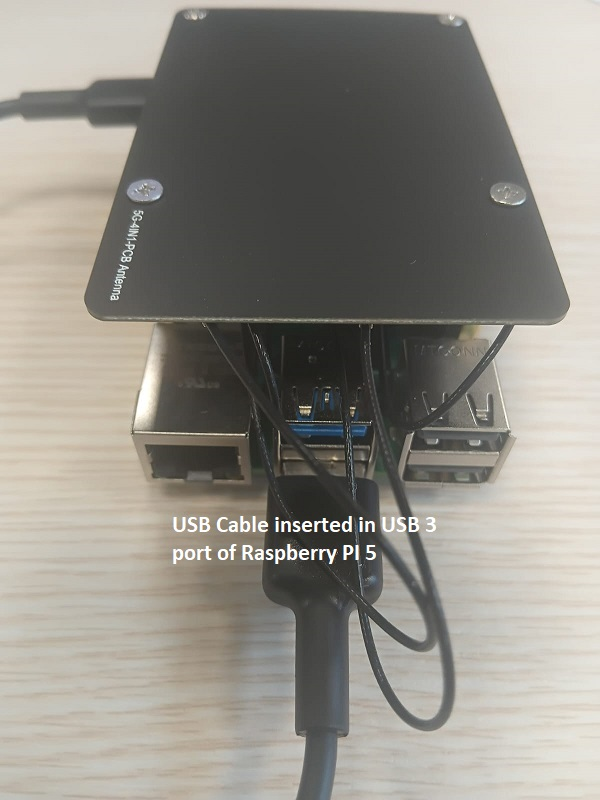
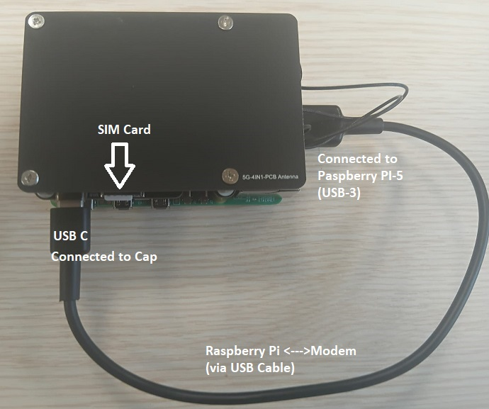
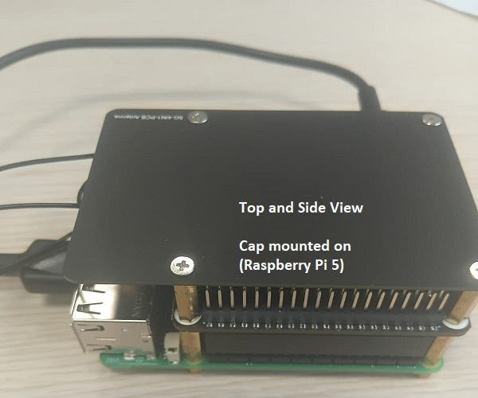
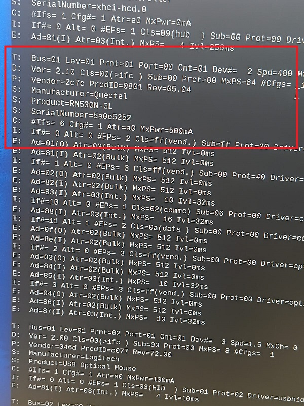

---
tags:
  - quectel
  - RM530N-GL
---

Under Construction

# Software and network setup
This section contains material about installing necessary drivers, initializing the modem, configuring software settings, and establishing network connectivity with RM530N-GL on a Raspberry Pi board. 

**Important note:**

We will be establishing a network **over a USB connection** from RPi-5 and the RM530N-GL cap. 
(we are **NOT** using PCIe connection between PI board and RM50N-GL hat in the setup)

---
## 1. Check the hard-connectivity
Before we start working on the software, we need to make sure that hardware mounting and connectivity is correct.

- USB cable is connected 
- Cap is mounted properly.
- Antenna is mounted on the cap and wires are connected properly.


### Pictures
(Click to enlarge)

| USB on Pi-5 | SIM and USB on Cap | Cap Mounting on PI-5|
|:--:|:--:|:--:|
| <a href="images/usb-pi.jpeg" target="_blank"></a> | <a href="images/usb-modem-and-sim.jpeg" target="_blank"></a> | <a href="images/side-view-cap.jpeg" target="_blank"></a> |

For detailed connection information, see the [hardware setup](hw-setup-pi5.md)

---
## 2. USB connectivity
Power-on the RPi-5 board with the cap mounted on (as shown in above pictures).

### Check USB detection
``` console
lsusb
```
There appears a list of usb devices, and if quectel modem is detected, we should see an entry like this:
``` console
**Quectel Wireless Solutions Co., Ltd. RM530N-GL**
```
### Check serial ports (ttyUSB)
``` console
dmesg | grep tty
```
OR monitor while plugging in
``` console
dmesg -w
```
We should see entries like this:
``` console
usb 1-1: GSM modem (1-port) converter now attached to ttyUSB0
usb 1-1: GSM modem (1-port) converter now attached to ttyUSB1
usb 1-1: GSM modem (1-port) converter now attached to ttyUSB2
usb 1-1: GSM modem (1-port) converter now attached to ttyUSB3
```
### usb-decie list (optional)
type
``` console
usb-devices
```
Information about **Quectel and device model RM50N-GL** should be display (click to enlarge):

<a href="images/usb-devices.jpeg" target="_blank">
  
</a>


**Note:**
Quectel modems usually expose multiple interfaces, each for different purposes:
(**for AT command setup, we'll be using ttyUSB2**)


---
## 3. Install ```minicom```

Minicom:

- is a text-based serial communication tool (terminal emulator) for Linux
- is a lightweight alternative to tools like PuTTY.

To install:
``` console
sudo apt update
sudo apt install minicom
```

To verify:
``` console
minicom --version
```

We should see something like this:
``` console
minicom version 2.8
Copyright (C) Miquel van Smoorenburg.
```
---
## 4. Configure Quectel modem 

- AT commands are the universal language to interact with and control cellular modems (provided by the modem vendors like quectel)
- We first need to connect to modem and configure it using AT commands over the USB interface (minicom is the tool at this stage)
- Once modem is configure, and connectivity to the vendor is verified (e.g. SIM is activated), other software (ModemManager, PPP, etc.) automates these commands.
(to be explained in the next section)


### Step 1: start minicom
type any one of the following:
``` consolde
sudo minicom -D /dev/ttyUSB2 -b 115200
```
Or connect without mentioning the baudrate (minicom uses 115200 as default baudrate)
```
sudo minicom -D /dev/ttyUSB2 
```

### Step 2: AT commands
(under construction)--check later

- 
- 


---
## 5. Configure network on Pi

---
## 6.Some useful links

[Waveshre-RM50N-GL_5G_Hat+](https://www.waveshare.com/wiki/RM530N-GL_5G_HAT+#RM5xx_Series_Module){:target="_blank"}

[Quectel 5G RM530N-GL](https://www.quectel.com/product/5g-rm530n-gl/){:target="_blank"}

[Hubtronics-RM530N-GL PCIe to 5G Hat+](https://www.hubtronics.in/rm530n-gl-5g-hat-plus?srsltid=AfmBOor0o1-OiXnwroMSHIjHqa-Fa92hwIS_DCLU8MhuV3YA5WxNgYaD){:target="_blank"}
