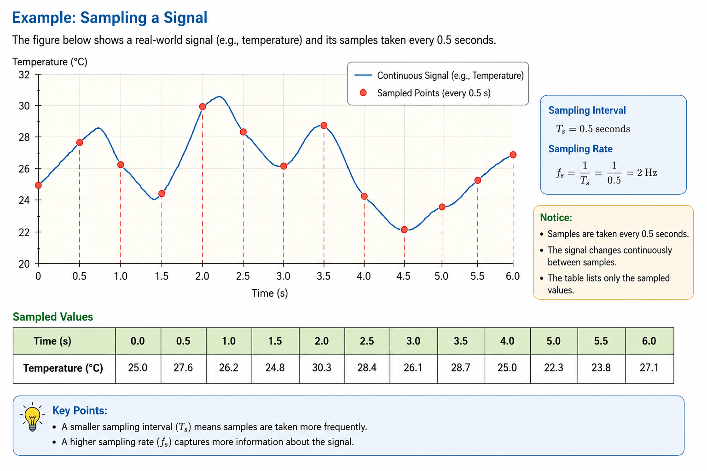

---
hide:
  - navigation
  
search:
  exclude: true
  
---

# <font color='green'>Chapter 2: Analog-to-Digital Conversion (ADC)</font>

**Goal:** Students understand how an analog signal is converted into a digital signal through **sampling** and **quantization**, and the practical limitations introduced by this conversion.

---
## <font color='green'> 2.1 Introduction to ADC </font>

In the previous chapter, we learned that computers can only process **digital signals**, while most real-world signals are **analog**.

The purpose of an **Analog-to-Digital Converter (ADC)** is to convert an analog signal into a digital signal that can be stored, transmitted, and processed by a computer.

This conversion involves two fundamental steps:

1. **Sampling** – Converting a continuous-time signal into a discrete-time signal.
2. **Quantization** – Converting each sample into one of a finite number of digital values.

In this chapter, we will study each of these steps in detail.

---
## <font color='green'>2.2 Why Sampling?</font>

The real world is **continuous**. For example, the temperature of a room exists at every instant of time.

A computer, however, cannot continuously observe a signal. It can only read or store values at specific instants.

Therefore, instead of recording every possible value, we measure the signal at regular time intervals. This process is called **sampling**.

For example, instead of measuring the temperature continuously, we may record it:

- Every 1 second
- Every 100 milliseconds
- Every 10 milliseconds

Each measurement is called a **sample**, and the collection of these samples forms a **discrete-time signal**.

### Key Takeaway

> **Sampling** converts a continuous-time (analog) signal into a **discrete-time** signal by taking measurements at regular time intervals.

---
## <font color='green'>2.3 Sampling Interval and Sampling Rate</font>

When sampling a signal, two quantities are important:

- **Sampling Interval (\(T_s\))** – The time between two consecutive samples.
- **Sampling Rate (\(f_s\))** – The number of samples taken per second.

These two quantities are related by:

\[
f_s=\frac{1}{T_s}
\]

### Example

| Sampling Interval (\(T_s\)) | Sampling Rate (\(f_s\)) |
|------------------------------|-------------------------|
| 1 second | 1 sample/second (1 Hz) |
| 100 ms | 10 samples/second (10 Hz) |
| 10 ms | 100 samples/second (100 Hz) |
| 1 ms | 1000 samples/second (1 kHz) |

Notice that:

- A **smaller sampling interval** means samples are taken more frequently.
- A **higher sampling rate** captures more information about the signal.

The choice of sampling rate is important. If the sampling rate is too low, important information may be lost. We will study this in the next section.




### Key Takeaway

- **Sampling Interval (\(T_s\))** is the time between successive samples.
- **Sampling Rate (\(f_s\))** is the number of samples taken per second.
- A higher sampling rate provides a more accurate representation of the original signal.

---
## <font color='green'>2.4 How Fast Should We Sample?</font>

A natural question arises:

> **How many samples per second are enough to accurately represent an analog signal?**

Intuitively, taking more samples captures more information about the signal. However, taking too many samples increases storage, transmission bandwidth, and computational cost.

On the other hand, taking too few samples may cause important information to be lost.

Is there a minimum sampling rate that still allows us to reconstruct the original signal?

The answer is **yes**.

This is given by the **Nyquist Sampling Theorem**.

### Nyquist Sampling Theorem

If the highest frequency present in a signal is **\(f_{max}\)**, then the sampling rate must satisfy

\[
f_s \ge 2f_{max}
\]

The quantity

\[
2f_{max}
\]

is called the **Nyquist Rate**.

### Example

Suppose a signal contains frequencies up to **5 kHz**.

Then the minimum sampling rate is

\[
f_s \ge 10\ \text{kHz}
\]

In practice, engineers usually sample at a rate slightly higher than the Nyquist rate to provide a safety margin.

### Key Takeaway

To avoid losing information, the sampling rate should be **at least twice the highest frequency present in the signal**.

> <font color='red'><b>Note:</b> At this stage, we are not concerned with the mathematical proof or derivation of the Nyquist Sampling Theorem. Our goal is simply to understand **when** and **why** it is used in practice. The mathematical derivation will be discussed later when we study the frequency domain and the Fourier Transform.</font>

---
## <font color='green'>2.5 Aliasing</font>

What happens if we sample a signal **below the Nyquist rate**?

The answer is **aliasing**.

Aliasing occurs when the sampling rate is too low to capture all the frequency components present in the original signal.

As a result, **high-frequency components appear as lower frequencies** in the sampled signal. Once this happens, the original signal **cannot be recovered**, even if we later increase the sampling rate.

### A Simple Example

Suppose a signal contains a frequency of **8 kHz**.

If we sample it at **10 kHz**, the Nyquist rate is violated because:

\[
10\ \text{kHz} < 2 \times 8\ \text{kHz} = 16\ \text{kHz}
\]

The sampled signal will no longer represent the original 8 kHz signal correctly. Instead, it will appear as a different (lower) frequency.

This phenomenon is called **aliasing**.

### Preventing Aliasing

Aliasing can be prevented in two ways:

1. Sample at or above the **Nyquist rate**.
2. Remove frequencies above the Nyquist limit using an **anti-aliasing filter** before sampling.

The anti-aliasing filter will be discussed in a later chapter on digital filters.

### Key Takeaway

- **Aliasing** occurs when a signal is sampled below the Nyquist rate.
- High-frequency components are misrepresented as lower frequencies.
- Once aliasing occurs, the lost information cannot be recovered.

> <font color='red'><b>Note:</b> At this stage, we are not concerned with the mathematical explanation of **why aliasing occurs** or how the alias frequency is calculated. Our goal is simply to understand **what aliasing is**, **why it happens**, and **how to prevent it** in practice. The mathematical explanation will become clearer when we study the frequency domain and the Fourier Transform.</font>

---
## <font color='green'>2.6 Quantization</font>

After sampling, we have a **discrete-time signal**, but each sample can still take **any real value**.

For example,

```text
25.3
26.8
24.4
28.2
...
```

A computer cannot store infinitely many possible values. Instead, each sample must be represented using a **finite number of levels**.

This process is called **quantization**.

Quantization consists of **two steps**:

1. **Rounding** each sample to the nearest quantization level.
2. **Encoding** the quantized value into binary bits.

---

### Step 1: Rounding to the Nearest Level

The figure below illustrates the first step of quantization. Each sampled value is rounded to the nearest available quantization level.

```text
Temperature (°C)

30 |------------------------------------------------------●
   |                                                    ○ 29.7

29 |-------------------------------------------------------

28 |-------------------------------●-----------------------
   |                             ○ 27.6

27 |-------------------------------------------------------

26 |----------------●--------------------------------------
   |              ○ 26.2

25 |-------------------------------------------------------

24 |---------------------------------------●--------------
   |                                     ○ 24.4

23 |------●-----------------------------------------------
   |    ○ 23.3

   +------------------------------------------------------------>
      Sample 1   Sample 2   Sample 3   Sample 4   Sample 5

Legend:
○ = Original sampled value
● = Quantized value
```

| Sample | Original Value | Quantized Value |
|-------:|---------------:|----------------:|
| 1 | 23.3 | 23 |
| 2 | 24.4 | 24 |
| 3 | 26.2 | 26 |
| 4 | 27.6 | 28 |
| 5 | 29.7 | 30 |

Each original value is rounded to the nearest quantization level.

The difference between the original value and the quantized value is called the **quantization error**.

---

### Step 2: Binary Encoding

After quantization, each sample has been assigned to a quantization level.

The ADC now converts this level into a **digital code (binary number)**.

This encoding depends on:

- The **input voltage (or measurement) range** of the ADC.
- The **number of bits** used.

---

### Example

Suppose an **8-bit ADC** is designed to measure temperatures from

```text
0°C to 100°C
```

An 8-bit ADC provides

```text
2⁸ = 256
```

possible digital codes.

Therefore,

- **0°C** is represented by digital code **0**
- **100°C** is represented by digital code **255**

All other temperatures are mapped proportionally between these two values.

| Temperature (°C) | Digital Code | Binary (8-bit) |
|-----------------:|-------------:|:--------------:|
| 0 | 0 | 00000000 |
| 25 | 64 | 01000000 |
| 50 | 128 | 10000000 |
| 75 | 191 | 10111111 |
| 100 | 255 | 11111111 |

```text
Temperature

0°C  ───────────────────────────────► 00000000

50°C ───────────────────────────────► 10000000

100°C ──────────────────────────────► 11111111
```

Notice that the **binary number does not represent the temperature directly**.

Instead, it represents the **position of the quantized value within the ADC's measurement range**.

### Key Takeaway

The binary output of an ADC is **not simply the binary representation of the measured value**.

Instead, the ADC maps the analog input range to a finite set of digital codes. The computer can later convert these digital codes back into meaningful physical units (such as temperature, pressure, or voltage) using the known ADC range.


---

### Complete Quantization Process

```text
Analog Sample
      │
      ▼
Round to nearest level
      │
      ▼
Quantized Value
      │
      ▼
Convert to Binary
      │
      ▼
Digital Bits
```

### Key Takeaway

Quantization converts sampled values into digital data by:

1. **Rounding** each sample to one of a finite number of levels.
2. **Encoding** the quantized value into binary bits.

> <font color='red'><b>Note:</b> In practice, an ADC performs both steps automatically. We separate them here only to understand the conversion process more clearly.</font>

---
## <font color='green'>2.7 Bit Depth and Quantization Error</font>

The accuracy of a digital signal depends on the **number of bits** used to represent each sample. This is known as the **bit depth**.

If a sample is represented using **\(n\)** bits, then the number of possible quantization levels is

\[
2^n
\]

Some common examples are shown below.

| Bit Depth | Quantization Levels |
|-----------|---------------------:|
| 8-bit  | 256 |
| 10-bit | 1,024 |
| 12-bit | 4,096 |
| 16-bit | 65,536 |

A higher bit depth provides more quantization levels, allowing the digital signal to represent the original analog signal more accurately.

### Quantization Error

Since each sample is rounded to the nearest quantization level, a small difference exists between the original sample value and its digital representation.

This difference is called the **quantization error**.

In general:

- Higher bit depth → Smaller quantization error
- Lower bit depth → Larger quantization error

### Key Takeaway

- **Bit depth** determines the number of quantization levels.
- More bits provide a more accurate representation of the original signal.
- Quantization always introduces a small error, but increasing the bit depth reduces this error.


---
## <font color='green'>2.8 The Complete ADC Process</font>

We can now summarize the complete process of converting an analog signal into a digital signal.

```text
Analog Signal
      │
      ▼
  Sampling
      │
      ▼
Discrete-Time Signal
      │
      ▼
 Quantization
      │
      ▼
Digital Signal
```

The two key operations are:

1. **Sampling** – Converts a continuous-time signal into a discrete-time signal.
2. **Quantization** – Converts each sample into one of a finite number of digital values.

The resulting digital signal can now be:

- Stored in memory
- Processed by a computer
- Transmitted over a network
- Used by DSP algorithms

---
## <font color='green'>2.9 Chapter Summary</font>

## <font color='green'>2.9 Chapter Summary</font>

In this chapter, we learned how a computer converts a real-world **analog signal** into a **digital representation**.

The conversion begins by **sampling** the analog signal at regular time intervals, producing a **discrete-time signal**. To accurately preserve the original signal, the sampling rate must satisfy the **Nyquist criterion**.

Although the signal is now discrete in time, each sample can still take any real value. Therefore, each sample is **quantized** by rounding it to the nearest available level. This introduces a small **quantization error** because the rounded value is not exactly equal to the original sample.

Finally, each quantized level is **encoded into a binary code**. Rather than storing the physical quantity directly, the binary code represents the sample's position within the ADC's measurement range. The number of available codes depends on the **bit depth** of the ADC, with higher bit depths providing more quantization levels and better accuracy.

Together, **sampling**, **quantization**, and **binary encoding** form the complete **Analog-to-Digital Conversion (ADC)** process, allowing real-world signals to be stored, transmitted, and processed by digital computers.

### What's Next?

So far, we have learned how real-world signals enter a digital system.

In the next chapter, we will study the reverse process—**Digital-to-Analog Conversion (DAC)**—which converts digital signals back into analog signals that can be heard, displayed, or measured in the real world.


---
## **Relevant Links**

[Back to DSP Undergrade Level](index.md)

[Back to DSP Courses (All)](../index.md)


