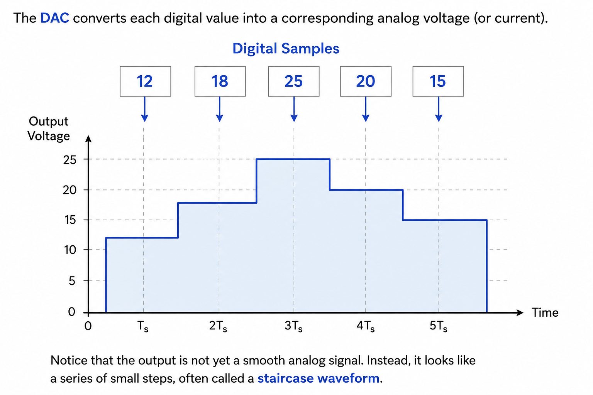
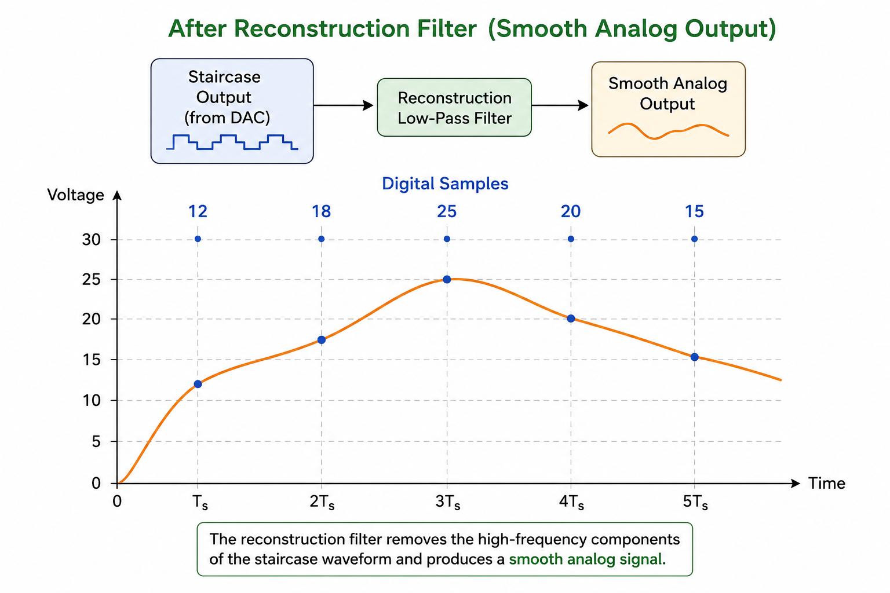

---
hide:
  - navigation
  
search:
  exclude: true
  
---

# <font color='green'>Chapter 3: Digital to Analog Conversion (DAC)</font>

**Goal:** Students understand how a digital signal is converted back into an analog signal, why a DAC is needed, and how the reconstructed analog signal is used in real-world systems.


---
## <font color='green'>3.1 Introduction to DAC</font>

In the previous chapter, we learned how an **Analog-to-Digital Converter (ADC)** converts a real-world analog signal into a digital signal that can be processed by a computer.

Once the processing is complete, we often need to convert the digital signal back into an analog signal. This is the job of a **Digital-to-Analog Converter (DAC)**.

In simple terms:

- **ADC** converts **Analog → Digital**
- **DAC** converts **Digital → Analog**

Without a DAC, digital signals would remain as numbers inside a computer and could not interact with the real world.

### Examples

A DAC is used whenever a digital system needs to produce a real-world analog signal.

Examples include:

- Playing music through speakers
- Audio output from smartphones and laptops
- Voice playback in smart assistants
- Control signals for motors and industrial systems
- Medical devices that generate analog waveforms'

### Common Applications of ADC and DAC

| **ADC (Analog → Digital)** | **DAC (Digital → Analog)** |
|----------------------------|----------------------------|
| Microphone → Computer | Computer → Speaker |
| Camera sensor → Image file | Music player → Headphones |
| ECG sensor → Medical monitor | Smart assistant → Voice output |
| Temperature sensor → Microcontroller | Microcontroller → Motor controller |
| Pressure sensor → Data logger | Signal generator → Analog waveform |
| Radio receiver → Digital baseband | Audio interface → Studio monitors |
| Industrial sensors → PLC/Computer | PLC/Computer → Analog actuator |
| Oscilloscope (signal acquisition) | Function generator (signal generation) |


### Key Takeaway

A **Digital-to-Analog Converter (DAC)** converts a digital signal into an analog signal so that it can be heard, displayed, measured, or used to control real-world systems.


---
## <font color='green'>3.2 How a DAC Works</font>

A DAC performs the **reverse operation** of an ADC.

Instead of converting a continuous analog signal into digital values, it converts a sequence of digital values back into an analog signal.

Suppose a digital signal contains the following sample values:

```text
12
18
25
20
15
...
```

The DAC converts each digital value into a corresponding analog voltage (or current).

```text
Digital Samples
12   18   25   20   15
```



### Key Takeaway

A DAC converts each digital sample into an analog level. The immediate output is a **staircase waveform**, which must be smoothed to reconstruct the original analog signal.


---
## <font color='green'>3.3 Reconstruction Filter</font>

The output of a DAC is a **staircase waveform**, not a smooth analog signal.

To recover a smooth signal, the DAC output is passed through a **reconstruction filter**, also called a **low-pass filter**.

The filter smooths the sharp transitions between adjacent samples, producing an output that closely resembles the original analog signal.

The complete DAC process is therefore:

```text
Digital Signal
      │
      ▼
     DAC
      │
      ▼
Staircase Waveform
      │
      ▼
Reconstruction Filter
      │
      ▼
Analog Signal
```




Without the reconstruction filter, the output would contain unwanted high-frequency components introduced by the staircase waveform.

### Key Takeaway

- A DAC alone does **not** produce a smooth analog signal.
- The DAC output is first a **staircase waveform**.
- A **reconstruction (low-pass) filter** smooths the waveform to recover the analog signal.

---
## <font color='green'>3.4 Low-Pass Filters in ADC and DAC</font>

Although both ADCs and DACs use **low-pass filters (LPFs)**, they serve different purposes.

| **ADC (Before Sampling)** | **DAC (After Conversion)** |
|---------------------------|----------------------------|
| **Anti-aliasing Filter** | **Reconstruction Filter** |
| Placed **before** the ADC | Placed **after** the DAC |
| Removes frequencies above the Nyquist limit | Removes high-frequency components created by the staircase waveform |
| Prevents **aliasing** during sampling | Produces a smooth analog output |
| Input: Analog signal | Input: Staircase waveform |
| Output: Band-limited analog signal | Output: Smooth analog signal |

The complete signal path is therefore:

```text
Analog Signal
      │
      ▼
Anti-Aliasing Filter
      │
      ▼
      ADC
      │
      ▼
Digital Signal
      │
      ▼
      DAC
      │
      ▼
Staircase Waveform
      │
      ▼
Reconstruction Filter
      │
      ▼
Analog Signal
```

### Key Takeaway

Although both are low-pass filters:

- The **anti-aliasing filter** prepares an analog signal **before sampling**.
- The **reconstruction filter** smooths the DAC output **after conversion**.


---
## <font color='green'>3.5 The Complete DSP Signal Chain</font>

We can now summarize the complete journey of a signal through a typical digital signal processing system.

```text
                    REAL WORLD

      Analog Signal
            │
            ▼
  Anti-Aliasing Filter
            │
            ▼
           ADC
            │
            ▼
      Digital Signal
            │
            ▼
   Digital Signal Processing
            │
            ▼
      Digital Signal
            │
            ▼
           DAC
            │
            ▼
 Reconstruction Filter
            │
            ▼
      Analog Signal

                    REAL WORLD
```

This signal chain appears in countless real-world systems, including:

- Smartphones
- Audio players
- Smart speakers
- Medical devices
- Industrial control systems
- Communication systems

### Key Takeaway

A complete DSP system consists of:

1. **Signal acquisition** using an **ADC**.
2. **Digital processing** using DSP algorithms.
3. **Signal reconstruction** using a **DAC**.


---
## <font color='green'> 3.6 Chapter Summary </font>

In this chapter, we completed the journey of a signal from the digital world back to the analog world.

The key points are:

- A **Digital-to-Analog Converter (DAC)** converts a digital signal into an analog signal.
- A DAC converts each digital sample into a corresponding analog voltage or current.
- The immediate output of a DAC is a **staircase waveform**.
- A **reconstruction filter** smooths the staircase waveform to recover the analog signal.
- Although both ADCs and DACs use **low-pass filters**, they serve different purposes:
  - **Anti-aliasing filter** (before the ADC) prevents aliasing.
  - **Reconstruction filter** (after the DAC) smooths the DAC output.
- A complete DSP system consists of:
  - Signal acquisition (ADC)
  - Digital signal processing (DSP)
  - Signal reconstruction (DAC)

At this point, we understand how signals move between the **analog** and **digital** worlds.

In the next part of the course, we will shift our focus from **how signals are represented** to **how signals are analyzed**, beginning with the **time domain** and eventually the **frequency domain**.


---
## **Relevant Links**

[Back to DSP Undergrade Level](index.md)

[Back to DSP Courses (All)](../index.md)


