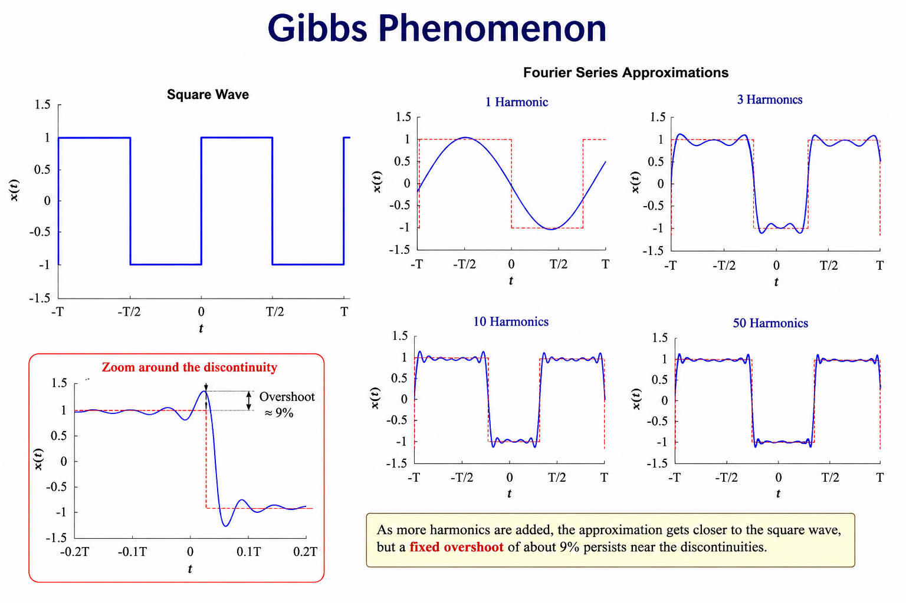

---
hide:
  - navigation
  
search:
  exclude: true
  
---

# <font color='green'>Chapter 9: Fourier Series</font>

**Goal:**  Students understand how a periodic signal can be represented as a sum of sinusoids of different amplitudes, frequencies, and phases, and why the Fourier Series forms the foundation of frequency-domain analysis.

---
## <font color='green'>9.1 Why Fourier Series?</font>

In the previous chapters, we learned two important ideas:

- Any periodic signal can be represented as a combination of sinusoids.
- Linear Time-Invariant (LTI) systems allow each sinusoidal component to be analyzed independently.

The next question is:

> **How can we determine the sinusoids that make up a given signal?**

This is precisely the purpose of the **Fourier Series**.

Instead of viewing a periodic signal as a waveform in the **time domain**, the Fourier Series describes it as a collection of sinusoids, each having its own:

- Amplitude
- Frequency
- Phase

For example, consider the following periodic square wave.

```text
Time Domain

      ┌───────┐       ┌───────┐
      │       │       │       │
──────┘       └───────┘       └────────► Time
```

Although the waveform is not sinusoidal, the Fourier Series tells us that it can be represented as the sum of many sinusoids.

```text
Square Wave

      =

Sinusoid 1
      +

Sinusoid 2
      +

Sinusoid 3
      +

...
```

Each sinusoid contributes a small part of the overall waveform. When all the sinusoidal components are added together, they reconstruct the original signal.

This idea is known as the **Fourier Series**.

Rather than analyzing a complicated waveform directly, we analyze its sinusoidal components. This often makes signal analysis, filtering, and system design much easier.

> <font color='red'><b>Note:</b> The Fourier Series applies only to <b>periodic signals</b>—signals that repeat over time. Non-periodic signals require a different mathematical tool called the <b>Fourier Transform</b>, which will be introduced in the next chapter.</font>

### Key Takeaway

The **Fourier Series** represents a **periodic signal** as the sum of many sinusoids with different amplitudes, frequencies, and phases. This provides a powerful alternative way of describing and analyzing signals.

---
## <font color='green'>9.2 The Fourier Series Concept</font>

The Fourier Series states that **every periodic signal** can be represented as the sum of sinusoids.

Instead of describing a signal by its waveform in the **time domain**, we describe it by listing the sinusoidal components that make up the signal.

Each sinusoid is characterized by three parameters:

- Amplitude
- Frequency
- Phase

The original signal is obtained by simply adding all of these sinusoidal components together.

```text
Original Signal

        =
        Sinusoid 1
      + Sinusoid 2
      + Sinusoid 3
      + Sinusoid 4
      + ...
```

---

### The Fundamental Frequency

Every periodic signal has a **period**, denoted by **T**.

The corresponding frequency is called the **fundamental frequency** and is given by

```text
          1
f₀ = -----------
          T
```

The first sinusoid in the Fourier Series always has this frequency.

---

### Harmonics

The remaining sinusoids have frequencies that are **integer multiples** of the fundamental frequency.

These are called **harmonics**.

| Harmonic | Frequency |
|----------|-----------|
| Fundamental | f₀ |
| Second Harmonic | 2f₀ |
| Third Harmonic | 3f₀ |
| Fourth Harmonic | 4f₀ |
| nth Harmonic | nf₀ |

For example, if

```text
Fundamental Frequency = 50 Hz
```

then the harmonics are

| Harmonic | Frequency |
|----------|-----------:|
| 1st | 50 Hz |
| 2nd | 100 Hz |
| 3rd | 150 Hz |
| 4th | 200 Hz |
| 5th | 250 Hz |

The Fourier Series determines **how much** of each harmonic is required to reconstruct the original signal.

Some harmonics may have large amplitudes, while others may be very small or even zero.

---

### Fourier Coefficients

For every harmonic, the Fourier Series computes a set of numbers called **Fourier coefficients**.

These coefficients determine:

- The amplitude of each harmonic.
- The phase of each harmonic.

Once these coefficients are known, the original signal can be reconstructed by adding all of the harmonics together.

> <font color='red'><b>Note:</b> In this introductory chapter, we focus on the concept of Fourier coefficients rather than their mathematical derivation. The equations used to compute these coefficients will be introduced later.</font>

### Key Takeaway

The Fourier Series represents a periodic signal as the sum of a **fundamental sinusoid** and its **harmonics**. The contribution of each harmonic is determined by its **Fourier coefficients**, which specify the amplitude and phase of that sinusoidal component.

---
## <font color='green'>9.3 Common Periodic Signals</font>

Many real-world signals are **periodic**, meaning they repeat after a fixed interval of time.

Although these signals have very different shapes in the **time domain**, the Fourier Series tells us that each can be represented as a sum of sinusoids.

Some of the most common periodic waveforms are shown below.

| Signal | Typical Applications | Fourier Series Characteristics |
|---------|----------------------|--------------------------------|
| **Square Wave** | Digital electronics, clock signals | Contains only odd harmonics. Harmonic amplitudes decrease with frequency. |
| **Triangle Wave** | Function generators, control systems | Contains only odd harmonics. Higher harmonics decrease much faster than those of a square wave. |
| **Sawtooth Wave** | Audio synthesis, power electronics | Contains both odd and even harmonics. |
| **Pulse Train** | Digital communication, radar, PWM | Harmonic content depends on the pulse width (duty cycle). |

---

### Square Wave

```text
      ┌───────┐       ┌───────┐
      │       │       │       │
──────┘       └───────┘       └────────► Time
```

A square wave changes abruptly between two levels.

Although it contains sharp edges, it can be represented by adding together many sinusoidal harmonics.

---

### Triangle Wave

```text
      /\      /\      /\
     /  \    /  \    /  \
____/    \__/    \__/    \______► Time
```

A triangle wave changes linearly with time.

Compared with a square wave, its higher harmonics are much weaker, giving it a smoother appearance.

---

### Sawtooth Wave

```text
      /|      /|      /|
     / |     / |     / |
____/  |____/  |____/  |______► Time
```

A sawtooth wave rises gradually before changing abruptly.

Unlike the square and triangle waves, it contains both odd and even harmonics.

---

### Pulse Train

```text
      ┌───┐         ┌───┐
      │   │         │   │
──────┘   └─────────┘   └────────► Time
```

A pulse train consists of repeating pulses.

Changing the pulse width changes the harmonic content, making pulse trains particularly important in digital communications and power electronics.

### Key Takeaway

Many periodic signals have very different shapes in the time domain, yet all of them can be represented using the **same Fourier Series framework**. The main difference lies in the amplitudes and phases of their harmonic components.

---
## <font color='green'>9.4 Building Signals with Harmonics</font>

One of the most remarkable features of the Fourier Series is that a complicated waveform can be reconstructed by **adding simple sinusoids together**.

The reconstruction starts with the **fundamental frequency**.

```text
Original Signal

≈ Fundamental
```

The approximation is usually poor because only one sinusoid is used.

---

Next, the **second**, **third**, and higher harmonics are added.

```text
Approximation

≈ Fundamental
+ 2nd Harmonic
+ 3rd Harmonic
+ ...
```

Each additional harmonic makes the reconstructed waveform more closely resemble the original signal.

In theory, if an **infinite number of harmonics** are added, the reconstructed signal becomes identical to the original periodic signal.

---

### Progressive Reconstruction

The figure below illustrates the idea.

```text
1 Harmonic

      ~~~~~~~~


3 Harmonics

    ~~/‾\__/‾\~~


10 Harmonics

   ┌───────┐
   │       │
───┘       └────


Infinite Harmonics

   ┌───────┐
   │       │
───┘       └────────────
```

Notice that the approximation improves as more harmonics are included.

---

### Can We Ever Use Infinite Harmonics?

In practice, the answer is **no**.

Neither computers nor measurement systems can work with an infinite number of sinusoidal components.

Instead, only a **finite number of harmonics** are used.

Fortunately, for many practical signals, a relatively small number of harmonics already provides an excellent approximation.

---

### Gibbs Phenomenon

For signals containing sudden discontinuities, such as a square wave, an interesting effect occurs.

Even after many harmonics are added, a small oscillation remains near the sharp edges.

This small overshoot is known as the **Gibbs Phenomenon**.

Adding more harmonics makes the oscillation **narrower**, but it does **not** disappear completely.



<font color='red'> A detailed study of the Gibbs Phenomenon is beyond the scope of this introductory course.</font>

### Key Takeaway

The Fourier Series reconstructs a periodic signal by **adding harmonically related sinusoids**. As more harmonics are included, the approximation becomes increasingly accurate. However, signals with sharp discontinuities exhibit a small overshoot known as the **Gibbs Phenomenon**.

---
## <font color='green'>9.5 Frequency Spectrum</font>

So far, we have represented signals in the **time domain**, where the signal value is plotted against time.

After applying the Fourier Series, we obtain a completely different representation.

Instead of asking

> **"What is the signal value at a particular time?"**

we ask

> **"How much of each frequency is present in the signal?"**

This new representation is called the **frequency spectrum**.

Rather than a single waveform, the Fourier Series produces **two separate plots**.

---

### Amplitude Spectrum

The **amplitude spectrum** shows the amplitude of each harmonic.

```text
Amplitude
    ^
    |
    |        │
    |        │        │
    |   │    │        │      │
    |   │    │   │    │      │
    +-----------------------------------------> Frequency
       f₀   2f₀  3f₀  4f₀   5f₀
```

Each vertical line represents one harmonic.

The height of the line indicates the amplitude of that harmonic.

---

### Phase Spectrum

The **phase spectrum** shows the phase angle associated with each harmonic.

```text
Phase
 ^
 |
 |      ●
 |
 |                 ●
 |
 |            ●
 |
 +-----------------------------------------> Frequency
      f₀   2f₀  3f₀  4f₀  5f₀
```

Each harmonic has its own phase, which determines how that sinusoidal component is shifted in time.

---

### Time Domain vs Frequency Domain

| Time Domain | Frequency Domain |
|--------------|------------------|
| Signal value versus time | Amplitude versus frequency |
| Shows how the signal changes with time | Shows the strength of each frequency component |
| One waveform | Two spectra (amplitude and phase) |

Both representations describe **exactly the same signal**.

The difference is simply **how the information is organized**.

Some problems are much easier to understand in the time domain, while others become much simpler in the frequency domain.

Throughout the remainder of this book, we will move freely between these two representations depending on which one provides the greatest insight.

### Key Takeaway

The Fourier Series transforms a periodic signal from the **time domain** into the **frequency domain**, where the signal is represented by **two spectra**:

- An **amplitude spectrum**, showing the strength of each harmonic.
- A **phase spectrum**, showing the phase of each harmonic.

Together, these spectra contain all the information needed to reconstruct the original signal.

---
## <font color='green'>9.6 Is Fourier Series Used in Digital Computers?</font>

The Fourier Series is one of the most important mathematical tools in signal processing because it explains **how periodic signals can be represented using sinusoids**.

However, digital computers do **not** compute the Fourier Series directly.

This is because the classical Fourier Series was developed for **continuous-time periodic signals**, whereas computers work with **sampled digital data**.

There are two fundamental differences.

### Continuous vs Discrete Signals

The Fourier Series assumes that the signal exists continuously for all time.

A computer, however, only receives **discrete samples** from an Analog-to-Digital Converter (ADC).

```text
Analog Signal
      │
      ▼
Sampling (ADC)
      │
      ▼
Discrete-Time Signal
```

Since computers never see the original continuous signal, they require a different mathematical tool.

---

### Infinite vs Finite Harmonics

A Fourier Series may contain **an infinite number of harmonic components**.

Although this is mathematically correct, a computer has:

- Finite memory
- Finite storage
- Finite processing speed

Therefore, it can only process a **finite number** of frequency components.

---

### The Discrete Fourier Transform (DFT)

To analyze sampled signals, digital computers use the **Discrete Fourier Transform (DFT)**.

Like the Fourier Series, the DFT converts a signal from the **time domain** into the **frequency domain**.

However, unlike the Fourier Series, the DFT:

- Operates on **sampled (discrete-time) signals**.
- Produces a **finite number of frequency components**.
- Is specifically designed for digital computation.

For large datasets, an efficient algorithm called the **Fast Fourier Transform (FFT)** is used to compute the DFT.

```text
Analog Signal
      │
      ▼
Sampling (ADC)
      │
      ▼
Discrete Samples
      │
      ▼
DFT / FFT
      │
      ▼
Frequency Spectrum
```

Although engineers rarely compute the Fourier Series directly on a computer, it remains extremely important because it provides the **theoretical foundation** for the **Fourier Transform**, **Discrete Fourier Transform (DFT)**, and **Fast Fourier Transform (FFT)**.

### Key Takeaway

The **Fourier Series** is primarily a **theoretical tool** for analyzing continuous-time periodic signals.

Digital computers instead use the **Discrete Fourier Transform (DFT)** and its efficient implementation, the **Fast Fourier Transform (FFT)**, to analyze sampled digital signals.


---
## <font color='green'>9.6 Limitations of the Fourier Series</font>

Although the Fourier Series is one of the most important tools in signal processing, it has several important limitations.

---

### Limitation 1: Applicable Only to Periodic Signals

The Fourier Series can only represent **periodic signals**—signals that repeat after a fixed interval of time.

```text
Periodic Signal

      ┌───────┐       ┌───────┐
      │       │       │       │
──────┘       └───────┘       └────────► Time
```

Many real-world signals, however, are **non-periodic**.

Examples include:

- A spoken word
- A clap
- A radar pulse
- A single ECG heartbeat
- An earthquake

```text
Non-Periodic Signal

            /\__
___________/    \______________________► Time
```

Since these signals do not repeat, they **cannot** be represented using the Fourier Series.

---

### Limitation 2: A Theoretical Tool

The classical Fourier Series is primarily a **theoretical and analytical tool**.

It assumes:

- A continuous-time signal.
- An infinite-duration periodic waveform.
- An infinite number of harmonic components.

These assumptions make the Fourier Series extremely valuable for understanding signal behavior and developing mathematical theory.

However, they also make it **unsuitable for direct implementation on digital computers**, which work with:

- Sampled (discrete-time) signals.
- Finite-length data.
- Finite memory and computational resources.

For this reason, practical digital signal processing uses the **Discrete Fourier Transform (DFT)** and the **Fast Fourier Transform (FFT)** instead.

---

### Looking Ahead

Fortunately, the same fundamental idea behind the Fourier Series can be extended to overcome these limitations.

- The **Fourier Transform** analyzes **non-periodic continuous-time signals**.
- The **Discrete Fourier Transform (DFT)** analyzes **sampled digital signals**.
- The **Fast Fourier Transform (FFT)** provides an efficient algorithm for computing the DFT.

These techniques form the foundation of modern Digital Signal Processing.

### Key Takeaway

The **Fourier Series** is an essential **theoretical foundation** for frequency-domain analysis, but it has two important limitations:

- It applies only to **periodic signals**.
- It is **not intended for direct implementation on digital computers**.

These limitations motivate the study of the **Fourier Transform**, **DFT**, and **FFT**, which are the practical tools used in modern DSP.

---
## <font color='green'>Chapter Summary</font>

In this chapter, we introduced the **Fourier Series**, a mathematical technique for representing a **periodic signal** as the sum of sinusoids with different amplitudes, frequencies, and phases.

We learned that every periodic signal consists of a **fundamental frequency** together with a series of **harmonics**. By combining these harmonics, complex waveforms such as square waves, triangle waves, sawtooth waves, and pulse trains can be accurately reconstructed. As more harmonics are included, the reconstruction improves, although discontinuities give rise to the **Gibbs phenomenon**.

We also discussed two important limitations of the Fourier Series:

1. It is applicable **only to periodic signals**. Non-periodic signals require the **Fourier Transform**.
2. It is primarily a **theoretical analysis tool**. Since it assumes continuous-time signals and an infinite number of harmonic components, it is not suitable for direct implementation on digital computers.

To analyze sampled digital signals, practical DSP systems use the **Discrete Fourier Transform (DFT)**, while the **Fast Fourier Transform (FFT)** provides an efficient algorithm for computing the DFT.

In the next chapter, we will extend the ideas of the Fourier Series by introducing the **Fourier Transform**, which enables frequency-domain analysis of **non-periodic signals**.


---
## **Relevant Links**

[Back to DSP Undergrade Level](index.md)

[Back to DSP Courses (All)](../index.md)


