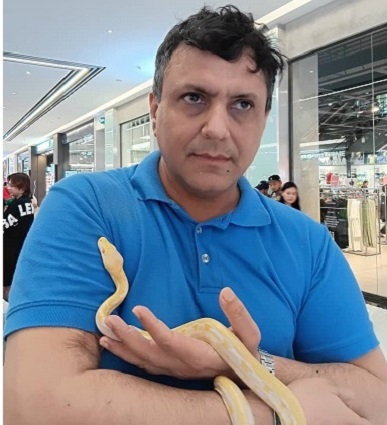

# Engineering Autonomous Systems
<center><b>Communication, autonomy, reliability, and distributed systems for robots, drones, and intelligent systems</b></center>

---

<style>
img {
  border-radius: 50%;
}
</style>

<div style="text-align: center;">
  <!--  -->
  
</div>

---

- Autonomous systems are built from many interconnected technologies—robotics platforms, networking, distributed computing, communication systems, cloud and edge infrastructure, AI, and real-time data processing.

- The goal of this site is to explore how these technologies fit together to create reliable, scalable, and practical autonomous systems.

- Rather than focusing on low-level hardware design, electronics, or mechanics, I focus on the software and systems side of autonomy:
```
Embedded Linux platforms
Robotics middleware (ROS2)
Distributed computing
Networking and communication systems
Cloud-edge integration
System reliability and fault tolerance
AI-enabled autonomous systems
Real-time data and media transmission
End-to-end system integration
```

This site serves as both a personal knowledge base and a collection of practical lessons learned from real-world engineering projects, experiments, and technical explorations.


For more details: [about me](about/aboutme.md)


---
## Looking for something specific?

Use the search bar to find topics such as ROS2, Linux, WebRTC, networking, distributed systems, robotics, drones, and AI.

Or browse the **[Keywords](tags.md)** page to explore content by topic.

---

## About Me

I'm an Autonomous Systems Architect with a passion for understanding how communication, distributed computing, reliability, and AI come together to build real-world autonomous systems.

Learn more on the **[About Me](about/aboutme.md)** page.

---
## Email

**Email:** aloha.mujeeb AT yahoo.com  (please use @ instead of AT)

---
## Connect

[LinkedIn](https://www.linkedin.com/in/alohamujeeb/){:target="_blank"}

