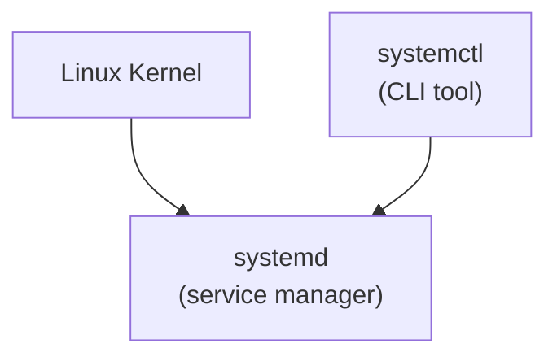

---
tags:
  - systemctl
  - systemd
---

# System Services
---

## 1. What are automatic scripts/services 

In Linux, there are several types of automatic scripts:

1. **Cron jobs:** Scripts that run at scheduled times or regular intervals.

2. **Startup scripts:** Scripts that execute automatically during system boot or when a user logs in.

3. **System services (daemons):** Background processes managed by the system, typically running continuously.

This article will first define each of these types and then focus primarily on system services, which are the main topic of discussion.


### 1.1 Cron job
A cron job is a scheduled task in Linux that runs automatically at specified times or intervals.

Examples:

- Run a script every day at midnight
- Run a backup every Sunday at 2 AM
- Run a command every 15 minutes
- Run a script on the first day of each month at 5 AM


### 1.2 Startup scripts

Startup scripts are scripts that run automatically when the system boots up or when a user logs in. They are commonly used to initialize services, set environment variables, or perform system configuration tasks.

Examples:

- Running a script to mount network drives during system startup
- Starting custom applications when a user logs in
- Setting up environment variables or aliases at login
- Running cleanup tasks each time the system boots

### 1.3 System services (systemd and systemctl)

System services are background processes managed by the operating system, often running continuously to provide core functionality or run specific tasks. 

- On modern Linux systems, these services are typically controlled by ```systemd```, the system and service manager.

```systemctl``` is the command-line tool used to manage these services: starting, stopping, enabling at boot, disabling, and checking their status.


Examples:

- Starting the web server service (apache2 or nginx) automatically at boot
- Managing the database service (mysql or postgresql) as a background process
- Enabling or disabling services to control what runs when the system starts
- Checking the current status or logs of a service

---
## 2. How services are managed

- System services are background processes managed by the operating system. 

- On most modern Linux distributions, these services are managed using ```systemd```; which is the ```init``` system and service manager used by most modern Linux distributions.

- The ```systemctl``` command is used to interact with these services — to start, stop, enable, disable, or check their status.



**systemd is responsible for executing and managing system services. systemctl is the command-line utility used to send commands to systemd to control those services.**

---
## 3. Some 'built-in' services
Most modern Linux distributions come with several built-in services. These services are managed by ```systemd``` and can be controlled using the ```systemctl``` command.

Examples of built-in services:

- **NetworkManager:**  Manages network connections (such as Wi-Fi, Ethernet)
- **sshd:**  Handles incoming SSH connections for remote access
- **cron:** Manages scheduled jobs and tasks
- **cups:** Printer service for Linux

### 3.1 Example usage (network manager)

| Action  | Command  | Description     |
|----------------------|-----|---------|
| Start service  | `sudo systemctl start NetworkManager`  | Start the NetworkManager service   |
| Stop service   | `sudo systemctl stop NetworkManager`   | Stop the NetworkManager service |
| Enable at boot | `sudo systemctl enable NetworkManager` | Enable NetworkManager to start at boot|
| Disable at boot| `sudo systemctl disable NetworkManager`| Disable NetworkManager from starting at boot |
| Check status | `systemctl status NetworkManager` | Show the current status of the service |

---
## 4. Create a service
(in progress)

