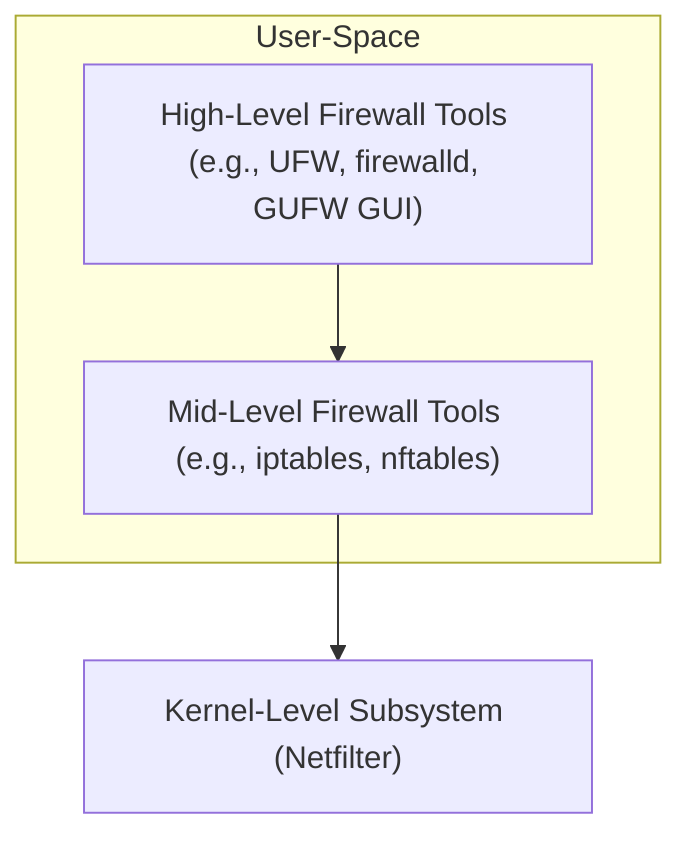
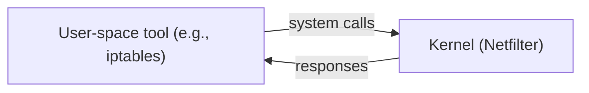

---
tags:
  - Firewall
  - UFW
  - Netfilter
---

# Linux Firewall
A Linux firewall is a software built into the Linux operating system that controls incoming and outgoing network traffic based on a set of rules. 

---
## 1. Netfilter

- Linux firewall implemented as part of the Linux kernel via a subsystem called **Netfilter**.
- Netfilter is a framework within the Linux kernel that provides the infrastructure for various network-related operations, **including firewalling**, network address translation (NAT), packet mangling, and packet filtering.
- It allows or blocks traffic to protect the system from unauthorized access, attacks, or misuse.
- No extra hardware is needed, as the firewall runs on Linux system.

=== "Incoming Traffic"
	```mermaid
	flowchart TB
		EXT["External Network"]
		NIC["Network Interface (eth0)"]
		PR["PREROUTING (Netfilter)"]
		INPUT["INPUT (Netfilter)"]
		APP["Local Application (e.g., SSH, Nginx)"]

		EXT --> NIC --> PR --> INPUT --> APP
	```


=== "Outgoing Traffic"
	```mermaid
	flowchart TB
		APP["Local Application (e.g., curl, apt)"]
		OUT["OUTPUT (Netfilter)"]
		POST["POSTROUTING (Netfilter)"]
		NIC["Network Interface (eth0)"]
		EXT["External Network"]

		APP --> OUT --> POST --> NIC --> EXT
	```

Note:
Prerouting and postrouting is closely related to [NAT](nat1.md) (click for more details)

- PREROUTING is the usual place for [DNAT](nat1.md) (Destination NAT) — changing the destination IP/port before routing happens.
- POSTROUTING is where [SNAT](nat1.md) (Source NAT) or masquerading happens — modifying the source IP after routing, just before the packet leaves the system.


---
## 2. How to configure **```Netfilter```**?
Various toolsor frontends that are used that send rules to Netfilter in the kernel. Some of them are following:

### 2.1. ```iptables``` (traditional interface)

- CLI tool to configure Netfilter rules.
- is used to define how packets are filtered, forwarded, [NATed](nat1.md), etc.

### 2.2. ```nftables``` (modern replacement)

- Modern tool designed to replace iptables, ip6tables, arptables, and ebtables.
- Offers a unified syntax, better performance, and easier rule management.

### 2.3 High-level frontends (simplify management)

| Tool       | Description                           | Uses                         |
|------------|---------------------------------------|------------------------------|
| UFW        | Uncomplicated Firewall (Ubuntu)       | ```iptables``` backend             |
| firewalld  | Dynamic firewall manager (RedHat)     | ```nftables``` or ```iptables``` backend|
| GUFW       | Graphical interface for **UFW**       | Desktop use (```iptables``` backend) |




---
## 3. User-space vs Kernel-space tools

### 3.1 Kernel space

- Kernel is core part of the operating system where critical system code runs (e.g., memory management, device drivers, file systems, network stack).
- Code running in kernel space has direct access to hardware and system resources.
- It is privileged mode, and can execute any instruction and access any memory.
- ⚠️ However, a crash in kernel space can crash the whole system.

### 3.2 User space

- All user applications run here; e.g. shells, editors, browsers, etc.
- Programs in user space cannot directly access hardware or kernel memory.
- They must communicate with the kernel via system calls (e.g., open, read, write).

### 3.3 Netfilter vs user-space tools

- A user-space tool (like iptables) sends commands to the kernel's firewall subsystem (Netfilter) using system calls, often via libraries like libc.
- The kernel carries out the actual work, such as blocking packets or writing data to disk.
- Any module running in kernel space can only be accessed from user space through system calls.
- System calls are well-defined interfaces exposed by the kernel (or device drivers) to safely communicate between user and kernel space




---
## 4. ```ferm``` and ```shorewall```
Besides the popular tools like UFW, firewalld, iptables, and nftables, there are other useful firewall management tools in the Linux ecosystem, such as:


1. ferm — helps write complex firewall rules in clean, human-friendly config files.
2. Shorewall — simplifies managing large or complex firewall setups through easy-to-understand configuration files.

### 4.1 Comparision
- UFW is the easiest and best for quick setups, mostly on desktops or simple servers.
- firewalld adds dynamic rule management and works well in environments requiring zones and services.
- ferm and Shorewall are powerful tools aimed at sysadmins who want fine-grained control with configuration files — ideal for complex and large firewall setups.
- Both ```ferm``` and ```Shorewall``` require more understanding of iptables and networking concepts but provide much more flexibility.

## 5. Analogy of various tools

| Layer                  | Analogy                      | Tools                                      |
|------------------------|------------------------------|--------------------------------------------|
| **Kernel Layer**       | Hardware / CPU               | `Netfilter`                                |
| **Low-Level Tools**    | Assembly Language            | `iptables`, `nftables`                     |
| **High-Level Tools**   | High-Level Programming Language | `ufw`, `firewalld`, `ferm`, `Shorewall` |

- Netfilter is like the CPU; it's the engine inside the kernel that executes firewall logic.
- iptables and nftables are like assembly language:
	```
	Powerful but verbose
	Precise but hard to read and maintain
	Require detailed instructions
	```
- ufw, ferm, firewalld, etc. are like high-level languages:
	```
	Easier to use and understand
	Abstract away low-level complexity
	Generate the low-level rules for you
	```

---
## Relevant links
[UFW reference](../linux-cli.md)


