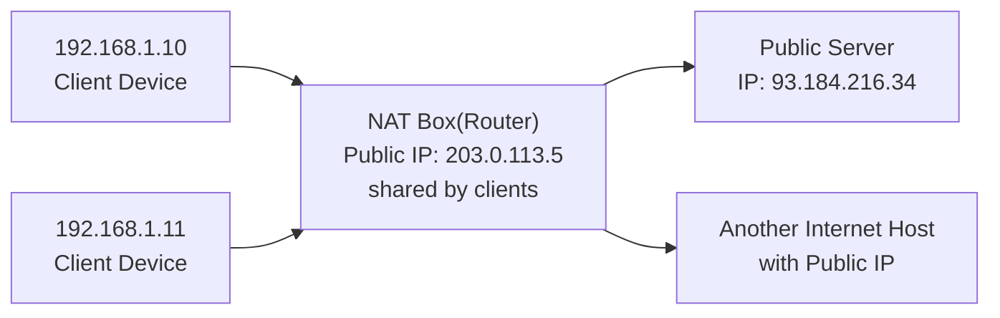
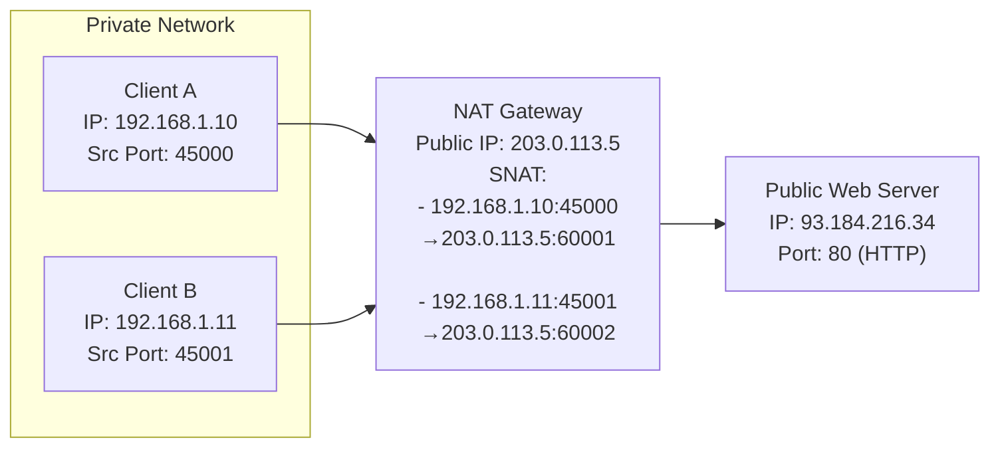
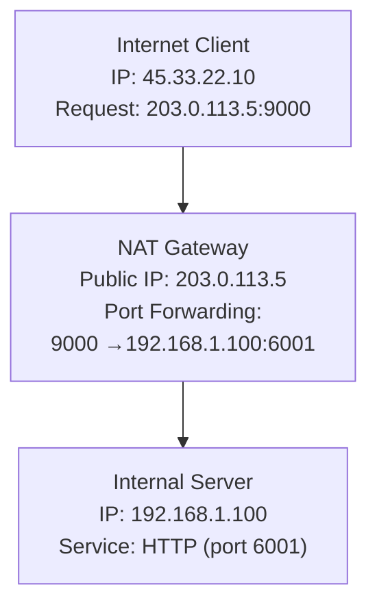

---
tags:
  - NAT
---

# Network Address Translation (NAT)
NAT (Network Address Translation) is a method used in networking to allow multiple devices on a private network to share a single public IP address when accessing external networks like the internet.

---


```text
NOTE:
- NAT translates internal private IPs (192.168.x.x) to the public IP (203.0.113.5).
- Public servers on the internet must have public IPs (e.g., 93.184.216.34).
- Responses from public servers are routed back to the NAT device, which forwards
```

## Port forwarding
Port Forwarding allows external devices to reach a specific internal service (like a web server or SSH server) behind a NAT router.



```text
Note:
- Both clients initiate HTTP requests to 93.184.216.34:80
- NAT translates each client's private IP and source port to the public IP and a unique source port
- The server replies to 203.0.113.5:<port>, and NAT routes responses back to the correct client
```


## SNAT/ MASQUERADE
SNAT (Source NAT) is a technique that changes the source IP address (and optionally the port) of packets leaving a private network so they can communicate with the public internet.

- Devices in a private network (with IPs like 192.168.x.x) can’t be routed on the internet.
- SNAT replaces their private IPs with the public IP of the NAT router, allowing internet access.

Before SNAT (at the device):
```
From: 192.168.1.10:45000 → 93.184.216.34:80
```

After SNAT (at the router):
```
From: 203.0.113.5:60001 → 93.184.216.34:80
```

## DNAT (Destination NAT)

- SNAT modifies the source IP address of outgoing packets from a private network to the public IP, so replies from the internet come back correctly.
- DNAT modifies the destination IP address of incoming packets from the public IP to a private IP inside the network, so external clients can reach internal services.
- DNAT typically happens in the router or NAT gateway that sits between the internet and your private network.'


| Direction | Address Modified         | Purpose                                   |
|-----------|--------------------------|-------------------------------------------|
| SNAT      | Source IP (outbound)     | Private → Public IP for internet access   |
| DNAT      | Destination IP (inbound) | Public IP → Private for incoming requests |



```
Note:
- External client sends request to NAT gateway’s public IP on port 8080.
- NAT gateway rewrites destination IP and port to internal server’s private IP and port.
- Internal server responds; NAT tracks connection and forwards response back to client.
```


## NAT vs Reverse proxy
NAT (Network Address Translation):

- Works at the network layer (IP level).
- Translates IP addresses and ports to route traffic between private and public networks.
- Primarily used to allow multiple devices on a private network to share a single public IP.
- Handles all types of protocols, not limited to HTTP/HTTPS.

Reverse Proxy:

- Works at the application layer (HTTP, HTTPS, TCP).
- Acts as an intermediary server that forwards client requests to backend servers.
- Provides additional features like load balancing, SSL termination, caching, and security.
- Mainly used for web services and application-level traffic management.

---
## Relevant links
[Netfilter and Firewall](linux-firewall.md)


