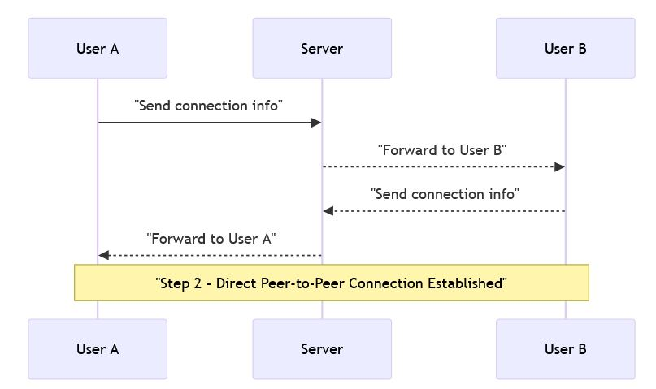
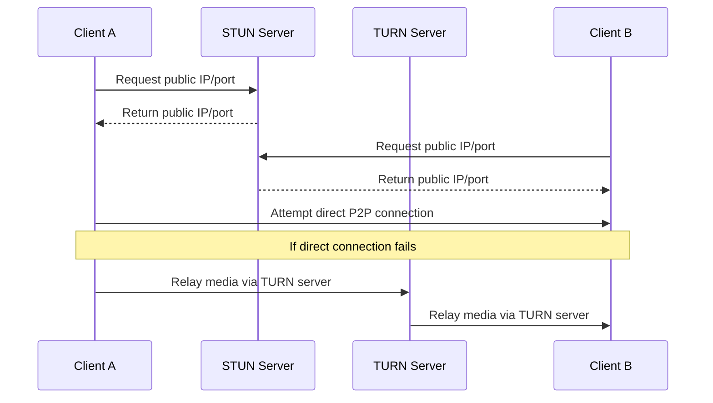

---
tags:
  - WebRTC
  - P2P
  - TURN
  - STUN
---

# WebRTC (Web Real Time Communication)

---
## 1. What is WebRTC?

- WebRTC is a communication protocol and technology that enables two devices (like browsers or mobile apps) to connect **directly with each other** over the internet. 

- Can be used for real-time audio, video, or data communication, without routing the actual content through a central server.

---
## 2. How it works
Following are the steps involved:

**Step 1. Initial contact via a server:** The two clients first connect to a server (called a **signaling server**) to exchange connection details, like their IP addresses and ports.

(This step is like two people calling a receptionist to get each other’s phone numbers.)

**Step 2. Direct Peer-to-Peer (P2P) connection:**
Once connection info is exchanged, the two devices establish a direct, secure connection between themselves. This is called a peer-to-peer (P2P) connection.

From this point forward, they communicate directly, bypassing the server entirely.

**Step 3. Secure and Real-Time Communication:** All media and data shared is encrypted, and communication happens in real time, with very low latency.

<!-- (remove space betwee -- and > in the code)
```mermaid
sequenceDiagram
    User A ->>Signaling Server: "Send connection info"
    Signaling Server -- >>User B: "Forward to User B"
    User B-- >>Signaling Server: "Send connection info"
    Signaling Server-- >>User A: "Forward to User A"
    
    Note over User A, User B: "Step 2 Direct Peer-to-Peer Connection Established"
```
-->


### 2.1 What is signaling

Signaling is the process of coordinating communication between two (or more) peers in WebRTC. It’s not handled by WebRTC itself, so you must implement it separately.

(i.e. Signaling is how two devices exchange the information they need to start a WebRTC connection.)

## 3. Can server take back control?

**Question:** What happens when a user’s authorization expires (e.g. due to account balance depletion) after signaling is completed and the P2P connection is already established?

**Ans:** WebRTC is designed for peer-to-peer (P2P) communication. Once the signaling is done and the connection is established, media/data flows directly between clients, bypassing the server (except when using a TURN or media server).

So:

✅ Signaling & auth checks can be enforced before connection.

❌ After signaling, the server is no longer "in the loop" to control or terminate the connection; unless we've built infrastructure to do that.


### 3.1 How to enforce Authorization AFTER connection?

a. **Client Polling **: Client pings the backend every X seconds to check if they’re still authorized.

b. **Server Push **: Keep a real-time connection (e.g., WebSocket).

c. **Use TURN Server with Authorization Control:** If users are behind strict NAT/firewalls, you’re already using a TURN server to relay media. 

- TURN server can be configured to require credentials and time limits.
- Once the token/session expires, the TURN server stops relaying media.

### 3.2 TURN 


TURN (Traversal Using Relays around NAT) is a relay server that allows WebRTC communication to work when direct peer-to-peer connections are blocked by network restrictions.

It acts as a relay server that forwards media/data traffic between two peers.

- TURN is used as a **fallback mechanism** after attempts to establish a direct connection using STUN or local candidates fail.

- Because TURN relays all media, it consumes bandwidth and adds some latency.

- TURN servers are centralized infrastructure that enable connectivity in challenging network conditions.

### 3.3 STUN

STUN (Session Traversal Utilities for NAT) is a protocol and server that helps WebRTC clients discover their public IP address and port when behind a NAT (Network Address Translator).

Its main function is to enable peers to determine how they are reachable on the internet, which is essential for establishing a direct peer-to-peer connection.

Unlike TURN, STUN does not relay media; it only helps in discovering network information required to attempt a direct connection.

### 3.4. Pictorial view




---
## 4. Some use-cases

| Use Case                      | Description                                   |
|------------------------------|-----------------------------------------------|
| Video and Voice Calls         | Real-time audio/video communication between users (e.g., Zoom, Google Meet) |
| Live Streaming with Interaction | Broadcasting video with real-time user interaction |
| Real-time Gaming             | Multiplayer games with low-latency peer communication |
| File Sharing Peer-to-Peer    | Direct transfer of files between users without servers |
| IoT Device Communication     | Low-latency communication between IoT devices |
| Remote Desktop and Support   | Screen sharing and remote control over the web |
| Collaborative Editing        | Real-time document or whiteboard collaboration |
| Telehealth                  | Remote medical consultations with video and data sharing |
| Customer Support Chatbots    | Interactive voice/video support sessions |
| Augmented/Virtual Reality    | Real-time data streaming for AR/VR experiences |

---
## 5. Key objectives

1. **Direct communication:** Establishes P2P connetion to enable low-latency transmission of audio, video, and data

2. **Reduced server load:** Once the connection is established, data flows directly between peers minimizing bandwidth and processing demands on the server.

3. **Real-time interaction:** More suited for use-cases like video calls, live chats, and remote control where real-time response is necessary.


