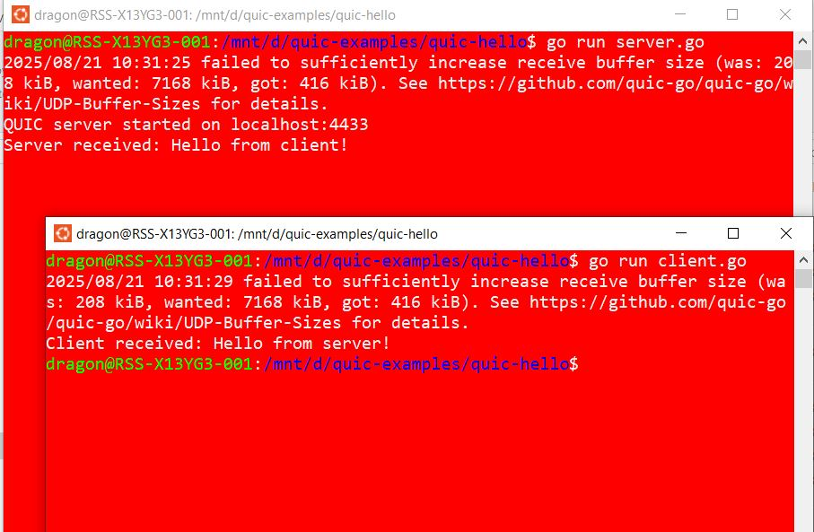

# Hello World  in Quic-Go

- This is a simple "Hello, World" application designed to set up the quic-go environment and verify that it's working correctly.

- The instructions below have been tested on Linux (Ubuntu and WSL), but they are expected to work on most other Linux distributions as well.

---
## 1. Install Go

i. Make sure you have Go installed: 
[go installation](../../languages/golang101/01-gettingstarted.md)


---
## 2. Create a new Go module

i. Create a project folder and initialize the module:
	``` bash
	mkdir quic-hello
	```

ii) Initialize Go module

``` go
cd quic-hello
go mod init quic-hello  #this creates project structure
```

iii) Verify module creation

type ```ls -al``` and check the contents of the foler. A file is created ```go.mod``` with contents similar to the following:
``` bash
module quic-hello

go 1.22.2
```


## 3. Install Go dependencies

i. Install openssl 
``` bash
sudo apt install openssl
```

ii. Install quic-go dependencies
``` go
cd quic-hello
go get github.com/quic-go/quic-go
```


## 4. Generate Self-Signed certificate for localhost

```console
openssl req \
  -new \
  -newkey rsa:2048 \
  -days 365 \
  -nodes \
  -x509 \
  -keyout key.pem \
  -out cert.pem \
  -subj "/CN=localhost" \
  -addext "subjectAltName=DNS:localhost"
```


## 5. Create **server**
Create server file `server.go` with following content:

```go
package main

import (
    "context"
    "crypto/tls"
    "fmt"
    "io"
    "log"

    quic "github.com/quic-go/quic-go"
)

func main() {
    // TLS config
    tlsConfig := generateTLSConfig()

    // Start QUIC listener
    listener, err := quic.ListenAddr("localhost:4433", tlsConfig, nil)
    if err != nil {
        log.Fatal(err)
    }
    fmt.Println("QUIC server started on localhost:4433")

    for {
        // Accept a new session
        session, err := listener.Accept(context.Background())
        if err != nil {
            log.Fatal(err)
        }

        // Accept a stream
        stream, err := session.AcceptStream(context.Background())
        if err != nil {
            log.Fatal(err)
        }

        // Read data
        buf := make([]byte, 1024)
        n, err := stream.Read(buf)
        if err != nil && err != io.EOF {
            log.Fatal(err)
        }
        fmt.Println("Server received:", string(buf[:n]))

        // Reply
        _, err = stream.Write([]byte("Hello from server!"))
        if err != nil {
            log.Fatal(err)
        }
    }
}

// Load TLS cert + key
func generateTLSConfig() *tls.Config {
    cert, err := tls.LoadX509KeyPair("cert.pem", "key.pem")
    if err != nil {
        log.Fatal(err)
    }
    return &tls.Config{Certificates: []tls.Certificate{cert}}
}
```


## 6. Create **client**
Create client file `client.go` with following content:

```go
package main

import (
    "context"
    "crypto/tls"
    "fmt"
    "io"
    "log"

    quic "github.com/quic-go/quic-go"
)

func main() {
    tlsConfig := &tls.Config{
        InsecureSkipVerify: true, // for self-signed cert
    }

    // Connect to server (note: context.Background() is first arg now)
    session, err := quic.DialAddr(context.Background(), "localhost:4433", tlsConfig, nil)
    if err != nil {
        log.Fatal(err)
    }

    // Open a stream
    stream, err := session.OpenStreamSync(context.Background())
    if err != nil {
        log.Fatal(err)
    }

    // Send message
    _, err = stream.Write([]byte("Hello from client!"))
    if err != nil {
        log.Fatal(err)
    }

    // Read reply
    buf := make([]byte, 1024)
    n, err := stream.Read(buf)
    if err != nil && err != io.EOF {
        log.Fatal(err)
    }
    fmt.Println("Client received:", string(buf[:n]))
}
```

## 7. Run server and client

In terminal 1:

```console
go run server.go
```

In terminal 2:

```console
go run client.go
```

### Screenshot


