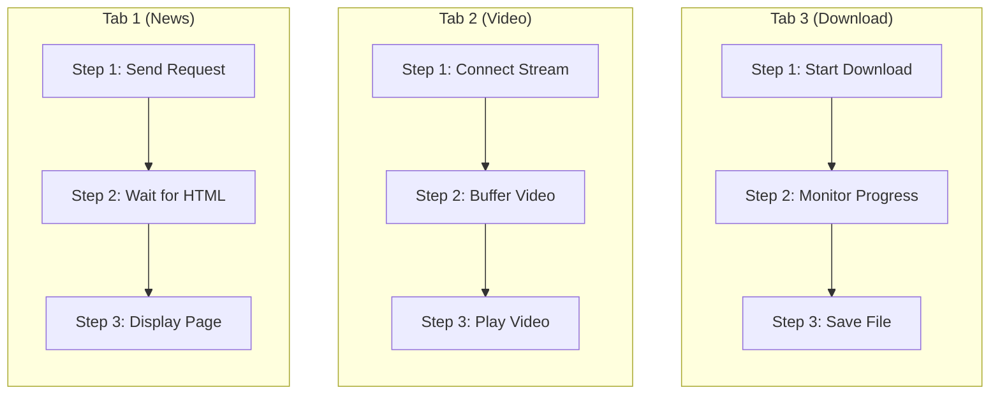
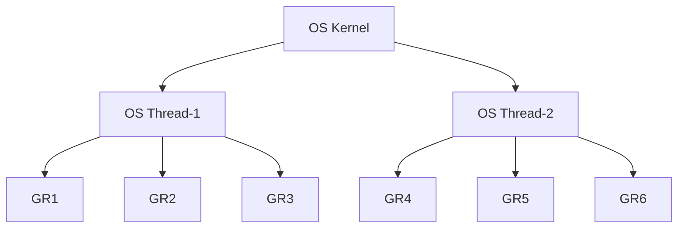
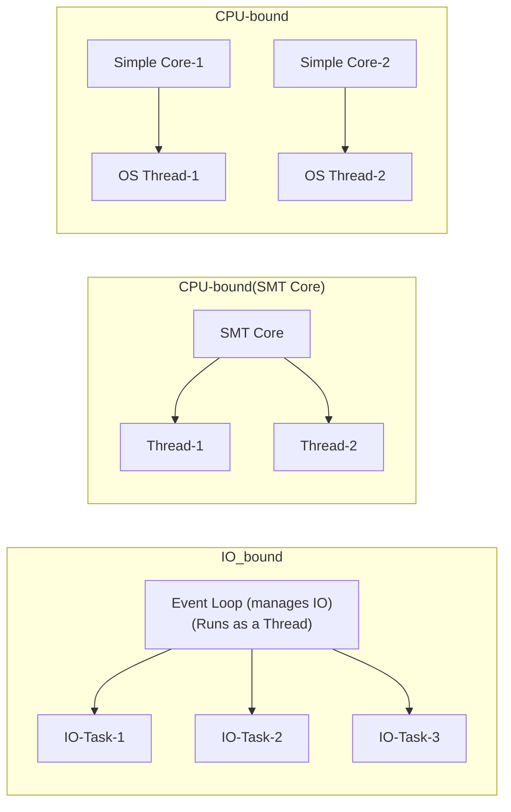
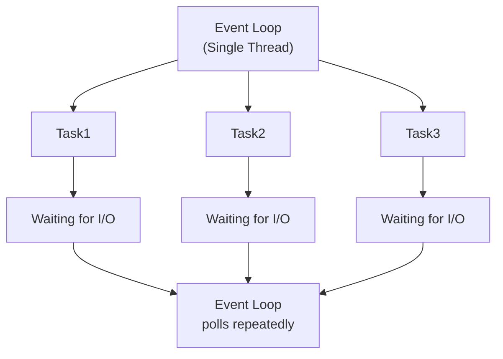

# **11 Goroutines Part-1**

This section covers the theoretical concepts of ```goroutines``` in Go and concurrency in general. The next section will focus on hands-on practice.

---
Main topics:

- Goroutines
- Concurrency
- IO-bound vs CPU-bound concurrency
- Threads vs goroutines vs asyncio
- Coroutines vs goroutines
- Preemptive vs cooperative scheduling

---
## 1. What is a Goroutine?

A goroutine is an independent function that runs concurrently with other functions in Go.
For those familiar with threads, you can think of a goroutine as a thread, with the following differences:

For example, consider a browser app that opens three tabs, all running in parallel:




## 2. main() is a Goroutine
In Go, even the main() function is executed as a goroutine — called the main goroutine.
That means every Go program always starts with at least one goroutine.

From there:

- We can create additional goroutines using the go keyword.
- All goroutines, including the **main** one, run concurrently.
- When the **main** goroutine ends, the whole program terminates; even if other goroutines are still running.

So, **every Go application is composed of at least one goroutine (main)**, and we can scale concurrency by adding more goroutines when needed.

## 3. Threads vs Goroutines

### 3.1 Threads in OS

- Modern hardware (microprocessors) often provides multiple cores, sometimes in the dozens or even hundreds. Each core acts as an independent processing unit capable of executing instructions.
- At the operating system level, these cores are utilized through the concept of threads. A thread is the smallest unit of execution, and typically, the OS scheduler maps threads to cores. Multiple threads can be run concurrently across cores.

Therefore, multithreading depends on both the OS kernel features (such as thread scheduling, context switching, etc.) and the number of available CPU cores.

- The Go programming language offers a higher-level concurrency model through goroutines, which are lightweight functions that can run independently. Goroutines are not tied 1:1 to OS threads. Instead, the Go runtime uses a scheduler that maps many goroutines onto a smaller number of threads.

- This is known as an M:N scheduling model: M goroutines are multiplexed onto N OS threads, which in turn are scheduled on physical CPU cores. This enables Go to support massive concurrency with relatively low overhead.


### 3.2 M:N scheduling model

- The diagram below illustrates the M:N scheduling model where multiple goroutines (GR1 to GR6) are multiplexed onto fewer OS threads (OS Thread-1 and OS Thread-2). 
- These OS threads, in turn, are managed by the OS kernel, enabling efficient concurrency by allowing **many goroutines** to run on a **smaller number of threads**.




### 3.3 groutines compared to threads

- Goroutines are lighter than threads (thousands or millions can run on few OS threads).
- They are managed by the Go runtime, not the operating system.
- They have smaller stack sizes (grow/shrink dynamically), unlike fixed-size thread stacks.

### 3.4 Comparison table

| Aspect              | OS Threads (Kernel-Managed)                                   | Goroutines (Go Runtime-Managed)                           |
|---------------------|---------------------------------------------------------------|-----------------------------------------------------------|
| **Management**      | Managed by the operating system kernel                        | Managed by the Go runtime scheduler (user space)          |
| **Stack Size**      | Fixed, usually 1–2 MB reserved per thread                     | Starts small (~2 KB) and grows/shrinks dynamically        |
| **Creation Cost**   | Expensive (system calls required)                             | Very cheap (just a function call + small runtime setup)   |
| **Context Switch**  | Handled by OS, involves saving/restoring registers & stacks   | Handled in user space by Go scheduler, much cheaper       |
| **Scheduling**      | Kernel schedules all system threads across processes         | Go runtime uses M:N scheduling (many goroutines on few OS threads) |
| **Scalability**     | Limited (hundreds or thousands, memory-heavy)                 | Extremely scalable (hundreds of thousands or millions)    |
| **Communication**   | Usually needs locks, mutexes, or shared memory               | Done via channels (safe, blocking, typed communication)   |
| **Overhead**        | Higher memory + kernel involvement                           | Low memory + efficient runtime management                 |


 
## 4. How many threads a system can support
On Linux, threads are basically lightweight processes (tasks) managed by the kernel.

Each thread requires:

- Stack memory (typically 1–2MB per thread by default)
- Kernel data structures (task_struct, file descriptors, etc.)
- In practice, Linux can often handle several thousand threads per process


### Example: On an Intel PC

- Suppose we have **16 GB RAM**
- Default stack size per thread is **2 MB**

    ```
    Max threads ≈ 16 GB / 2 MB ≈ 8,000
    ```

Or, for inline math:

- Max threads ≈ $ \frac{16\ \text{GB}}{2\ \text{MB}} \approx 8{,}000 $


```text
Example: On an Intel PC
	
* Suppose we have 16GB RAM
* default 2MB stack per thread;

	Max threads ≈16GB​/2MB ≈8,000
```

### 4.1 How many goroutine
Goroutines are much lighter:

```text 
Example: On the same Intel PC 

* Suppose we have 16GB RAM.
* Initial stack ~2KB (grows dynamically)

	Max goroutines ≈16GB/2KB  ​≈8,000,000
```


## 5. Processor vs IO concurrency
Concurrency can be broadly categorized as:

- Processor-bound (CPU-bound) concurrency
- I/O-bound concurrency

| Feature                     | Processor-bound (CPU-bound)               | I/O-bound                                  |
|-----------------------------|------------------------------------------|-------------------------------------------|
| **Definition**               | Tasks limited by CPU computation          | Tasks limited by waiting for I/O          |
| **Characteristics**          | Heavy computations, minimal waiting       | Mostly waiting for external resources     |
| **Concurrency model**        | OS threads or goroutines on multiple cores | Lightweight threads, goroutines, or async/event loop |
| **Parallelism**              | True parallelism improves throughput     | Parallelism mostly logical (many tasks waiting concurrently) |
| **CPU usage**                | High                                      | Low                                        |
| **Example tasks**            | Image/video processing, simulations, math computations | Web servers, network requests, database queries |
| **Optimization focus**       | Maximize CPU core usage                  | Maximize concurrency, minimize blocking  |



Note:

- CPU-bound: Threads / goroutines doing heavy computations mapped directly to cores
- Simple cores run one thread, however a Simultaneous Multithreading (SMT) core can run more than one thread at a time. 
- I/O-bound: ```async``` tasks multiplexed over few OS threads or a single event loop
- A goroutine can be bound to a single thread (if performance is needed). Or multiple (thousands) can be bound to a single thread when performance is not required but other considerations are important such as multiple IO.


### 5.1 Event loop (in IO-bound)

An event loop is a programming construct that repeatedly checks for and dispatches events or tasks. It allows a program to handle many I/O-bound operations concurrently on a single thread by switching between tasks whenever one is waiting for I/O.




- The Event Loop is a single thread that repeatedly checks tasks.
- Each task that is waiting for I/O yields control.
- The loop continues to poll and schedule ready tasks, allowing high concurrency without multiple threads.

## 6. Where do Goroutines fit?

**Goroutines are general-purpose lightweight concurrency units**.

- They are excellent for I/O-bound workloads, 
- but they can also handle CPU-bound workloads up to the number of available CPU cores.

### 6.1 I/O-bound

- Goroutines are **more suited** here. 
- We can run thousands of concurrent I/O operations (network calls, disk reads, etc.) very efficiently. 
- This is similar to asyncio or Node.js’s event loop, but with a simpler model (you just write normal-looking code with goroutines + channels).

### 6.2 CPU-bound

- Goroutines also work well for processor-bound tasks (i.e. threading), 
- However, they’re limited by the number of CPU cores. The Go runtime maps goroutines onto OS threads, and the OS threads onto cores. 
- So, if you have an 8-core machine, you’ll get at most 8 CPU-heavy goroutines truly running in parallel. 

### 6.3 Async-io loop

- ```asyncio``` is mainly for I/O-bound concurrency (single thread can juggle many tasks, but CPU-heavy work will block it).

- Goroutines, being mapped onto OS threads, can do both I/O and CPU-bound concurrency.

### 6.4 Comparision of concurrency techniques

| Technique           | Best For                          | Characteristics                                | Example Scenarios                                   |
|---------------------|-----------------------------------|-----------------------------------------------|----------------------------------------------------|
| **OS Threads**      | CPU-heavy parallelism             | Heavyweight, limited in number, managed by OS  | Video rendering, physics simulations, game engines |
| **Goroutines (Go)** | Mixed CPU + I/O, scalable tasks   | Lightweight, multiplexed on OS threads, simple API | Web servers, microservices, proxies, IoT collectors |
| **Asyncio / Event Loop** | I/O-heavy concurrency (low CPU) | Single-threaded, cooperative multitasking      | Chat servers, web scrapers, GUI event handling, lightweight web apps |
 
**A goroutine can be bound to a single thread (if performance is needed). Or multiple (thousands) can be bound to a single thread when performance is not required but other considerations are important such as multiple IO.**

## 7. Coroutines vs goroutines

Coroutine is a lightweight function that can pause (yield) and resume later, allowing cooperative multitasking within a program.

- Coroutines and goroutines are both ways to run multiple tasks seemingly at the same time.

- Coroutines are functions that the programmer can control. They can pause themselves using something like ```yield``` or ```await```, and then resume later. 

- This is called **cooperative scheduling**, because the coroutine has to decide when to give up control. 

- goroutines on the other hand, are managed by the Go runtime, which automatically decides when to pause and resume them. This is called **preemptive scheduling**. 

- So, coroutines give programmers more manual control, but goroutines make concurrency easier by handling all the scheduling under the hood.


| Feature                | **Coroutines**                                          | **Goroutines**                                           |
|------------------------|---------------------------------------------------------|----------------------------------------------------------|
| **Scheduling Type**    | Cooperative — controlled by the programmer             | Preemptive — controlled by the Go runtime                |
| **Pause/Resume**       | Manually using `yield`, `await`, etc.                  | Automatic by the runtime — no need to yield manually     |
| **Blocking Risk**      | Yes, if coroutine forgets to yield                     | No, Go handles blocking transparently                    |
| **Ease of Use**        | Requires discipline to manage yielding correctly       | Very easy — just use `go myFunction()`                   |
| **Syntax Required**    | Needs special keywords (`yield`, `await`, `suspend`)   | No special syntax — normal function with `go` keyword    |
| **Managed By**         | Language/runtime or libraries (e.g., `asyncio`, `trio`) | Go’s built-in runtime scheduler                          |
| **Flexibility**        | More control for advanced use cases                    | Simpler, less error-prone for general concurrency        |


