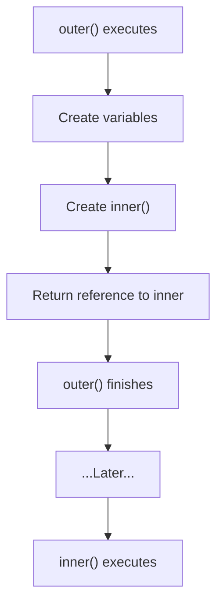

---
tags:
  - Closures
  
---
# Understanding Closures in Python

---
## <font color='green'>1. The Foundation: Nested Functions</font>

We'll first understand **nested functions and their execution flow**,
because **nested functions are the foundation of closures**.

Only after that will we define what a closure is.


``` python
def outer():

    print("1. outer() starts")

    x = 10
    print("2. x is created")

    def inner():
        print("4. inner() executes")
        return x

    print("3. inner() is CREATED (not executed)")

    return inner
```

Following is the calling code:

```
print("Before calling outer()")
f = outer()
print("After calling outer()")
```

### Output

``` text
Before calling outer()

1. outer() starts
2. x is created
3. inner() is CREATED (not executed)

After calling outer()
```

Calling `outer()` only:

-   creates `x`
-   creates the function object `inner`
-   returns a reference to `inner`

><font color='red'>**It does **not** execute </font>**`inner()'


---
## <font color='green'>2. What Is `outer()` Really Doing? (necessary configuration)</font>

Since `inner()` never executed, what was the purpose of calling
`outer()`?

<font color='red'>Think of `outer()` as a **setup** or **configuration** function.</font>

Its job is to prepare another function before handing it back.

Conceptually:




### 2.2 Purpose of outer()? (make preperations for inner())

The entire purpose of `outer()` is to prepare `inner()`.

Depending on the situation it may:

-   initialize variables
-   configure settings
-   prepare initial state
-   customize how `inner()` behaves

We can think of `outer()` as a preprocessing function.

---
## <font color='green'>3. What Gets Carried Forward? (only relevant information)</font>

Suppose `outer()` creates three variables.

``` python
def outer():

    a = 10
    b = 20
    c = 30

    def inner():
        return b

    return inner
```

`inner()` only uses `b`.

So after `outer()` returns, does Python preserve all three variables?

Conceptually:

``` text
a   ❌ discarded

b   ✅ preserved

c   ❌ discarded

inner   ✅ returned
```

<font color='red'>Python only keeps the context required by the returned function. It does **not** preserve everything created by `outer()`.</font>

---
## <font color='green'>4. So What Is a Closure?</font>

Now the formal definition becomes much easier.

> **A closure is a function returned together with the context
> (variables) it needs from its enclosing function.**

Many tutorials say:
> "The function remembers variables."
That is simply a convenient description.

A more practical way to think about it is:
> **`outer()` prepares `inner()`, and the returned function carries the
> context it needs.**

There is no magic involved.

---
## <font color='green'>5. Real-World Use Cases</font>

### Logger Factory

``` python
def make_logger(prefix):

    def log(message):
        print(f"[{prefix}] {message}")

    return log
```

``` python
info = make_logger("INFO")
error = make_logger("ERROR")

info("Server started")
error("Database connection failed")
```

`make_logger()` doesn't log anything.

It simply prepares different versions of the same function.

------------------------------------------------------------------------

### API Client

``` python
def make_client(api_key):

    def get(endpoint):
        print(f"Calling {endpoint} using API key {api_key}")

    return get
```

``` python
client = make_client("ABCD1234")

client("users")
client("orders")
client("products")
```

Again, the outer function is only configuring another function for later
use.

------------------------------------------------------------------------

## <font color='green'>6. Final Thoughts</font>

Closures are often presented as some mysterious feature where functions
"remember" variables.

In reality, they're much simpler.

Think of them like this:

-   Nested functions are the foundation.
-   `outer()` is a setup/configuration function.
-   It prepares `inner()` for a particular situation.
-   It returns a reference to that prepared function.
-   Later, `inner()` executes using the context that was prepared for
    it.

Instead of thinking:

> "A closure is a function that remembers variables."

it's often more useful to think:

> **A closure is simply a preconfigured function returned by another
> function.**

That mental model focuses on the purpose of closures rather than the
terminology.

