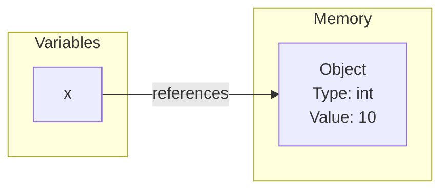
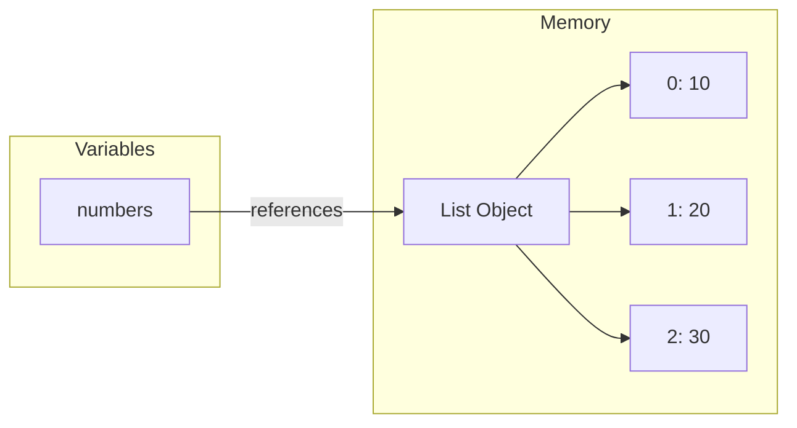

---
hide:
  - navigation
  
tags:
  - Python Data Types
---
# **Data Types in Python**
(Quick reference)

---
## <font color='green'>1. Built-in Data Types in Python</font>

| Category | Data Type | Example | How to Remember |
|----------|-----------|---------|-----------------|
| **Numeric** | `int` | `10` | Whole number (no special brackets) |
| | `float` | `3.14` | Decimal point (`.`) |
| | `complex` | `2+3j` | Has `j` for imaginary part |
| **Boolean** | `bool` | `True`, `False` | Only two values: `True` or `False` |
| **Text** | `str` | `"Hello"` | Text inside quotes (`" "` or `' '`) |
| **Sequence** | `list` | `[1, 2, 3]` | **Square brackets `[]`** → Like a shopping list (mutable) |
| | `tuple` | `(1, 2, 3)` | **Parentheses `()`** → Fixed collection (immutable) |
| | `range` | `range(5)` | Generates a sequence of numbers |
| **Mapping** | `dict` | `{"name": "Alice", "age": 25}` | **Curly braces `{}`** with **`key: value`** pairs |
| **Set** | `set` | `{1, 2, 3}` | **Curly braces `{}`** with **values only** (no `:`) |
| | `frozenset` | `frozenset({1, 2})` | Frozen (immutable) version of a set |
| **Binary** | `bytes` | `b"abc"` | Starts with **`b`** before quotes |
| | `bytearray` | `bytearray(b"abc")` | Mutable version of `bytes` |
| | `memoryview` | `memoryview(b"abc")` | A view into binary data (no copy) |
| **None Type** | `None` | `None` | Represents no value or nothing |


### 1.1. Quick Memory Tips

| Data Type | Symbol | Easy Way to Remember |
|-----------|--------|----------------------|
| `list` | `[]` | List = Square brackets → Can add/remove items |
| `tuple` | `()` | Tuple = Parentheses → Fixed (cannot change) |
| `dict` | `{}` | Dictionary = Curly braces + `key:value` |
| `set` | `{}` | Set = Curly braces with unique values only (no `:`) |
| `str` | `""` or `''` | Text is always inside quotes |
| `bytes` | `b""` | Binary text starts with `b` |
| `None` | `None` | No value / empty reference |


---
## <font color='green'>2. Variables as References to Objects</font>

In Python, a **variable does not store the actual value**. Instead, it stores a **reference** (or pointer) to an object in memory. The object contains the actual data, while the variable simply refers to its location.

**Example 1**

```python
x = 10
```
Here, `10` is an **integer object** created in memory, and `x` is a **reference** that points to that object.





**Example 2**

numbers = [10, 20, 30]



---
## <font color='green'>3. Arrays (array library)</font>

Python also includes another data type called **`array`**, but it is provided as part of the **Standard Library**, not as a built-in data type. You must import the `array` module before using it.

The concept is the same as **arrays in other programming languages**: an array stores multiple elements of the **same data type** in a contiguous block of memory, making it more memory-efficient than a Python list for homogeneous data.

Arrays are commonly used in **scientific computing**, numerical processing, and applications that work with large collections of numbers. However, for advanced scientific and data analysis tasks, developers typically use **NumPy arrays**, which offer significantly more features and better performance than the standard library's `array` module.


??? example "Python Array Example"

    ```python
    # Import the array module
    import array

    # Create an array of integers
    numbers = array.array('i', [10, 20, 30, 40, 50])

    print(numbers)
    print(numbers[0])      # Access first element

    # Add an element
    numbers.append(60)

    print(numbers)
    ```

    **Output**

    ```text
    array('i', [10, 20, 30, 40, 50])
    10
    array('i', [10, 20, 30, 40, 50, 60])
    ```

    **Common Array Type Codes**

    | Type Code | Data Type | Example |
    |-----------|-----------|---------|
    | `'b'` | Signed integer (1 byte) | `array.array('b', [1, 2, 3])` |
    | `'B'` | Unsigned integer (1 byte) | `array.array('B', [1, 2, 3])` |
    | `'h'` | Signed short integer | `array.array('h', [100, 200])` |
    | `'H'` | Unsigned short integer | `array.array('H', [100, 200])` |
    | `'i'` | Signed integer | `array.array('i', [10, 20, 30])` |
    | `'I'` | Unsigned integer | `array.array('I', [10, 20, 30])` |
    | `'l'` | Signed long integer | `array.array('l', [1000, 2000])` |
    | `'L'` | Unsigned long integer | `array.array('L', [1000, 2000])` |
    | `'q'` | Signed long long integer | `array.array('q', [100000, 200000])` |
    | `'Q'` | Unsigned long long integer | `array.array('Q', [100000, 200000])` |
    | `'f'` | Float | `array.array('f', [1.5, 2.5])` |
    | `'d'` | Double (double-precision float) | `array.array('d', [1.5, 2.5])` |
    | `'u'` | Unicode character* | `array.array('u', "hello")` |

    !!! note
        - `'i'` (signed integer) is the most commonly used type code.
        - Arrays can store **only one data type**.
        - The `'u'` type code is deprecated in modern Python. Use `str` for text instead.

>**Rule of thumb: We use array.array only when you specifically need a compact collection of values of the same type. **For scientific computing and data analysis**, we'll more commonly encounter NumPy arrays than array.array.

### NumPy and ndarray

> **NumPy** is widely used for scientific computing in Python. It **does not use the standard library's `array.array` module**. Instead, it provides its own array object called **`numpy.ndarray`**, which is implemented independently and is much more powerful and efficient for numerical computations.

### Comparision of list, Arrary, ndarray

| Feature | `list` | `array.array` | `numpy.ndarray` |
|---------|--------|---------------|-----------------|
| Available | Built-in | Standard Library (`import array`) | Third-party (`import numpy`) |
| Stores mixed data types | ✅ Yes | ❌ No | ❌ No |
| Stores one data type only | ❌ No | ✅ Yes | ✅ Yes |
| Memory efficient | ❌ | ✅ | ✅✅ |
| Multi-dimensional | ❌ | ❌ | ✅ |
| Vectorized mathematical operations | ❌ | ❌ | ✅ |
| Primary use | General-purpose programming | Compact storage of homogeneous data | Scientific computing, data analysis, machine learning |

> <font color='red'>WE cannot create a 2D array using array.array; It is restricted to 1D only.</font>

---
## <font color='green'>4. None and NoneType</font>

None is a special value in Python that represents "no value", "nothing", or "absence of a value". Its data type is NoneType.

None is commonly used when:

	A variable has not been assigned a meaningful value yet.
	A function does not explicitly return a value.
	A value is optional, missing, or unknown.


>None is the value, while NoneType is the data type of that value—just as 10 is a value of type int, None is a value of type NoneType.


??? example "Examples of `None` and `NoneType`"

    **1. Variable is not assigned a value**

    ```python
    print(name)
    ```

    **Output**

    ```text
    NameError: name 'name' is not defined
    ```

    ---

    **2. Variable is assigned `None`**

    ```python
    name = None

    print(name)
    print(type(name))
    ```

    **Output**

    ```text
    None
    <class 'NoneType'>
    ```

    ---

    **3. Function returns nothing**

    ```python
    def greet():
        print("Hello")

    result = greet()

    print(result)
    print(type(result))
    ```

    **Output**

    ```text
    Hello
    None
    <class 'NoneType'>
    ```

---
## <font color='green'>5. Mutable vs Immutable</font>

In Python, **mutable** objects can be **modified after they are created**, while **immutable** objects **cannot be changed**. If you need to change an immutable object, Python creates a new object instead of modifying the existing one.

| Data Type | Mutable / Immutable |
|-----------|---------------------|
| `list` | ✅ Mutable |
| `dict` | ✅ Mutable |
| `set` | ✅ Mutable |
| `bytearray` | ✅ Mutable |
| `tuple` | ❌ Immutable |
| `frozenset` | ❌ Immutable |


---
## <font color='green'>6. List vs Tuple vs Set </font>

`list`, `tuple`, and `set` are all collection data types used to store multiple values. However, they differ in how they store and manage data.

| Feature | `list` | `tuple` | `set` |
|---------|--------|---------|-------|
| Syntax | `[]` | `()` | `{}` |
| Ordered | ✅ Yes | ✅ Yes | ❌ No |
| Mutable | ✅ Yes | ❌ No | ✅ Yes |
| Allows duplicate values | ✅ Yes | ✅ Yes | ❌ No |
| Indexing supported | ✅ Yes | ✅ Yes | ❌ No |
| Typical use | Data that changes | Fixed data | Unique values |


### Examples

```python
# List (mutable)
numbers = [10, 20, 30]
numbers.append(40)      # Allowed

# Tuple (immutable)
coordinates = (10, 20, 30)
# coordinates.append(40)   # Error

# Set (unique values)
values = {10, 20, 20, 30}
print(values)
```

**Output**

```text
{10, 20, 30}
```

**Remember:**

```
- List → Ordered collection that can be modified.

- Tuple → Ordered collection that cannot be modified.

- Set → Unordered collection of unique values (duplicates are removed automatically).
```

---
## <font color='green'>7. What does "Ordered" mean?</font>

An **ordered** collection preserves the order of its elements. When we access or iterate over the collection, the items appear in the same order in which they were inserted.

```python
numbers = [10, 20, 30]

print(numbers[0])   # 10
print(numbers[1])   # 20
print(numbers[2])   # 30
```

A **set** is **unordered**, so it does not guarantee the order of its elements.

```python
values = {10, 20, 30}

print(values)
```

The output may not always appear in the same order.


### Why does a `set` not preserve order?

A `set` is designed to **store unique values** and provide **fast searching**. To achieve this, Python stores elements using a **hash table** instead of keeping them in the order they were added.

As a result:
```
- The order of elements is **not guaranteed**.
- Duplicate values are automatically removed.
- Membership tests (using `in`) are very fast.
```

```python
values = {30, 10, 20}

print(values)
```

**Possible output:**

```text
{10, 20, 30}
```

or

```text
{20, 30, 10}
```

The exact order is not important because a `set` is meant to represent a **collection of unique values**, not a sequence.


---
## **Relevant Links**

[Python Material on this website](index.md)

