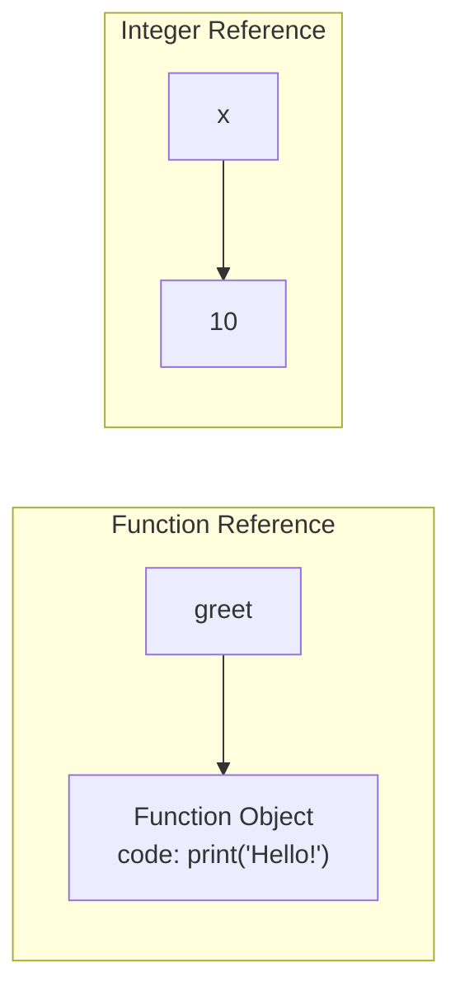

---
hide:
  - navigation
  
tags:
  - function as first class
---
# Understanding First-Class Functions in Python

---
## <font color='green'> 1. Introduction </font>

One of the most common phrases we hear when learning Python is:

> **"Functions are first-class citizens."**

**But what does it mean exactly?** Here is the explaination:

- Everything in Python is object. A variable is an object.

- A function in Python is **just another object**.

- Therefore, Just like a variable (integer, a string, or a list), a function can be used to:

```
- stored in a variable
- passed to another function
- returned from a function
- placed inside a list or dictionary
- created at runtime
```

> <font color='red'>If we can treat functions the same way we treat other values, then functions are called **first-class objects**.</font>


---
## <font color='green'> 2. Everything in Python is an Object </font>

In Python, nearly everything is an object.

```
x = 10
name = "Mujeeb"
numbers = [1, 2, 3]

- Each of these values is an object.
- We can assign them to variables.
```


Now lets consider a function.

```python
def greet():
    print("Hello!")
```

Python actually creates **a function object**.

The variable `greet` simply refers to that object.

---

## <font color='green'> 3: Variables Also Store References </font>

Variables don't contain the object itself. **They simply point to it.**



Variables point to objects.

Functions are objects.

Therefore variables can point to functions.

---
## <font color='green'>4. Assign a Function to Another Variable </font>

```python
def greet():
    print("Hello!")

say_hi = greet
```

Notice:

There are **no parentheses**.

We're copying the reference—not calling the function.

Now:

```python
say_hi()
```

Output:

```
Hello!
```

Both variables refer to the exact same function object.

```
greet ─────┐
           ▼
      +------------+
      | greet()    |
      +------------+
           ▲
say_hi ────┘
```

---
## <font color='green'>5: Functions Can Live Inside Collections </font>

Since functions are objects, they can be placed inside lists.

```python
def add():
    print("Adding")

def delete():
    print("Deleting")

actions = [add, delete]
```

Now:

```python
actions[0]()
```

Output:

```
Adding
```

The list stores references to functions.

---

## <font color='green'>6: Functions Can Be Passed as Arguments </font>

Suppose we have:

```python
def greet():
    print("Hello")
```

Another function can receive it.

```python
def execute(func):
    func()
```

Now:

```python
execute(greet)
```

Output:

```
Hello
```

Notice again:

We pass

```python
greet
```

**NOT**

```python
greet()
```

Because we want to pass the function itself—not its return value.

This is one of the most important ideas in Python.

---

## <font color='green'> 7. Real-World Analogy </font>

Imagine a remote control.

Calling the function:

```python
greet()
```

is like pressing the button.

Passing the function:

```python
greet
```

is like handing someone the remote.

They decide when to press the button.

---

## <font color='green'> 8: Functions Can Return Functions </font>

Since functions are just values, they can also be returned.

```python
def make_printer():

    def printer():
        print("Printing...")

    return printer
```

Now:

```python
p = make_printer()
```

What is `p`?

Not text.

Not a number.

It is another function.

```python
p()
```

Output:

```
Printing...
```

This ability forms the basis of **closures** and **decorators**.

---

## <font color='green'> 9: Higher-Order Functions </font>

A function that

- accepts another function, or
- returns another function

is called a **higher-order function**.

Example:

```python
def apply_twice(func, value):
    return func(func(value))
```

Suppose:

```python
def double(x):
    return x * 2
```

Now:

```python
apply_twice(double, 3)
```

Evaluation:

```
double(3)
↓

6

double(6)
↓

12
```

Result:

```
12
```

This works because functions are first-class objects.

---

## <font color='green'>10. Lambdas Are Also Function Objects </font>

```python
square = lambda x: x * x
```

This is simply another function object.

Equivalent to:

```python
def square(x):
    return x * x
```

The lambda can be passed around just like any other function.

```python
numbers = [1, 2, 3]

result = map(square, numbers)
```

or even:

```python
result = map(lambda x: x * x, numbers)
```

Again, functions are values.

---

## <font color='green'> 11. Why Python Was Designed This Way </font>

Imagine if functions were *not* first-class.

We couldn't write:

```python
sorted(names, key=len)
```

We couldn't use:

```python
map()
filter()
reduce()
```

You couldn't create decorators.

Frameworks like Flask, FastAPI, and Django would be much more complicated.

Many elegant Python features rely on passing functions around as ordinary values.

---

## <font color='green'> 12. A Mental Model </font>

Instead of thinking:

> "A function is something I call."

Think:

> "A function is an object that *can be called*."

That's a subtle but important distinction.

Objects have properties.

One of the properties of a function object is that Python allows it to be invoked using parentheses.

---

## <font color='green'> 13. Common Beginner Mistake </font>

<font color='red'>Call with parantheses</font>

Consider:

```python
execute(greet())
```

What happens?

Python first executes:

```python
greet()
```

Suppose it returns:

```python
None
```

Now Python actually runs:

```python
execute(None)
```

Inside:

```python
func()
```

Python tries:

```python
None()
```

which produces:

```
TypeError: 'NoneType' object is not callable
```

The correct code is:

```python
execute(greet)
```

<font color='red'> without parentheses:</font>

Remember:

```python
greet
```

means

> "the function"

while

```python
greet()
```

means

> "call the function now"

---

## <font color='green'> 14. How This Leads to Decorators </font>

Decorators work because functions are first-class.

```python
def logger(func):

    def wrapper():
        print("Before")
        func()
        print("After")

    return wrapper
```

Notice what happens:

```
A function is received.
Another function is created.
That new function is returned.
```

Everything here is possible because functions are ordinary objects.

---

## <font color='green'> 15. Key Takeaways </font>

A function in Python is not just executable code—it is an object.

Because it is an object, it can be:

- assigned to variables
- stored in data structures
- passed into other functions
- returned from other functions
- created dynamically

This property is known as **being first-class**.

Understanding this single concept unlocks many advanced Python features, including:

- callbacks
- closures
- decorators
- event handling
- asynchronous programming
- functional programming techniques

