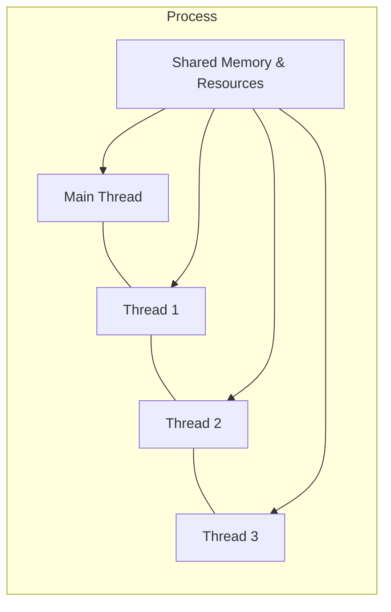

---
hide:
  - navigation
  
tags:
  - Threading in Python
  - Concurrency in Python

---

# Threading in Python


## <font color='green'> 1. What is Concurrency?</font>

Concurrency is the ability of a program to make progress on multiple tasks during the same period of time. Instead of completing one task before starting another, a concurrent program overlaps the execution of multiple tasks to improve responsiveness and resource utilization.

For example, while a program waits for data from a network, it can process user input or perform another operation instead of remaining idle.

> **Note:** Concurrency does not necessarily mean that multiple tasks execute simultaneously. Simultaneous execution is known as **parallelism**, which typically requires multiple CPU cores.


## 1.1 Threading as a Concurrency Mechanism

Threading is one of the most widely used mechanisms for implementing concurrency. A **thread** is an independent sequence of execution within a process. Multiple threads belonging to the same process can execute concurrently while sharing the process's memory and resources.

Because threads share the same address space, they can communicate efficiently, making threading well suited for I/O-bound tasks such as file operations, network communication, and background processing.

Python provides the built-in `threading` module to create and manage threads, making it straightforward to write concurrent applications.

---
## <font color='green'>2. Process vs. Thread</font>

Before learning about Python's `threading` module, it is important to understand the relationship between a **process** and a **thread**.

A **process** is an independent instance of a running program. Each process has its own memory space, system resources, and execution environment. By default, every process starts with a single thread known as the **main thread**.

A **thread** is the smallest unit of execution within a process. Unlike processes, multiple threads within the same process share the process's memory and resources, allowing them to communicate efficiently and execute concurrent tasks.

The following figure illustrates the relationship between a process and its threads.




### Process vs. Thread

| Process | Thread |
|---------|--------|
| Independent execution unit | Smallest execution unit within a process |
| Has its own memory space | Shares memory with other threads in the same process |
| Creation is relatively expensive | Creation is relatively lightweight |
| Communication requires inter-process communication (IPC) | Communication is simple through shared memory |
| Failure of one process usually does not affect others | A faulty thread can affect the entire process |

In Python, the `threading` module enables the creation of multiple threads within a single process. Since these threads share the same resources, they are particularly effective for applications that spend significant time waiting for I/O operations.


---
## <font color='green'>3. Creating Threads (functional style)</font>

The `threading` module provides the `Thread` class for creating and managing threads. 

A thread is associated with a function, known as the **target function**, which is executed when the thread starts.

The following example creates two threads. Each thread prints a sequence of numbers independently. Since both threads execute concurrently, their output may appear interleaved.

```python
import threading
import time

def task(name, delay):
    for i in range(5):
        print(f"{name}: {i}")
        time.sleep(delay)

t1 = threading.Thread(target=task, args=("Thread-1", 0.5))
t2 = threading.Thread(target=task, args=("Thread-2", 0.8))

t1.start()
t2.start()

t1.join()
t2.join()
```

**Sample Output**

```text
Thread-1: 0
Thread-2: 0
Thread-1: 1
Thread-2: 1
Thread-1: 2
Thread-1: 3
Thread-2: 2
Thread-1: 4
Thread-2: 3
Thread-2: 4
```

- Notice that the output from the two threads is interleaved. The exact order may differ each time the program is executed because the operating system determines how the threads are scheduled.

- another run might produce a completely different ordering.


---
## <font color='green'>4. Creating Threads (class style)</font>

Instead of passing a target function to the `Thread` constructor, another approach is to create a custom thread by inheriting from the `Thread` class and overriding its `run()` method.

```python
import threading
import time

class MyThread(threading.Thread):

    def __init__(self, name, delay):
        super().__init__()
        self.name = name
        self.delay = delay

    def run(self):
        for i in range(5):
            print(f"{self.name}: {i}")
            time.sleep(self.delay)

t1 = MyThread("Thread-1", 0.5)
t2 = MyThread("Thread-2", 0.8)

t1.start()
t2.start()

t1.join()
t2.join()
```

**Sample Output**

```text
Thread-2: 0
Thread-1: 0
Thread-1: 1
Thread-2: 1
Thread-1: 2
Thread-2: 2
Thread-1: 3
Thread-1: 4
Thread-2: 3
Thread-2: 4
```

In this approach, the work performed by the thread is defined inside the `run()` method instead of being supplied as a target function.

Just like the functional approach:

- `start()` begins execution of the thread by invoking the `run()` method.
- `join()` blocks the calling thread until the thread finishes execution.

> Subclassing `Thread` is useful when a thread needs to encapsulate both its data and behavior within a class. For simple tasks, using a target function is usually more concise.

---
## <font color='green'>5. Daemon Threads</font>

By default, all threads created using the `threading` module are **non-daemon threads**. A Python program does not terminate until all non-daemon threads have finished executing.

A **daemon thread** runs in the background and does not prevent the program from exiting. When all non-daemon threads have completed, any remaining daemon threads are terminated automatically.

A thread can be created as a daemon by setting the `daemon` parameter to `True`.

```python
import threading
import time

def background_task():
    while True:
        print("Background task running...")
        time.sleep(1)

t = threading.Thread(target=background_task, daemon=True)
t.start()

time.sleep(3)
print("Main thread finished.")
```

**Sample Output**

```text
Background task running...
Background task running...
Background task running...
Main thread finished.
```

Although the daemon thread contains an infinite loop, it terminates automatically when the main thread exits.

### **5.1 Daemon vs. Non-Daemon Threads**

| Non-Daemon Thread | Daemon Thread |
|-------------------|---------------|
| Keeps the program running until it finishes. | Does not prevent the program from exiting. |
| Suitable for tasks that must complete. | Suitable for background services. |
| Default thread type. | Created by setting `daemon=True`. |


### **5.2 When to Use Daemon and Non-Daemon Threads**

A daemon thread and a non-daemon thread execute in exactly the same way. The only difference is **how Python treats them when the application is about to terminate**.

- A **non-daemon thread** tells Python, *"Wait for me to finish before exiting."*
- A **daemon thread** tells Python, *"If the application is exiting, you do not need to wait for me. You can terminate me immediately."*

Therefore, use a **non-daemon thread** for tasks that must complete successfully, such as:

- Saving files
- Writing to a database
- Processing user requests
- Downloading data
- Performing computations

Use a **daemon thread** for tasks that are useful only while the application is running, but whose completion is not essential when the application exits, such as:

- Logging
- Monitoring system resources
- Periodic status updates
- Cache cleanup
- Heartbeat or health checks

> **Rule of Thumb:** Ask yourself, **"Should Python wait for this thread before exiting?"** If the answer is **yes**, use a **non-daemon thread**. Otherwise, use a **daemon thread**.

> <font color='red'> In other words, daemon threads continue running only while at least one non-daemon thread is still alive. Once all non-daemon threads (including the main thread) have finished, the Python interpreter automatically terminates any remaining daemon threads. </font>

### **5.3 Daemon Threads in Functional and Class Styles**

A daemon thread can be created using either the **functional** approach or the **class** approach.

**Functional style**

```python
t = threading.Thread(target=background_task, daemon=True)
```

**Class style**

```python
class MyThread(threading.Thread):

    def run(self):
        while True:
            print("Background task running...")
            time.sleep(1)

t = MyThread()
t.daemon = True
```

Alternatively, the daemon flag can be set when calling the parent constructor:

```python
class MyThread(threading.Thread):

    def __init__(self):
        super().__init__(daemon=True)

    def run(self):
        while True:
            print("Background task running...")
            time.sleep(1)
```

Regardless of whether the thread is created using the functional or class approach, the behavior is identical. The only difference is **how the thread's work is defined**.


---
## <font color='green'>6. Other Ways to Create Threads</font>

In this article, threads were created using the `Thread` class from the `threading` module. While this provides direct control over individual threads, Python also offers a higher-level interface for managing multiple threads.

### 6.1 `ThreadPoolExecutor`- Yet another way

The `ThreadPoolExecutor` class, provided by the `concurrent.futures` module, manages a pool of reusable worker threads. Instead of creating individual threads manually, tasks are submitted to the thread pool, which assigns them to available worker threads.

This approach is generally preferred when executing many independent tasks because it automatically manages thread creation, reuse, and cleanup.

| Approach | Typical Use |
|----------|-------------|
| **Functional style** (`threading.Thread`) | Create a thread by passing a target function. Suitable for simple and independent tasks. |
| **Class style** (subclassing `threading.Thread`) | Create a custom thread class by overriding the `run()` method. Suitable when a thread encapsulates its own data and behavior. |
| **`ThreadPoolExecutor`** | Execute many independent tasks using a pool of reusable worker threads. |

> <font color='red'> For the sake of keeping this article conceptual and to the poiont, `ThreadPoolExecutor` is not covered here. </font>


---
## <font color='green'>7. Summary</font>

In this article, we explored the fundamentals of multithreading in Python. The key takeaways are:

- **Concurrency** allows multiple tasks to make progress during the same period of time. It is different from **parallelism**, which requires tasks to execute simultaneously on multiple CPU cores.
- A **process** is an independent running program, while a **thread** is the smallest unit of execution within a process. Multiple threads in the same process share memory and resources. :contentReference[oaicite:0]{index=0}
- The `threading` module provides the `Thread` class for creating and managing threads. A thread begins execution with `start()`, while `join()` allows another thread to wait for its completion. 
- The execution order of multiple threads is **non-deterministic** and depends on how the operating system schedules them.
- By default, threads are **non-daemon threads**. Python waits for all non-daemon threads to finish before terminating the application.
- A **daemon thread** behaves like any other thread during execution. The only difference is that Python does **not** wait for daemon threads when the application exits; any remaining daemon threads are terminated automatically.
- Besides creating threads directly with `threading.Thread`, Python also provides `ThreadPoolExecutor` for efficiently executing many independent tasks using a pool of reusable worker threads.

Threading is most effective for **I/O-bound applications**, such as file operations, network communication, and background services. It improves responsiveness by allowing multiple tasks to make progress concurrently while sharing the same process resources.


---
## **Relevant Links**

[Python Material on this website](index.md)

[Python Virtual Environments](https://docs.python.org/3/library/venv.html)

[Anaconda Environments](https://www.anaconda.com/docs/getting-started/working-with-conda/environments)

