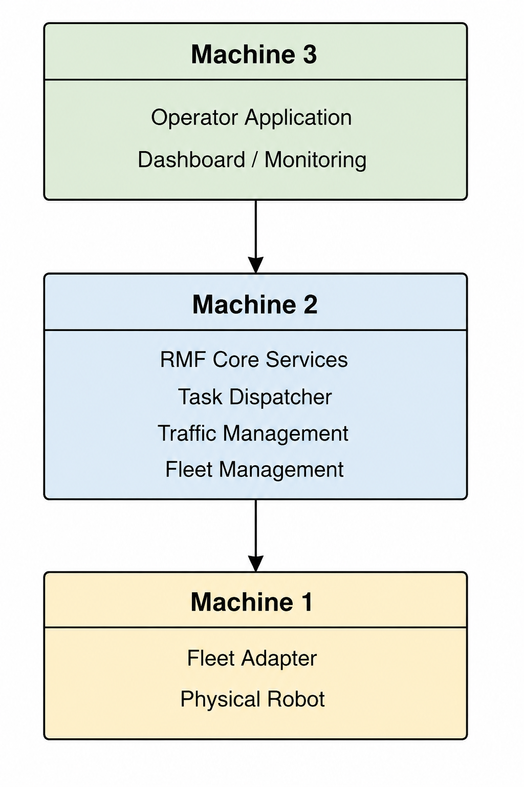
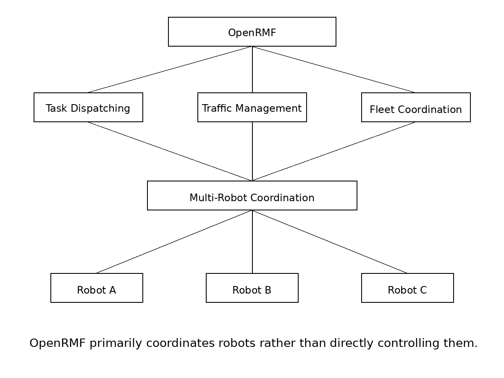

---
tags:
    - Case Studies
    - OpenRMF
    - Lessons Learned
---
# OpenRMF: Engineering Assessment
<font size-=2 color='purple'><center>A Practical Evaluation of Installation, Architecture, Fleet Operations, and Production Readiness</center></font>

<font color='red'> **(Work Under Progress)** </font>

(Last updated: 18-June-2026)


---
## <font color='green'>1. Introduction</font>

OpenRMF is an open-source fleet management and coordination framework designed for multi-robot systems operating in shared environments. It provides capabilities such as task dispatching, traffic management, scheduling, and fleet orchestration.

I am **evaluating OpenRMF from a practical engineering perspective**, with the goal of understanding where it fits within a real-world robotics software stack and whether it is suitable for production deployments.

My focus areas include:

- Installation and deployment
- Architecture and component separation
- Source code organization
- Fleet management capabilities
- Production readiness
- Integration effort
- Real-world limitations

This assessment is based on hands-on installation, experimentation, source code inspection, and deployment analysis.

---
## <font color='green'>2. Installation</font>

The first step in my evaluation was to perform a complete installation of OpenRMF and its associated tools. Wherever possible, I preferred building from source in order to better understand dependencies, component boundaries, and the overall development workflow.

### 2.1 Environment

| Item | Value |
|--------|--------|
| OS | Ubuntu 24.04 |
| ROS2 | Jazzy |
| Installation Method | Source and Binary |
| Hardware | WSL2, Native Ubuntu on Intel-based PC |

### 2.2 Installation Objectives

The installation process was intended to:

- Verify installation instructions
- Identify missing prerequisites
- Assess reproducibility
- Understand workspace organization
- Validate example applications
- Establish a baseline for further evaluation

### 2.3 ROS2 As Evaluation Reference

ROS2 is used as a reference point throughout this installation assessment because OpenRMF is built on top of the ROS2 ecosystem and follows the same distribution requirements (e.g. Humble, Jazzy, Rolling).

Consequently, installation quality, documentation clarity, reproducibility, and onboarding experience are frequently compared against the corresponding ROS2 installation experience.


### 2.4 Installation References Used

The following resources were consulted during the installation process.

[Official Installation Page](https://github.com/open-rmf/rmf)

[Official: Binary Instllation](https://github.com/open-rmf/rmf#binary-installation)

[Official: Installation from source](https://github.com/open-rmf/rmf#building-from-source)


### 2.5 Installation Findings

Several installation issues were encountered during the process, requiring source-code inspection and additional investigation beyond the official documentation.

### 2.5.1 Observation 1
> <font color='red'>**(Installation Instructions Are Not Distribution-Specific)**</font>

The installation documentation combines instructions for multiple ROS2 distributions into a single page. Users are expected to manually replace distribution-specific identifiers throughout the installation process.

For example, the official documentation contains commands such as:

```bash
sudo apt update && sudo apt install ros-<distro>-rmf-dev
```

Another example:
```bash
docker pull ghcr.io/open-rmf/rmf/rmf_demos:jazzy-rmf-latest
docker tag ghcr.io/open-rmf/rmf/rmf_demos:jazzy-rmf-latest rmf:jazzy-rmf-latest
# change to rolling-rmf-latest or other ROS 2 distributions as needed
```


This requires the user to determine the correct ROS2 distribution and manually substitute the placeholder value before executing the command.

#### Impact

* Reduces copy-paste usability.
* Increases the possibility of user error.
* Makes the installation process less approachable for new users.
* Requires additional interpretation by the reader.

#### Recommendation

A separate installation page should be provided for each supported ROS2 distribution (e.g. Humble, Jazzy, etc.), similar to the ROS2 documentation approach. Each page should contain fully validated commands that can be executed without modification.


### 2.5.2 Observation 2
> <font color='red'>**(Higher Installation Effort)**</font>

As part of this evaluation, several developers were independently **asked to install both ROS2 and OpenRMF** using the available online documentation.

The installation experience differed significantly:

* ROS2 installations were generally completed successfully on the first attempt.
* OpenRMF installations required substantially more effort.
* Most developers needed to consult additional online resources beyond the official documentation.
* Installation and troubleshooting frequently consumed several hours.

While this was not a formal usability study, the results suggest that OpenRMF currently presents a significantly higher onboarding burden than ROS2 itself.

#### Impact

* Increased time-to-productivity for new users.
* Greater dependence on community resources and third-party guides.
* Higher likelihood of installation errors and abandoned evaluations.
* Additional effort required for training and onboarding engineering teams.

#### Recommendation

The installation experience should be simplified through clearer documentation, distribution-specific installation guides, validated copy-paste workflows, and troubleshooting guidance for common installation issues.


### 2.5.3 Observation 3 (missing info)
> <font color='red'> **(Important Prerequisites Are Not Clearly Identified)** </font>

Several dependencies required for evaluating and running OpenRMF examples were not clearly identified during the installation process.

For example, Gazebo is required for running many of the demonstration applications. However, this dependency is not prominently highlighted as part of the installation workflow, making it easy for new users to overlook.

As a result, additional investigation and external resources were required to identify missing prerequisites and complete the setup.

#### Impact

* Additional setup time.
* Increased troubleshooting effort.

#### Recommendation

A dedicated prerequisites section should clearly list all required and optional dependencies, including simulation tools, visualization tools, and development packages. Users should be able to determine all installation requirements before beginning the setup process.


### 2.5.4 Observation 4 (ambibuious info)
> <font color='red'>**(References to Multiple ROS2 Distributions Can Be Confusing)**</font>


During installation, references were encountered that pointed to documentation for different ROS2 distributions without clearly explaining their relevance to the selected platform.

For example, the following page is referenced as a prerequisite:

```
https://docs.ros.org/en/rolling/Installation/Ubuntu-Install-Debs.html
```


However, when installing OpenRMF on ROS2 Jazzy, it is not immediately obvious whether documentation for the Rolling distribution should be followed or whether an equivalent Jazzy-specific page is intended.

#### Impact

* Creates uncertainty during installation.
* Increases the likelihood of following instructions intended for a different platform.
* Requires users to verify compatibility independently.

#### Recommendation

All prerequisite documentation should explicitly reference the intended ROS2 distribution. Distribution-specific installation guides should avoid linking to generic or unrelated distribution documentation whenever possible.


### 2.6 Installation Summary

Key observations from the installation process:

* Installation was ultimately successful.
* Success was highly dependent on prior Linux and ROS2 experience.
* Experienced developers were generally able to resolve issues independently.
* Less experienced developers often required assistance and external resources.
* ROS2 installation was significantly smoother and more reproducible.
* OpenRMF presented a noticeably higher onboarding barrier.

Overall assessment:

* Installation complexity: **Moderate to High**
* Documentation clarity: **Moderate to Low**
* Reproducibility for new users: **Moderate to Low**


---
## <font color='green'>3. Demo Applications</font>

### 3.1 Official Demos

OpenRMF provides several demonstration applications intended to showcase fleet management, task dispatching, traffic coordination, and multi-robot operations.

The following demos were available as part of the evaluated installation:

| Demo  | Purpose |
|------------|----------|
| Clinic World | Multi-floor clinic environment with lifts and multiple robot fleets |
| Office World | Office environment with delivery workflows and building infrastructure |
| Airport Terminal World | Airport operations and traffic coordination scenarios |
| Hotel World | Hotel environment with lifts, doors, and multiple fleets |
| Campus World | Large-scale outdoor campus deployment using GPS/WGS84 coordinates |
| Manufacturing & Logistics World | Industrial logistics, conveyors, workcells, and AMRs |

> Ref: https://github.com/open-rmf/rmf_demos

### 3.2 Evaluation Objectives

The demos were evaluated to:

- Verify installation correctness
- Understand major system components
- Explore fleet management workflows
- Identify deployment assumptions
- Establish a baseline for architectural analysis

### 3.3 Observation 1
> <font color='red'> **Demo Applications Use a Single-Machine Deployment Model** </font>

The provided demo applications are launched on a single machine. During evaluation, the following components appeared to run within the same environment:

- Robot simulation
- Fleet management services
- Visualization tools
- Supporting infrastructure components

This approach simplifies evaluation and demonstration but **does not reflect a typical production deployment**.

#### Impact
Real-world deployment boundaries are not immediately visible.
Server, robot, and operator responsibilities become difficult to identify.
Production architecture cannot be inferre[OpenRMF Online Book](https://osrf.github.io/ros2multirobotbook/intro.html)
d directly from the demos.
Additional investigation is required before designing a distributed deployment.


#### Recommendation

In addition to the single-machine demo setup, documentation should include example deployment models showing how components can be separated across robot, server, and operator environments.


### 3.4 Observation 2
> <font color='red'> **Component Responsibilities Are Not Clearly Explained** </font>

The demo documentation provides commands that launch various OpenRMF components and allows users to execute example tasks. However, the documentation does not clearly explain the purpose of the individual components being launched.

For example, multiple terminals are used to launch the Hotel World demo and execute tasks, but it is not immediately obvious:

- Which processes belong to RMF core services.
- Which processes represent robot fleets or fleet adapters.
- Which processes are responsible for visualization and monitoring.
- Which processes are simulation-specific.
- How the launched components communicate with each other.

As a result, the demos can be executed successfully without providing a clear understanding of the underlying system architecture.

#### Impact

- Understanding the system requires additional investigation.
- Component boundaries remain unclear.
- Source-code and launch-file inspection become necessary.
- Transitioning from demo environments to production deployments becomes more difficult.

#### Recommendation

Each demo should include a component diagram or reference together with a brief explanation of every launched process, its purpose, and its role within the overall system.


---
## <font color='green'>4. Architecture</font>

### 4.1 High-Level Architecture

From an operational perspective, OpenRMF appears to consist of three major layers:

| Layer | Responsibility |
|---------|---------|
| Fleet Management Server | Scheduling, coordination, task management, traffic management |
| Robot Adapter Layer | Interface between RMF and robot-specific systems |
| Operator Applications | Monitoring, visualization, and task management |

The Robot Adapter acts as a bridge between the fleet management infrastructure and the physical robots.




---
## <font color='green'>5. Component Analysis</font>

OpenRMF consists of multiple components that collectively provide fleet management, traffic coordination, infrastructure integration, monitoring, and simulation capabilities. Understanding the responsibilities and interactions of these components is essential for evaluating the architecture, deployment model, and suitability of OpenRMF for real-world applications.

<font color='red'> each component is explained and analyzed below </font>
### 5.1 RMF Core

### 5.2 Fleet Adapters

### 5.3 Traffic Management

### 5.4 Traffic Editor

### 5.5 Infrastructure Adapters

### 5.6 RMF-Web

### 5.7 Visualization Tools

### 5.8 Simulation Components


---
## 6. Deployment Models

### 6.1 Single-Machine Deployment

The provided **OpenRMF demo applications primarily use a single-machine deployment model** where simulation, fleet management services, visualization tools, and supporting infrastructure components are executed on the same machine.

This approach offers several advantages:

- Simplifies installation and evaluation
- Reduces infrastructure requirements
- Makes demonstrations easier to reproduce
- Provides a convenient learning environment
- Enables rapid experimentation and development

**For educational purposes and initial evaluation, a single-machine deployment is often the most practical approach.**

### 6.2 Limitations of Single-Machine Deployment

While suitable for learning and experimentation, a single-machine deployment does not accurately represent most production environments.

In real-world deployments, components are often distributed across multiple machines and networks, including:

- Robot-side systems
- Fleet management servers
- Monitoring and operator applications

As a result, important deployment considerations such as network boundaries, connectivity, fault tolerance, security, and component isolation are not immediately visible from the provided demos.

### 6.3 Distributed Deployment

A distributed deployment separates responsibilities across multiple systems.

Typical deployment boundaries may include:

- Robot-side components running close to the robot
- Fleet management services running on centralized infrastructure
- Monitoring and operator applications running on user devices

This separation improves:

- Scalability
- Reliability
- Maintainability
- Security
- Operational flexibility

### 6.4 Documentation Gap

One of the challenges encountered during this evaluation was the lack of clear documentation describing how OpenRMF components should be separated across multiple machines.

While the demos demonstrate system functionality, they do not clearly explain:

- Which components belong on robot systems
- Which components belong on server infrastructure
- Which components belong on operator devices
- How the components communicate across deployment boundaries

As a result, understanding the deployment architecture required additional investigation of source code, launch files, configuration files, and project documentation.

### 6.5 Why Deployment Documentation Matters

Experienced developers can often determine deployment boundaries through experimentation and source-code inspection.

However, this effort is duplicated by every team evaluating or adopting the platform.

Without clear deployment guidance:

- New users face a steeper learning curve
- Integration effort increases
- Deployment mistakes become more likely
- Adoption becomes more difficult

Providing documented deployment architectures and working distributed deployment examples would significantly reduce onboarding effort and improve the overall developer experience.

### 6.6 Recommendations

The project would benefit from:

- Documented deployment architectures
- Component-level deployment diagrams
- Multi-machine deployment examples
- Production-oriented reference architectures
- "Hello World" robot integration examples
- Clear descriptions of communication paths between components

These additions would help bridge the gap between demonstration environments and real-world deployments.

---
## 7. Applications and Operational Suitability

This section evaluates where OpenRMF fits within a robotics software stack and the types of applications for which it appears most suitable.

**Teleoperation** is a common operational requirement in unmanned systems, including mobile robots, autonomous vehicles, and UAVs. For this reason, teleoperation is also considered as part of this assessment.

### Suitable Applications (<font color='green'>Coordination ✅</font>)

Based on the evaluated architecture, demos, and communication model, OpenRMF appears well suited for:

- Fleet management
- Task dispatching
- Traffic management
- Resource scheduling
- Mission monitoring
- Multi-robot coordination
- Facility-wide robot operations

### Less Suitable Applications (<font color='red'>Direct Control 🔴</font>)

OpenRMF does not appear to be primarily designed for:

- Teleoperation
- Remote driving
- Joystick-based robot control
- Real-time video operations
- Low-latency operator-in-the-loop control




### Operational Characteristics

The evaluated demos and documentation suggest that OpenRMF focuses on:

- Task assignment
- Scheduling
- Resource allocation
- Traffic negotiation
- Fleet-wide coordination
- Operational monitoring

rather than continuous control of robots.

### Teleoperation Considerations

Teleoperation systems typically require:

- Low-latency command delivery
- Continuous operator feedback
- Real-time telemetry
- Video transport
- Predictable end-to-end latency

In contrast, OpenRMF appears to be designed around:

- Task requests
- Mission execution
- Fleet coordination
- Traffic negotiation
- Status monitoring

> <font color='red'> OpenRMF primarily coordinates robots rather than directly controlling them. </font>

### Communication Model

The evaluated OpenRMF architecture makes use of multiple communication technologies depending on the interacting components.

Communication technologies identified during evaluation include:

- ROS2
- DDS (through ROS2 middleware)
- REST APIs
- WebSocket-based services
- Web-based dashboards and monitoring tools
- RMF-Web components

The communication stack appears to be designed primarily for:

- Task dispatching
- Fleet coordination
- Traffic management
- Resource scheduling
- Monitoring and visualization

rather than continuous low-latency robot control.

#### Communication Paths

The following communication paths were identified during the evaluation:

| Path | Technology |
|--------|--------|
| Dashboard ↔ RMF-Web Services | REST APIs / WebSocket |
| RMF-Web Services ↔ RMF Core | ROS2 |
| RMF Core ↔ Fleet Adapters | ROS2 |
| Fleet Adapter ↔ Robot | Fleet-specific implementation |

#### Teleoperation Implications

The identified communication architecture is well suited for:

- Supervisory control
- Task delegation
- Fleet management
- Mission monitoring

However, teleoperation systems typically require additional capabilities such as:

- Video transport
- Low-latency command channels
- Continuous telemetry streams
- End-to-end latency management
- Network resilience mechanisms

> <font color='red'>The identified communication mechanisms are well suited for coordination and supervisory control but do not appear to be designed for teleoperation workloads requiring low-latency command delivery and high-bandwidth video transport.</font>


### Assessment

OpenRMF is best viewed as a fleet management and orchestration platform rather than a complete teleoperation platform.

<font color='red'> For teleoperated robots, OpenRMF would likely operate <ins>**alongside**</ins> dedicated communication systems responsible for: </font>

- Video transport
- Real-time command delivery
- Telemetry streaming
- Network resilience
- Operator feedback

### Summary

| Application Area | Suitability |
|------------------|-------------|
| Fleet Management | High |
| Task Dispatching | High |
| Traffic Management | High |
| Multi-Robot Coordination | High |
| Facility Operations | High |
| Mission Monitoring | High |
| Teleoperation | Low |
| Real-Time Video Operations | Low |
| Remote Driving | Low |
| Low-Latency Robot Control | Low |

---
## <font color='green'> XX Disclaimer </font>

This document represents my personal assessment of OpenRMF based on hands-on installation, experimentation, source-code inspection, documentation review, and deployment analysis.

The observations, conclusions, and recommendations presented here are my own and should not be considered official guidance from the OpenRMF project or its contributors.

While every effort has been made to ensure accuracy, the findings reflect the evaluated version, environment, and use cases at the time of writing.


---
## <font color='green'>XX. OpenRMF References</font>

[OpenRMF Online Book](https://osrf.github.io/ros2multirobotbook/intro.html)

[OpenRMF Demos: Official](https://github.com/open-rmf/rmf_demos)

[Official Installation Page](https://github.com/open-rmf/rmf)

[Official: Binary Instllation](https://github.com/open-rmf/rmf#binary-installation)

[Official: Installation from source](https://github.com/open-rmf/rmf#building-from-source)

[My OpenRMF Material](../drobots/openrmf/index.md)

[My Personal Installation Notes](../drobots/openrmf/openrmf-installation.md)


