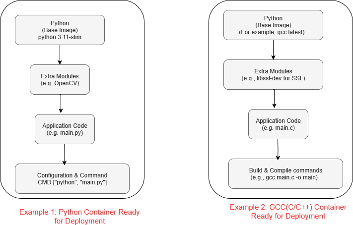

---
tags:
  - Linux
  - docker
---
# Hello Docker

**Writing a Python Application**

In this section, we build a simple Docker application that displays a message 100 times on the screen with a delay of one second. 

While it's not a very useful app, it serves to demonstrate the basic concept clearly.


## 1. Directory structure

We create a folder structure like this:

(**a minimum docker application has two files. i)applicaiton code, and ii) Docker file**)
```
hello-python-docker/
├── Dockerfile			#docker configuration file
├── hello_world.py		#contains application code
└── requirements.txt  	#(optional) file to install extra modules which are not part of base package

```

Create he directory and files (empty) as shown below:
``` bash
mkdir hello_python_docker	#create a folder

cd hello_python_docker		#python file that prints a message

touch hello_world.py

touch Dockerfile			#docker build instructions

touch requirements.txt 		# (optional) dependencies such as required python modules
```

## 2. File contents

A Docker container must include the application code, which is its fundamental purpose.
In addition to the code, it can also contain build tools, runtime environments, and configuration files — these will be explained in the next section.

Below is an example of the application code that we are using in this example. 

### Essential item 1: Application code

```hello_world.py```
``` python
import time

for i in range(1, 101):
    print(f"hello world - from a docker app-{i}")
    time.sleep(1)  # wait for 1 second
```

### Essential item 2: Dockerfile
A Dockerfile is a script that defines how to build a Docker image. It specifies the following:

    i) the base image
    ii) the application code
    iii) required dependencies
    iv) configuration needed to run the application

In the simple example below, we are covering only the first two items: 
(**the base image and the application**)

```Dockerfile```
``` Dockerfile
# Use official Python base image
FROM python:3.11-slim

# Set working directory
WORKDIR .

# Copy source code
COPY hello_world.py .
COPY requirements.txt ./

# Install dependencies (if any)
RUN pip install --no-cache-dir -r requirements.txt

# Run the app
CMD ["python", "./hello_world.py"]
```

 Brief Description of Dockerfile Instructions:

    FROM python:3.11-slim
    Sets the base image for the container. Your application code and other configurations will be layered on top of this.

    COPY main.py .
    Copies the main.py file from your local directory into the Docker image.
    Note: If your app includes more files or folders, you need to copy those too.

    WORKDIR .
    Sets the working directory inside the container — this is where commands will run from.

    RUN pip install --no-cache-dir -r requirements.txt
    Installs the Python dependencies listed in requirements.txt using pip.

    CMD ["python", "./hello_world.py"]
    Defines the default command that runs when the container starts — in this case, it runs the Python script.
	
	
	
## 3. Base image (the starting container)
The base image is the foundational container used to host an application. Additional elements, such as modules and dependencies, are added as needed, along with any necessary configuration settings.




In this example, we are using a Python image as the base image to provide the runtime environment for our application.


## 4. Build and run

- **Change directory**
Make sure that you are in the folder "hello_python_docker"
``` bash 
cd ~/hello-python-docker
```
	
- **Build the docker (container)**
``` bash
sudo docker build -t my_first_docker .
```
The resulting Docker image is saved locally on your system — not as a file but inside Docker’s internal storage.
``` bash
sudo docker images
```
Output is:
```
REPOSITORY        TAG       IMAGE ID       CREATED         SIZE
my_first_docker   latest    d4f0787c8afb   2 minutes ago   141MB
```

- **Run the docker** (the flag -it is important here... more on this later)
``` bash 
sudo docker run -it my_first_docker
```
Output:
```
hello world - from a docker app-1
hello world - from a docker app-2
hello world - from a docker app-3
......
```

## 5. Migrate to another machine
Once docker image is ready, you can export it to a file, so that it can be trasferred to any machine where it can be executed.

``` bash
sudo docker save -o my_first_docker.tar my_first_docker
```

### Run into another machine

- Create a docker image file (see the above section "exporting the docker image")
- Transfer to another machine (via network, usb, etc.)
- load the image into the target machine
``` bash
sudo docker load -i my_first_docker.tar
```
- verify that the image is properly imported.
``` bash
sudo docker images
```

- Run the docker application.
``` bash
sudo docker run -it my_first_docker
```

## 6. Run multiple instances 
As mentioned earlier, that a docker is an indepdent container. 

Once created, a docker can run many instances. Following instructions show how to run a docker multiple (twice) in the same machine.

``` Open Terminal 1```
``` bash
sudo docker -it run my_first_docker
```

``` Open Terminal 2```
``` bash
sudo docker -it run my_first_docker
```

Both will be running the same program and each will be displaying their own message count.


