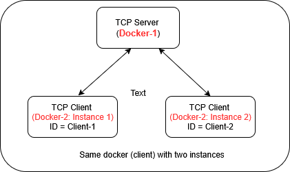

---
tags:
  - docker
  - docker networking
  - docker tcp
---
# A More Complex Example (TCP Server/Client)

---
## 1.The Objective 

In this example, we are creating TWO docker apps.
	- Docker 1: To run a TCP Server
	- Docker 2: To run a TCP Clinet that connects to the above server
- The server starts and waits for a connection request from client(s)




- When a TCP client connects to the server and passes its ID name to the server (e.g. TClient-1, TClient-2), which is passed through a command line. 

- The server in turn, sends a greeting message to each client **Hello from server to TCLinet1---Msg #**

- Additionally, we can run multiple instances of client docker, and server handles each of them with their own greeting message.


---
## 2. Directory structure
Create the following directory structure. Refer to the previous tutorial [Hello Docker](docker-hello.md) if you need a refresher.

```
# we do not need any extra modules other than the standard ones
# so we are removing requirments.txt file completely
tcp-docker-app/
├── server/
│   ├── server.py
│   └── Dockerfile
└── client/
    ├── client.py
    └── Dockerfile
```

---
## 3. File contents

### Server (Python)
``` server/server.py ```
``` python
import socket
import time

HOST = '0.0.0.0'
PORT = 5000

def start_server():
    with socket.socket(socket.AF_INET, socket.SOCK_STREAM) as s:
        s.bind((HOST, PORT))
        s.listen(1)
        print(f"[SERVER] Listening on {HOST}:{PORT}")
        conn, addr = s.accept()
        with conn:
            print(f"[SERVER] Connected by {addr}")
            counter = 1
            while True:
                message = f"hello-client1-msg {counter}\n"
                conn.sendall(message.encode())
                print(f"[SERVER] Sent: {message.strip()}")
                counter += 1
                time.sleep(1)

if __name__ == "__main__":
    start_server()
```

### Server (Dockerfile)
``` server/Dockerfile ```
``` Dockerfile

FROM python:3.10-slim
WORKDIR /app
COPY server.py .
CMD ["python", "server.py"]
```

### Client (Python)
``` client/client.py ```
``` python
import socket

SERVER_HOST = 'server-container'  # container name of the server
SERVER_PORT = 5000

def start_client():
    with socket.socket(socket.AF_INET, socket.SOCK_STREAM) as s:
        print(f"[CLIENT] Connecting to {SERVER_HOST}:{SERVER_PORT}")
        s.connect((SERVER_HOST, SERVER_PORT))
        while True:
            data = s.recv(1024)
            if not data:
                break
            print(f"[CLIENT] Received: {data.decode().strip()}")

if __name__ == "__main__":
    start_client()
```

### Client (Docker file)
``` client/Dockerfile ```
``` Dockerfile
FROM python:3.10-slim
WORKDIR /app
COPY client.py .
CMD ["python", "client.py"]

```

## 4. Build docker images
```server```
``` bash
cd tcp-docker-app/server
sudo docker build -t tcp-server .
```

```client```
``` bash
cd tcp-docker-app/client
sudo docker build -t tcp-client .
```

### Verify the build
``` bash
sudo docker images
```
If everything was built correctly, you should see an output:
```
REPOSITORY        TAG       IMAGE ID       CREATED              SIZE
tcp-client        latest    3a7e23eb624a   59 seconds ago       127MB
tcp-server        latest    8aa392e6b1e3   About a minute ago   127MB

```

## 5. Run (server, client, network)

### Create a docker network 

``` bash
sudo docker network create tcp-net
```

### Run the server container
``` In Terinal-1```
``` bash
sudo docker run  --rm -it --name server-container --network tcp-net tcp-server
```


### Run the Client container (1)
``` In Terminal-2 ```
``` bash
sudo docker run --rm -it --name client-container1 --network tcp-net tcp-client python client.py Client-1
```

### Run the Client container (2)
``` In Terminal-2 ```
``` bash
sudo docker run --rm -it --name client-container2 --network tcp-net tcp-client python client.py Client-1
```


