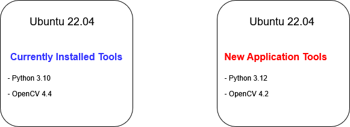
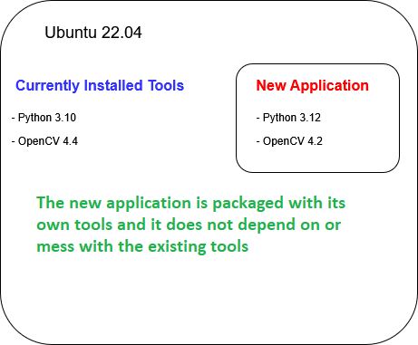
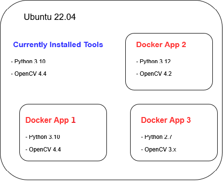

---
tags:
  - docker
---
# Getting Started with Docker

Docker is a tool (primarily a linux-based) that lets you package your application and everything it needs to run into a single container, so it works the same on any computer.

---
## 1. What is a docker

**Consider a scenario**:

There is a linux machine with following configuration.

- Ubuntu Linux 22.04
- Python 3.10
- OpenCV version 4.4


Now you wnat to run an application about **robotic vision** which required different set of tools as follows:

- Ubuntu Linux 22.04
- Python 3.12
- OpenCV version 4.2 (4.4 is not compatible with our robotic application)




---
## 2. We create an **ISOLATED** container
The ubunutu machine is not only running many other applications besides this new application **robotic vision**. By changing the python verion and OpenCV version may break other applications.

**So what to do in this case?**
We create an **ISOLATED** space in which we run new application alongwith all necessary tools and configuration settings.

This new isolated space is called a container (or docker).



---
## 3. Multiple docker containers
This idea can be extended to include many dockers containers in a single machine, as shown below. In each case, we can chose different tools, version and configurations.



---

##  4. Docker installation
Docker is an application that enables the creation of isolated environments called containers. If Docker is not installed on your system, follow these steps to install it:

You can check if docker is installed or not:
``` bash
docker --version
```
if you see an out like **docker command not found**, then following the steps below.


### Step 1: Install dependencies

```
sudo apt update
sudo apt install \
	ca-certificates \
	curl \
	gnupg \
	lsb-release -y
```

### Step 2:  Add Docker’s official GPG key
``` bash
sudo mkdir -p /etc/apt/keyrings
curl -fsSL https://download.docker.com/linux/debian/gpg | \
    sudo gpg --dearmor -o /etc/apt/keyrings/docker.gpg
```

### Step 3: Add Docker's repository

- Find debian codename by ``` lsb_release -c ```
(code name can be "bookwork" or "buster", or "bullseye" etc.) 
- $(lsb_release -cs) is replaced with your Debian codename (e.g., bullseye, bookworm):

=== "General Command"
	``` bash
	echo \
	  "deb [arch=$(dpkg --print-architecture) \
	  signed-by=/etc/apt/keyrings/docker.gpg] \
	  https://download.docker.com/linux/debian \
	  $(lsb_release -cs) stable" | \
	  sudo tee /etc/apt/sources.list.d/docker.list > /dev/null
	```

=== "Debian (Bookworm) Command"
	
	``` bash
	echo \
	  "deb [arch=$(dpkg --print-architecture) \
	  signed-by=/etc/apt/keyrings/docker.gpg] \
	  https://download.docker.com/linux/debian \
	  bookworm stable" | \
	  sudo tee /etc/apt/sources.list.d/docker.list > /dev/null
	```

### Step 4: Install docker 
``` bash
sudo apt update
sudo apt install docker-ce docker-ce-cli containerd.io docker-buildx-plugin docker-compose-plugin -y
```

### Step 5: Verify installation
``` bash
docker --version
```

You should see an output like:
```
Docker version 28.3.3, build 980b856
```

## 5. Summary 

- Docker is a tool that allows multiple applications to run in isolation from each other on the same machine.

- Each application is packaged along with its code and the tools needed to run it, ensuring consistency.

- If one Docker container fails, it does not affect other running containers.

- Applications can be easily moved across machines since everything needed to run them is bundled together, eliminating the need for separate installations and configurations.


