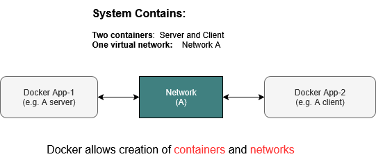

---
tags:
  - Linux
  - docker
---
# A network example

As explained earlier, Docker is a container that bundles application code along with the tools required to run it. In today’s era of distributed computing, it's common for applications to communicate over networks using protocols like TCP or UDP.

In addition to containerization, Docker also provides built-in tools to create virtual networks, enabling containers to communicate with each other seamlessly.

---
## 1. What is a docker network
A **Docker network** is a virtual communication layer that enables containers to interact with each other, whether they are running on the same machine or distributed across multiple hosts.

- It creates an isolated, software-defined environment for container networking.
- The example below shows two Docker containers communicating through such a virtual network.
- Both the containers and the virtual network are created and managed using Docker's built-in tools.



---
## 2. Protocols supported

All Docker networks support:
    TCP
    UDP
    ICMP (ping)
    And any other IP-based protocol your app uses.

It’s your application inside the container (e.g. a Python script or C program) that chooses whether to use TCP or UDP — not the Docker network.

---
## 3. An example application
In this section, we demonstrate the concept of a Docker network by creating two Docker containers and one virtual network.

- One container acts as a TCP server, waiting for incoming connections.

- The second container serves as a TCP client that connects to the server. Once connected, the server sends the message "hello client 1, 2, 3" every second.

- The virtual network is a Docker-managed component that establishes the TCP link between the server and the client, enabling seamless communication.

### How many containers and networks
In this example, we will set up two containers—one for the client and one for the server—and connect them using a single network, as illustrated below


---
## 3. Directory structure
Create the following directory structure. Refer to the previous tutorial [Hello Docker](docker-hello.md) if you need a refresher.

```
# we do not need any extra modules other than the standard ones
# so we are removing requirments.txt file completely
tcp-docker-app/
├── server/
│   ├── server.py
│   └── Dockerfile
└── client/
    ├── client.py
    └── Dockerfile
```


---
## 4. File contents

### Server (Python)
``` server/server.py ```
``` python
import socket
import time

HOST = '0.0.0.0'   # Listen on all interfaces
PORT = 5000        # Port to listen on

def start_server():
    with socket.socket(socket.AF_INET, socket.SOCK_STREAM) as server_socket:
        server_socket.bind((HOST, PORT))
        server_socket.listen(1)
        print(f"[SERVER] Listening on {HOST}:{PORT}...")

        conn, addr = server_socket.accept()
        with conn:
            print(f"[SERVER] Connected by {addr}")
            counter = 1
            while True:
                message = f"hello from server - msg {counter}\n"
                conn.sendall(message.encode())
                print(f"[SERVER] Sent: {message.strip()}")
                counter += 1
                time.sleep(1)

if __name__ == "__main__":
    start_server()

```

### Server (Dockerfile)
``` server/Dockerfile ```

``` Dockerfile

FROM python:3.10-slim
WORKDIR /app
COPY server.py .
CMD ["python", "server.py"]
```

### Client (Python)
``` client/client.py ```
``` python
import socket

SERVER_HOST = 'server-container'  # Replace with actual hostname or IP if needed
SERVER_PORT = 5000

def start_client():
    with socket.socket(socket.AF_INET, socket.SOCK_STREAM) as s:
        print(f"[CLIENT] Connecting to {SERVER_HOST}:{SERVER_PORT}...")
        s.connect((SERVER_HOST, SERVER_PORT))
        print("[CLIENT] Connected. Waiting for messages...\n")
        while True:
            data = s.recv(1024)
            if not data:
                print("[CLIENT] Connection closed by server.")
                break
            print(f"[CLIENT] Received: {data.decode().strip()}")

if __name__ == "__main__":
    start_client()
```

### Client (Docker file)
``` client/Dockerfile ```

``` Dockerfile

# Use a lightweight Python base image
FROM python:3.11-slim

# Set the working directory inside the container
WORKDIR /app

# Copy the client script into the container
COPY client.py .

# Set the default command to run the client
CMD ["python", "client.py"]
```

---
## 5. Build client and server dockers

### Build server image
1. Open a terminal and navigate to the **server** folder.
2. Build the Docker image:
``` bash
docker build -t my-tcp-server .
```


### Build client images
1. Navigate to the **client** folder
2. Build the client image:
``` bash
docker build -t my-tcp-client .
```

### Check the docker images
``` bash
sudo docker images
```

You should see something like this
``` bash
REPOSITORY       TAG       IMAGE ID       CREATED          SIZE
my-tcp-server    latest    abcdef123456   10 minutes ago   45MB
my-tcp-client    latest    123456abcdef   9 minutes ago    44MB
```

## 6. Create a docker network
Create a network named network-A to manage communication between the server and client Docker containers:

``` bash
docker network create network-A
```

To verify that docker network is created:
``` bash
docker network ls
```
Output shold look like
``` 
NETWORK ID     NAME         DRIVER    SCOPE
abcd1234efgh   network-A    bridge    local
```
## 7. Run and test client/server dockers

In terminal 1 (run the server):
``` bash
docker run --rm -it --name server-container --network network-A my-tcp-server
```

In terminal 2 (run the client):
``` bash
docker run --rm -it --name client-container --network network-A my-tcp-client
```


